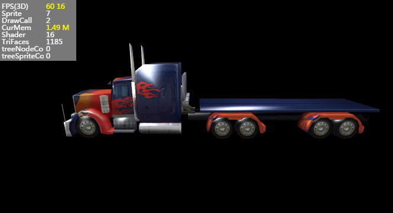

##Layair3D의 모형

###모형 개술

3D 모형은 3차원 소프트웨어를 통해 물체의 구조에 따라 모델을 형성하는 3D 입체 대상을 가리킨다.현재 Layaiair 3D 엔진에 두 가지 모형 디스플레이 종류를 포함하여 일반 모델**Messprite3D**다음은 복피 모형**SkinnedMesprite3D**.

구별은 복피 애니메이션 모형은 제작 시 복피와 뼈 애니메이션의 모형으로 애니메이션 역할을 하는 것이다.보통 모형은 애니메이션이 없는 장면을 뜻한다.

그것들은 모두 모형격과 소재 두 부분을 포함했다.

**모형 격자 (Mesh):**

모형 눈금은 점, 선, 면으로 구성된 3차원 데이터, 레이이에이어 엔진에 전문적인 메쉬 패널 데이터 종류가 있으며, 3D 모형 디스플레이 대상 Mesprite3D 또는 SkinedMeshsprite3D를 부여한 후 장면에서 볼 수 있다.

현재 3D는 소프트웨어를 많이 만들고 있으며, 가장 주류하는 것은 3d max 및 maya 소프트웨어다.3D 모델의 데이터 형식도 많다. FBX, 3DS, OBJ 같은 경우도 많다.

Layaiair 엔진에 모형 내보내기 도구 FBXTools 유닛y3D 내보내기 플러그인을 제공하고, 레이야어에서 필요한 3D 데이터 형식을 생성합니다.유닛 내보내기 플러그인을 사용하면 FBXTools 도구가 업데이트되지 않을 것입니다.

**소재 (Matrial):**

재질은 우리가 독립된 장절에 소개하고 이 장절에는 잠시 설명을 하지 않는다는 것을 설명한다.


###엔진 자체 테이프 기초 모형 만들기

빠른 속도로 3D의 여단 과정에서 보이스미쉬 케이스 모형을 사용했습니다. 이 시간에는 Layair 엔진이 제공하는 다른 Spheremesh, CylinderMersh 기초 모형 데이터를 작성하고, 트래스form의 속성을 통해 이동하는 위치를 소개합니다. 구체적인 코드가 다음과 같습니다.

창건할 때 주의하는 것은 장면 중 엔진 자체 모델, 축센터가 모형 센터에 포함돼 있어 모형 중심점을 참고로 이동, 회전, 축소.장면에 가재할 때, 모형 기본값은 장면의 세계 좌표 원점에 놓여 2D와 유사하다.


```java

package {
	import laya.d3.core.Camera;
	import laya.d3.core.MeshSprite3D;
	import laya.d3.core.Sprite3D;
	import laya.d3.core.light.DirectionLight;
	import laya.d3.math.Vector3;
	import laya.d3.math.Vector4;
	import laya.d3.resource.models.BoxMesh;
	import laya.display.Stage;
	import laya.utils.Stat;
	import laya.d3.core.scene.Scene3D;
	import laya.d3.core.material.BlinnPhongMaterial;
	import laya.webgl.resource.Texture2D;
	import laya.display.Scene;
	import laya.d3.resource.models.SphereMesh;
	import laya.d3.core.material.PBRStandardMaterial;
	import laya.d3.resource.models.CylinderMesh;
	import laya.utils.Handler;
	public class LayaAir3D {
		
		public function LayaAir3D() {

			//初始化引擎
			Laya3D.init(0, 0);
			
			//适配模式
			Laya.stage.scaleMode = Stage.SCALE_FULL;
			Laya.stage.screenMode = Stage.SCREEN_NONE;

			//开启统计信息
			Stat.show();
			var scene:Scene3D = Laya.stage.addChild(new Scene3D())as Scene3D;

			//创建摄像机（纵横比，进距裁剪，远距裁剪）------
			var camera:Camera = new Camera(0,0.1,1000);
			//加载到场景
			scene.addChild(camera);
			//移动摄像机的位置
			camera.transform.position = new Vector3(0,3,10);
			//旋转摄像机角度
			camera.transform.rotate(new Vector3(-15,0,0),true,false);
			//加入摄影机移动控制脚本
			//camera.addComponent();

			//创建方向光
			var light:DirectionLight = scene.addChild(new DirectionLight())as DirectionLight;
			//移动灯光位置
			light.transform.translate(new Vector3(0,2,5));
			//调整灯光方向
			light.transform.worldMatrix.setForward(new Vector3(0.15,-1.0,0.0));
			//设置灯光颜色
			light.color = new Vector3(0.3,0.3,0.3);
			//设置灯光环境色
			scene.ambientColor = new Vector3(1,1,1);

			//创建模型
			//创建盒子模型（参数为：长，宽，高，单位：米）
			var boxMesh:BoxMesh = new BoxMesh(2,2,2);
			//创建模型显示对象
			var box3D:MeshSprite3D = new MeshSprite3D(boxMesh);
			scene.addChild(box3D);

			//创建球体模型（参数为：半径，水平层数，垂直层数）
			var sphereMesh:SphereMesh = new SphereMesh(1,20,20);
			//创建模型显示对象
			var sphere3D:MeshSprite3D = new MeshSprite3D(sphereMesh);
			//x轴上移动-3米（世界坐标 向左）
			sphere3D.transform.translate(new Vector3(-3,0,0),false);
			scene.addChild(sphere3D);

			//创建圆柱体模型（参数为：半径，高，圆截面线段数）
			var cylinderMesh:CylinderMesh = new CylinderMesh(1,2,20);
			//创建模型显示对象
			var cylinder3D:MeshSprite3D = new MeshSprite3D(cylinderMesh);
			cylinder3D.transform.translate(new Vector3(3,0,0),false);
			scene.addChild(cylinder3D);
			//创建材质
			var material:PBRStandardMaterial = new PBRStandardMaterial();
			box3D.meshRenderer.material = material;	
			sphere3D.meshRenderer.material = material;
			cylinder3D.meshRenderer.material = material;
		}		 
	}
}
```


위쪽 코드에서 카메라와 조명을 생성하고 기본 기하학 모형을 추가해 기본적인 기본 기본 소재를 사용했습니다.그림 1 과 같은 효과 보이기

< br > (그림 1)


###3차원 소프트웨어 생성 모형 만들기

상술한 세 가지 기본 모형은 주로 개발자 학습 테스트에 쓰인다.게임의 모형은 대부분 3차원 소프트웨어를 제작한 후 유닛 편집기에서 맞춤법을 편집한 후 레이레이레이어 내보내기 도구 전환으로 발생한 다음 3D 장면이나 모형 디스플레이를 통해 사용됩니다.

이 자리에서 내보내는 자원 유별과 파일 사용 방법을 다시 한번 설명해 보겠습니다.

내보내는 폴더에는 자원이 많습니다(도 2), 장면, 3D 모형 용기, 3D 모형, 3D 모델, 3D 소재 등 해상 파일, 조명 스티커, 재질 스티커 등 데이터 파일이 있습니다.

< br > (그림 2)

**loveSce 폴더**untiy 에서 빛사진 스티커를 생성한 폴더입니다. 유니티에서 만든 장면과 같은 사진 사진만 찍은 스폰서 편에 소개되었습니다.

**Matrials 폴더**유닛에서 FBX 모형을 도입할 때 소재 볼을 만드는 폴더입니다. 내보내는 리야아 재질 자료 해석 파일, 파일 속에 소재의 보카데미 자원 경로, 소재의 다양한 광색 속성 등이 저장되어 있습니다.

**Texture 폴더**유닛에서 생성된 저장된 폴더입니다. 이 중 자원은 소재의 스티커파일이며, 일련의 그림 파일입니다. Layair 엔진에서 우리는 jpg 또는 png 형식의 그림을 사용하여 다른 형식의 그림을 자동으로 jpg 또는 pg을 자동으로 바꾸고, 개발자들의 주의를 기울여 주십시오.


####*.ls 형식 Scene 데이터 파일

내보내는 장면 Scene 형식의 데이터 파일 파일은 기존 수업에서 설명을 많이 하지 않습니다.


####*.lh 형식 Sprite3D 데이터 파일

내보내는 3D 디스플레이 컨테이너 Spirte3D 형식 데이터 파일, JSON 형식 인코딩, 유닛 3D 중 레이야아 플러그인 플러그인 내보내기 'Sprite3D' 유형 생성, 내부 저장 비례는 *.ls 형식이 적고, 다른 모든 것.

'*.lh' 형식 가재 및 장면 가재 방법과 비슷하게, Sprite3D.load () 또는 Laya.loader.create () 방법을 불러오기, 참고코드:


```java

......
//添加3D场景
var scene:Scene3D = new Scene3D();
Laya.stage.addChild(scene);

//方法一：直接异步加载
//Sprite3D.load("res/room.lh",Handler.create(this,function(sp:Sprite3D):void{
//	var sprite3D:Sprite3D = scene.addChild(sp)as Sprite3D;
//}));

//方法二：预加载
Laya.loader.create("res/room.lh",Handler.create(this,function():void{
	var sprite3D:Sprite3D = Laya.loader.getRes("res/room.lh");
	scene.addChild(sprite3D);
}));
```


####*.lm 형식 데이터 파일

"Scene" 파일이나 "Sprite3D" 파일 형식을 내보내거나 내보내는 자원 폴더에는 시리즈 *.lm 형식 파일이 포함되어 있습니다. 이 항목에서는 model 폴더가 유닛에서 개발자가 만든 메모리 FBX 모형 폴더를 저장하는 폴더와, 그림 2, 내보내기 위한 폴더와 lm 자원 파일을 생성했습니다.

< br > (그림 3)

‘ *.lm '파일은 모형 데이터 파일이며 Meshprite3D나 SkinedMeshesprite3D 형식 디스플레이 대상을 나타내는 격자 메쉬, 모형 네킹 정점 위치, 법선, 정점, 정점 UV 등 정보가 포함되어 있다.

비동기를 통해 Mesprite.load () 또는 Laya.loader.create () 방법을 불러오기, 참고 코드를 다음과 같습니다:


```java

......
//添加3D场景
var scene:Scene3D = new Scene3D();
Laya.stage.addChild(scene);

//方法一：直接异步加载
//Mesh.load("LayaScene_01/Assets/model/loveScene_jianzhu.lm",Handler.create(this,function(m:*):void{
	//var meshSprite3D:MeshSprite3D = new MeshSprite3D(m);
	//scene.addChild(meshSprite3D);
//}));

//方法二：预加载，.lm默认创建为Mesh类型
Laya.loader.create("LayaScene_01/Assets/model/loveScene_jianzhu.lm",Handler.create(this,function():void{		                         varmesh:Mesh=Laya.loader.getRes("LayaScene_01/Assets/model/loveScene_jianzhu.lm");
	var meshSprite3D:MeshSprite3D = new MeshSprite3D(mesh);
	scene.addChild(meshSprite3D);
}));
```


상술한 두 가지 방법으로 게임 화면에 모형을 나타낼 수 있으며 재질 스티커 엔진도 자동으로 모형에 적용된다.프로젝트에서 우리는 상황에 따라 이 두 가지 방법을 사용할 수 있으며, 고정 장면은 ls 형식을 사용할 수 있으며, 활동하는 물건은 ls 나 lm 를 사용할 수 있다.


###가져오기 대상 모델 및 격자

3D 모형은 가끔씩 다신 모형 모델로 구성된다. 예를 들면 장면 모형 모형, 기본적으로 여러 개의 물체 모형과 소재로 구성돼 외부는 Sprite3D 용기이며 내부는 진정한 모형 Mesprite3D 혹은 SkinedMisprite 3D.또한 여러 겹으로 새겨질 수도 있다.

####가져오기 대상 모델

게임 논리를 작성할 때, 어떤 모형은 수정되거나, 모형 삭제, 또는 모형 추가 구성 요소나 모형에 있는 애니메이션 구성 요소, 모형 구성 요소 및 개정 모형 재질 등을 교환한다.이것은 모두 가재된 모형에서 얻는 대상을 가져야 한다. 우리는 통과할 수 있다**getChildAt (), getChildByName**방법을 얻기 위해 하위 대상을 얻는 것은 2D 엔진 가져오기 상대 방법과 같다.

다음은 트럭 모형 파일을 가재하고, 그것을 가져온 대상.키보드 대상이 되기 전에 lh 파일을 열어 모형의 부자 계급을 확인하는 것을 건의합니다. 모델을 만들 때, 모델이 몇 개의 개체 모델로 구성되었는지, 그것들의 명명 규칙을 확인할 수 없습니다.

tips: 3ds max 에서 모델 을 지을 때 모델 대상 에 이름 을 지어서 프로젝트 의 자원 명명 규칙 을 작성 해 기본 모델 이름 을 사용하지 않습니다.

다음은 유닛에서 내보내는 트럭 트럭.lh, 켜진 뒤 JSON 구조를 통해 볼 수 있다. 외부는 Sprite3D 용기(유닛의 장면에 해당), 내부는 Sprtie3D 용기(유닛 장면에 해당하는 트럭), 트럭 용기 중 두 개의 모델 Messprite3D(차와 차형 모델)이다.따라서 우리는 두 차례의 getChildAt () 방식이 필요합니다.

채취자 대상 중 한 가지 문제를 주의해야 한다. 바로 모형과 재질의 재질이 적용되지 않아 캐시 대상을 얻을 수 없는 것이므로 자원 가재 또는 비운로드 시 이벤트 감청을 완료해야 한다.


```java

//加载导出的卡车模型
Sprite3D.load("LayaScene_truck.lh",Handler.create(this,function(s:*):void{
	var truck3D:Sprite3D = s as Sprite3D;
    //获取模型（查看.lh文件，有两个子对象模型，一为车头“head”，一为车身"body",暂取其中一个模型）
	var meshSprite3D:MeshSprite3D = truck3D.getChildAt(0).getChildAt(0)as MeshSprite3D;
     //输出模型的名字
	trace(meshSprite3D.name);
}))
```


상례 코드를 번역하면 모형 디스플레이를 볼 수 있습니다.

< br > (그림 4)


####모형 격자 메시 가져오기

게임에서 우리는 자주 캐릭터 환장 시스템을 만들어서 때로는 모형을 바꾸고 때로는 스티커를 바꾸고 때로는 서로 바꾸기도 한다.소재 스티커 부분은 후속 장절에서 설명하기 때문에 이 장절에는 모형 격자를 바꾸는 방법만 소개합니다.

모형 Mesprite3D나 SkinedMeshsprite3D 중**meshFilter**속성, 그것은 격자 필터 종류, 이 속성 중**sharedMesh**모형의 격자를 재건하고 소각할 수 있다.

다음의 예례를 살펴보면 트럭 모형 2초 뒤에 새 자동차 헤드 격자 대상이 기존 차체 격자를 바꾸면 효과 (그림 4) 와 같다.


```java

......
var truck3D:Sprite3D;
var meshSprite3D:MeshSprite3D;
//加载导出的卡车模型
Sprite3D.load("LayaScene_truck.lh",Handler.create(this,function(s:*):void{
	truck3D = s;
    //获取模型（查看.lh文件，有两个子对象模型，一为车头“head”，一为车身"body",暂取其中一个模型）
	meshSprite3D = truck3D.getChildAt(0).getChildAt(0)as MeshSprite3D;
     //输出模型的名字
	trace(meshSprite3D.name);
 	Laya.timer.once(2000,this,onTimerOnce);
}))

//2秒后更换模型网格
private function onTimerOnce():void
{
  //创建模型网格并更换原始网格
  Mesh.load("LayaScene_truck/Assets/truck-head.lm",Handler.create(this,function(m:*):void{
		meshSprite3D.meshFilter.sharedMesh = m;
 		 //因使用了卡车头网格，位置会重合，因此进行位置移动
 		 meshSprite3D.transform.translate(new Vector3(0,0,-8));
   }))
}
```


< br > (그림 5)