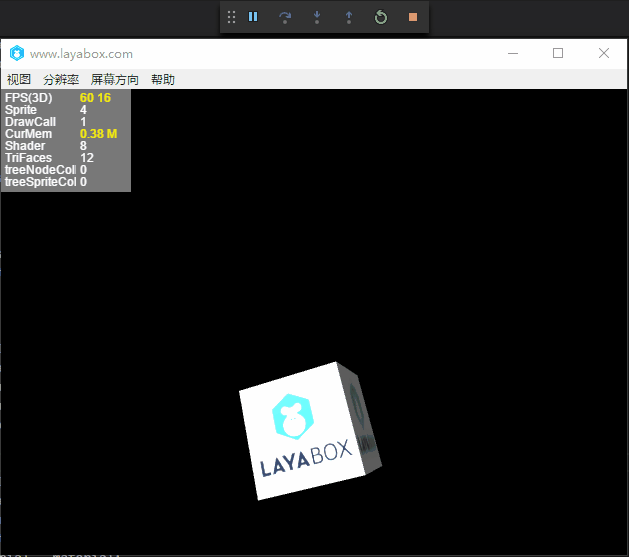

##3D 항목 빠르게 시작

다음은 Layair 엔진으로 3D 프로젝트를 빠르게 시작하고 AS 언어를 가르치고 엔진 코드로 기본적인 3D 적용을 간단히 시사할 것입니다.

###IDE 생성 3D 예제 항목

LayaiarIDE 다운로드, 새 프로젝트 시작 3d 항목을 그림처럼 설정합니다.

<br>（图1）


여기에 Actionscript3.0언어를 선택합니다.우리의 ide 가 우리에 3d의 템플릿을 세웠다.프로젝트에 대한 구조소개 개발자는 2D의 초보 과정을 참고할 수 있다.이곳은 군더더기가 없다.

Google은 직접 F5 (mac 시스템 사용자가 cmd + F5) 또는 실행 단추를 누르면 디버깅 창을 볼 수 있습니다.

< br > (그림 2)

Layaiar3D.aas라는 시작 종류는 우리에게 3D 세계를 구축했다.또한 간단한 3D 세계에 필요한 요소 몇 개 (장면, 카메라, 광원, 3D 모형, 소재) 를 추가했다.이런 개념 지식 후속 과정에 대해 우리는 자세한 소개를 통해 3D 지식을 점차적으로 이끌어갈 것이다.

이 간단한 데모에 대해 우리는 이 측체는 정적인 상태인 것을 발견하고, 우리에게 소득한 입체적인 시각감을 가져올 수 없다면, 우리는 간단한 몇 가지 코드 를 추가하여 그를 돌리게 했다.먼저 가동류 레이아ir3D.as 를 찾아서 다음과 같이 수정합니다.개발자는 직접 자신의 프로젝트에 붙일 수 있다.


```java

package {
	/*
	*@author wenqiang
	*/
	import laya.d3.core.Camera;
	import laya.d3.core.MeshSprite3D;
	import laya.d3.core.Sprite3D;
	import laya.d3.core.light.DirectionLight;
	import laya.d3.math.Vector3;
	import laya.d3.math.Vector4;
	import laya.d3.resource.models.BoxMesh;
	import laya.utils.Handler;
	import laya.display.Stage;
	import laya.utils.Stat;
	import laya.d3.core.scene.Scene3D;
	import laya.d3.core.material.BlinnPhongMaterial;
	import laya.webgl.resource.Texture2D;
	public class LayaAir3D {
		
		public function LayaAir3D() {

			//初始化引擎
			Laya3D.init(0, 0);

			//适配模式
			Laya.stage.scaleMode = Stage.SCALE_FULL;
			Laya.stage.screenMode = Stage.SCREEN_NONE;

			//开启统计信息
			Stat.show();

			//添加3D场景
			var scene:Scene3D = Laya.stage.addChild(new Scene3D()) as Scene3D;

			//添加照相机
			var camera:Camera = (scene.addChild(new Camera( 0, 0.1, 100))) as Camera;
			//移动摄影机位置
			camera.transform.translate(new Vector3(0, 3, 3));
			//旋转摄影机方向（角度）
			camera.transform.rotate(new Vector3( -30, 0, 0), true, false);
			//设置背景颜色
			camera.clearColor = null;
			//添加方向光
			var directionLight:DirectionLight = scene.addChild(new DirectionLight()) as DirectionLight;
             //灯光的漫反射颜色
			directionLight.diffuseColor = new Vector3(0.6, 0.6, 0.6);
             //灯光的方向（弧度）
			directionLight.transform.worldMatrix.setForward(new Vector3(1, -1, 0));
			//添加自定义模型
			var box:MeshSprite3D = scene.addChild(new MeshSprite3D(new BoxMesh(1,1,1))) as MeshSprite3D;
			//模型旋转方向
			box.transform.rotate(new Vector3(0,45,0),false,false);
			//给自定义的模型创建一个材质球
			box.meshRenderer.material = new BlinnPhongMaterial;
			//创建材质
			var material:BlinnPhongMaterial = new BlinnPhongMaterial();
			//加载材质的漫反射贴图
			Texture2D.load("h5/res/layabox.png", Handler.create(null, function(tex:Texture2D):void {
				//得到返回的Texture2D添加给材质球
				material.albedoTexture = tex;
			}));
			//给模型附上材质
			box.meshRenderer.material = material;
			//这里我们添加旋转逻辑
			var vect:Vector3 = new Vector3(1,1,0);
			//利用时间循环每10毫秒旋转一次
			Laya.timer.loop(10,null,function ():void{
				box.transform.rotate(vect,true,false);
			})
		}		
	}
}
```


< br > (그림 3)

여기에는 한 개의 타이머를 사용합니다. 10ms 드라이브에 한 개의 다음 다음, 구체적인 설명을 개발자 열독 및 api, 이것은 간단한 시사일 뿐입니다. 간단한 코드가 다음과 같습니다.


```java

            var vect:Vector3 = new Vector3(1,1,0);
			Laya.timer.loop(10,null,function():void{
				box.transform.rotate(vect,true,false)
			})	
```


여기에 우리는 이미 간단한 예를 달릴 수 있고, 이 측체를 회전 (도 3) 을 구동할 수 있다.


###Layaiair 3D 세계의 기본 구성

위쪽 코드를 통해 우리는 기본적인 3D 세계가 탄생했다.물론 위쪽 코드는 비교적 간단하고 다채로운 게임 세계를 만들어야 하는데, 엔진이 더 많은 기능을 알아야 한다.

4를 Layair 3D 세계로 볼 수 있는 요소 보기.3D 장면, 카메라, 조명, 모형 외에도 애니메이션 중 하나다.후기 과정을 우리는 점차 모두에게 소개할 것이다.

(그림 4)


###3D 세계 변환 및 벡터의 간단한 운용

상례 예시에서 디스플레이에 대한 몇 가지 요소 모듈을 생성했으나, 카메라, 조명, 모형에 벡터 Vector3, Vector4 등을 활용해 상대의 위치, 방향, 색채 등 부득치를 사용했다.

####좌표계 및 위치, 회전 수정

2D 엔진에서 X, y 좌표를 직접 조정하여 대상 위치와 회전방향을 제어하고, 3D 엔진 중 상대가 복잡하고, z 축 좌표에 가입하였기 때문에 Vector3 3차원 벡터를 사용해 각각 x, y, z를 대표하고 있습니다.

그러나 각종 3D 엔진과 3D 모형 애니메이션 제작 소프트웨어는 좌표 방향에 대한 정의가 다르기 때문에 초학자들은 그것의 차이를 파악해야 한다.

Layaiair 3D 엔진 좌표용 전문 용어에 속한다**`右手坐标系`**(도 5), 간단히 말하자면 화면의 오른쪽은 X 축 방향으로, 위쪽은 정Y 축 방향으로, 화면을 관찰자 방향으로 정Z 축 방향으로 향하고 있다.어떤 3D 엔진은 왼손 좌표학과에 속하며 소개를 하지 않고 흥미가 있는 초학자들은 바이두에서 이해할 수 있다.

< br > (도 5) 오른손 좌표계


엔진에서도 세계 좌표계와 국부 좌표학과, 세계 좌표계는 3D 장면의 좌표이며, 3축 방향은 영원히 변하지 않는다.국부 좌표는 모형 자체 좌표로, 모형 방향의 회전 변화에 따라 변할 수 있지만, 우리는 오른손 좌표계 제스처를 통해 좌표 방향을 식별할 수 있다(도 6), 밑그림에서 손의 모형은 Y축 회전-90도 뒤의 3D 모형 오른손 좌표계 좌표계 좌표계 자리표는 언제나 국부좌표의 정X 축 방향을 가리킨다.

< br > (그림 6)

이 같은 좌표학과를 알게 되면 3D를 통해 바꾸게 된다. 예시 코드에서 transform 은 3D 변환 대상이다(Transform3D)는 3D 세계에서 매우 중요하다. 대상 변화의 논리적 제어 코드를 사용한다.

코드 중 3D 변환 중 translate 이동 및 rotate 회전 방법을 사용하여 3차원 벡터 대표x, y, z 의 값에 사용합니다.이와 함께 두 가지 방법은 모두 인자 중 일부 공간 이동, 회전, 초보자들은 프로그램에 설치되어 있으며 이동, 회전, 어떤 차이가 있는지 관찰할 수 있다.


```java

            //移动摄像机位置
			camera.transform.translate(new Vector3(0, 3, 3));
          	//旋转摄像机方向（角度）
			camera.transform.rotate(new Vector3( -30, 0, 0), true, false);
```


< br > (7)

지금까지 Transform3D 의 API 중 이동, 회전 방법 설명, 물론, 변환 대상이 많은 속성과 방법들이 있습니다. 우리는 앞으로 예례에서 점차적으로 설명합니다.


####벡터의 사용

벡터는 Layair 3D 엔진에서 매우 빈번하게 사용해 2차원 벡터부터 4차원 벡터까지 여기저기 모습을 볼 수 있다.가장 기초적인 용법은 본 예에서 부가가치 사용에 사용된다.

코드 중 3D 대상의 이동, 회전, 축소 등 변환, 3차원 벡터는 그것의 x, y, z 축 축은 좌표부치이다.

그렇다면 불빛의 각종 컬러 속성 부치에서 3차원 벡터의 값은 R, G, B 3가지 색깔을 각각 대표하며 각각 레드, 녹색, 블루, 리야아 3D 엔진 중 세 가지 색상의 최대 수치는 1로, 전체적으로 크기가 높을수록 색상이 밝을수록 어두운 색상이 1을 넘어 1이 노출된다.

레드, 녹색, 블루는 어떤 색으로 조합할 수 있는지 초보자들은 게임 미술 디자이너들에게 문의할 수 있으며, 예를 들면 빨간색, 붉은색, 빨간색, 블루, 블루 등은 일반적으로 프로젝트 개발 과정에서 프로그래머들은 색상 값을 반복해서 테스트하는 효과가 있다.

예시 중 이하 코드가 벡터로 색상 값으로 사용되었습니다:


```java

             //灯光的漫反射颜色
			directionLight.diffuseColor = new Vector3(0.6, 0.6, 0.6);
             //灯光的方向（弧度）
			directionLight.transform.worldMatrix.setForward(new Vector3(1, -1, 0));
```


항목 중 많은 복잡한 용법도 있고, 벡터는 일부 수학 연산으로 활용해야 하며, 이 과정은 입문 과정으로 잠시 소개하지 않는다.

