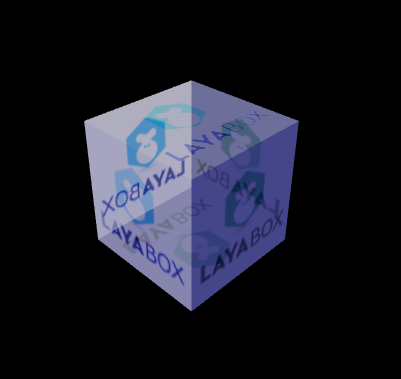

##Layaiar3D의 소재 빛과 스티커

###재질 빛과 스티커 속성

표준 소재 속성 과 조명 빛 속성 은 일정 한 유사, 만반사, 하이라이트, 환경색 등 속성 을 구현 하지만 소재 는 더욱 완벽하게 포함되어 있어 물체 미술 효과 를 더욱 편리 한 반사율, 만반사 색상, 만반사 색과 고광색, 고광색, 환경색과 환경 스티커, 반사 색과 반사 사진과 법선 볼록다음은 이 속성에 대해 상세하게 소개합니다.


####반사율

반사율(albedo Color)이 주로 재질의 밝고 색상, 수치가 높을수록 재질이 밝다.

반사율의 수치는 사차원 벡터로 아래의 코드를 살펴보고, 벡터 중 4개 원소는 각각 홍색, 녹색, 블루, 투명 alpha를 대표한다.

투명 albedoColor 효과는 백분비, 0은 투명, 1은 불투명, 반투명 또는 전투명 디스플레이, 반사율만 조정하면 안 되고, 재질의 보카시 패턴을 혼합형으로 만들어야 목적 (그림 1) 을 다룰 수 있다.

3D의 여행 과정 중 코드 수정


```java

	//创建标准材质
	var material:BlinnPhongMaterial = new BlinnPhongMaterial();
	//创建漫反射二维纹理贴图
    Texture2D.load("h5/res/layabox.png",Handler.create(this,function(text:Texture2D):void{
  		material.albedoTexture = text;
    }));
	//只有设置了渲染模式为透明混合类型才能达到透明效果
	//设置材质蓝色染色及30%半透明
	material.albedoColor=new Vector4(1,1,1,0.3);
	//渲染模式(也可设置数值，5-13等为混合类型，可观察其效果变化)
	material.renderMode =BlinnPhongMaterial.RENDERMODE_TRANSPARENT;
	//为box模型赋材质
	box.meshRenderer.material = material;
```


< br > (1) 반사율 염색과 투명


####만반사 색상과 만반사 스티커

만반사 색상(albedoColor)은 소재의 솔로 컬러를 가리키며 미술업계에서 물체의 고유색으로 불릴 수 있다.반면 만반사 스티커(albedoTexture)는 소재의 2D 고유 텍스처 이미지를 가리키며 나무 소재는 나무무늬 그림을 사용해야 한다. 벽돌 벽 소재는 벽돌 벽 무늬 그림을 사용해야 한다.

게임에서 가장 많이 사용하는 것은 만반사 스티커, 게임 미술 스티커를 그릴 때 작업량이 가장 큰 것도 만반사 스티커, 그것은 기본적으로 물체의 기본 질감을 반영할 수 있다.

만반사 컬러와 스티커는 레이야아 3D 엔진에서도 혼합할 수 있다. 이 제품은 융합 효과가 있다. 만반사색은 모형의 빛을 빛으로 염색한다(뒷빛은 변하지 않는다)고 한다. 불빛과 같은 만반사 광원색으로 더욱 전체적인 색조(도)가 생긴다.

'3D의 여행'과정 중 코드 수정은 다음과 같이 파란색 만반사 색상을 만들어 빛을 받게 되며, 보기2 효과:


```java

	//添加方向光（灯光色会与材质色融合，因此改灯光色为黑白灰色，且不能曝光过度）
	var directionLight:DirectionLight = scene.addChild(new DirectionLight()) as DirectionLight;
	directionLight.color = new Vector3(0.6, 0.6, 0.6);
	directionLight.transform.worldMatrix.setForward(new Vector3(10, -10, 0));
	scene.ambientColor = new Vector3(0.5,0.5,0.5);

	//创建标准材质
	var material:BlinnPhongMaterial = new BlinnPhongMaterial();
 	//创建漫反射二维纹理贴图
Texture2D.load("h5/res/layabox.png",Handler.create(this,function(text:Texture2D):void{
	material.albedoTexture = text;
	//设置材质漫反射颜色
	material.albedoColor = new Vector4(0.5,0.5,2,1);
}));
	//为box模型赋材质
	box.meshRenderer.material = material;
```


< br > (그림 2) 만반사 색상과 스티커 혼합


####하이라이터

하이라이트(specular Color)와 조명이 높은 빛과 마찬가지로 모형 물체 변각을 가리키거나 광원처에 있는 하이라이트 컬러를 가리킨다.

모형상의 하이라이트는 불빛과 재질의 고광색에 영향을 받아 불빛이나 불빛이 없는 하이라이트가 검은색이라면 재질에 하이라이트와 하이라이터를 설치해도 모형상의 하이라이트는 나오지 않는다.

하이라이트 스티커 (specularTexture) 는 2D 무늬 그림으로 사진 속 픽셀 컬러는 해당 모형에 맞는 하이라이트 컬러와 밝기, 픽셀 컬러가 밝을수록 픽셀 곳의 모형이 밝아진다.

물론 고광색과 하이라이트 스티커는 동시에 사용할 수 있으며 효과는 더욱 좋고 개발자들이 반복적으로 테스트를 해 필요한 효과를 조절할 수 있다.

‘ 빠른 속도로 3D의 여행 ’ 과정 중 코드 수정, 장면에서 트럭 한 대를 가재, 하이라이터, 하이라이트 스티커 사용을 관찰할 수 있으며, 기본값은 조명 높은 빛만을 사용해 대비해 코드가 다음과 같다


```java


  //获取模型
  var meshSprite3D:MeshSprite3D=role3D.getChildAt(0).getChildAt(0) as MeshSprite3D;
  //从模型上获取共享材质
  var sharedMaterial:BlinnPhongMaterial = meshSprite3D.meshRenderer.sharedMaterial
  //修改材质的高光颜色，让高光处偏红
  sharedMaterial.specularColor = new Vector4(1,0,0,1);
  //加载高光贴图（与漫反射一致，也可单独制作高光贴图）
  Texture2D.load("h5/res/layabox.png",Handler.create(this,function(text:Texture2D):void{
      sharedMaterial.specularTexture = text;
  }));
```

상술한 코드를 번역하여, (도3)에서 재질과 하이라이트 스티커를 사용하여 효과가 좋다.(사진 4)에는 조명만 사용한 기본 화이트 하이라이트 컬러만 사용해 효과적이다.

< br > (그림 3)

< br > (그림 4)


####환경색

환경색 (ambientColor) 은 배경 내의 소재에 색깔이 융합되어 염색을 해 소재가 어떤 색조에 따라 재질도 밝고 아날로그 하늘색, 빛의 강도를 높일 수 있다.

3D 여단 과정 중 코드 수정 (그림 6) 효과:


```java

//添加3D场景
var scene:Scene3D = Laya.stage.addChild(new Scene3D()) as Scene3D;
//设置环境色，提亮模型
scene.ambientColor = new Vector3(0.5,0.5,0.5);
```


< br > (그림 5) 고정조명 아래 환경색 사용하지 않음

< br > (그림 6) 고정불빛 아래 장면 사용 환경 색상 밝기


####반사 스티커

반사 스티커 (customReflection) 는 일반적으로 카세트 무늬 스티커 TextureCube 를 채택해 모형에 대한 전체적인 소포, 모의 주변 환경이 모형적인 효과를 반영한다.

반사 스티커는 효과와 동시에 반사율 albedo Color, 렌더모드 관련 효과가 있다.

렌더링 모드를 양면 불투명으로 바꾸어야 반사 스티커 (RENDERMODE OPAQUE) 를 표시할 수 있다.

반사율 albedocolor 수치가 높을수록 반사 스티커가 작을수록 만반사 스티커가 효과는 높을수록 실제 모형 소재 효과에 따라 조절, 액면, 미러, 금속면이 다른 반사율을 조절할 수 있다.

‘ 3D의 여행 ’ 과정 중 코드 수정은 다음과 같이 더 나은 관찰 효과를 위해 구형 모형을 사용한다.실행 후 (그림 7) 효과를 얻을 수 있습니다:


```java

//添加方向光
var directionLight:DirectionLight = scene.addChild(new DirectionLight()) as DirectionLight;
directionLight.color = new Vector3(0.6, 0.6, 0.6);
directionLight.transform.worldMatrix.setForward(new Vector3(0, -100, 0));
//设置场景的环境光颜色
scene.ambientColor = new Vector3(0.5,0.5,0.5);
//创建一个球
var sphere:MeshSprite3D = scene.addChild(new MeshSprite3D(new SphereMesh(1)))as MeshSprite3D;
	sphere.transform.translate(new Vector3(0,1,-3))
	Laya.timer.loop(10,this,function():void{
		sphere.transform.rotate(new Vector3(0,1,0),true,false)
	});
//创建材质
var material:PBRSpecularMaterial = new PBRSpecularMaterial();
//创建漫反射二维纹理贴图
Texture2D.load("h5/res/layabox.png",Handler.create(this,function(text:Texture2D):void{
				material.albedoTexture = text;
			})); 	
//获取反射贴图（用立方体全视角贴图进行赋值（类似于360全景包裹））
TextureCube.load("h5/LayaScene_test/Assets/1v1Scene/NewCubemap.ltc",Handler.create(this,function(cube:TextureCube):void{
		//设置反射贴图
		scene.customReflection = cube;
		//设置反射贴图的反射率
		scene.reflectionIntensity = 1;
	}));
//设置渲染模式为不透明（否则无法显示反射贴图）
material.renderMode =PBRSpecularMaterial.RENDERMODE_OPAQUE
//降低材质的反射率，加强反射贴图反射
material.albedoColor=new Vector4(0.1,0.1,0.1,0);

//为模型赋材质
sphere.meshRenderer.material = material;
```


< br > (7) 반사 스티커


####법선 요철 스티커

법선 요철 스티커(normalTexture)는 3D에서 매우 중요한 역할을 하고 있으며, 모형 표현의 정밀도가 주로 법선 스티커에 영향을 받아, 고정도, 고면수 모형의 세부 사항을 모방하여 게임 화면의 품질을 크게 향상시킬 수 있다.물론 법선 스티커를 사용하면 하드웨어에 대한 성능 향상을 요구한다.

법선 스티커는 미술 디자이너를 위해 두 가지 방법으로 제작한 것은 3D 프로듀싱에서 모형 고모 베이킹에서 저모형 플로팅, 작업량이 크며, 작업량이 크다는 것은 만반사 스티커로 일부 도구로 플랜 스티커, 작업량이 작지만 효과는 베이킹 방법보다 조금 낮다.법선 스티커 효과 (도 8) 가 제시한 것은 만반사 스티커로 전환된 것이다.

<br>（图8） 


만약 법선 스티커를 사용하려면 개발 과정에서 다음 문제를 주의해야 합니다:

1. 법선 스티커는 모형 데이터에 대해 일정한 요구가 있다. 모형상 절선 정보가 없으면 법선의 요철 효과를 낼 수 없을 것이다.예를 들어 Layaiair 3D 엔진에서 자체적으로 가져온 메쉬 형식 BoxMesh, Spheremesh, CylinderMersh 등은 절선 정보가 없는 것이며, 법선 스티커를 사용해도 볼록이 나오지 않는다.

2. 법선 스티커를 사용하려면 Layaiair의 유닛 플러그인을 통해 내보내며 메쉬 Setting 칸을 설정할 때 '접선 무시' 옵션 '옵션을 선택하지 않도록 주의해야 한다.

< br > (그림 9)

3. 법선 스티커를 사용해야 한다면, 게임 장면에서는 불빛을 사용해야 한다. 그렇지 않으면 모형에도 요철 효과가 생기지 않는다.


유닛 3D에서 Cube 모형 (unity 에서 만든 모형 테이프 절선 정보) 를 생성하고 플랫폼과 법선 스티커를 부과한 후 레이레이레이어로 내보내며, 법선 스티커도 자동으로 모형으로 가재됩니다.3D의 여단 과정 중 코드 수정 후 (그림 10) 요철 효과.


```java

//创建unity中导出的场景
Scene3D.load("h5/LayaScene_test_Light/test_Light.ls",Handler.create(this,function(s:Scene3D):void{
	var scene:Scene3D = Laya.stage.addChild(s)as Scene3D;
	//也可以代码加载法线贴图
	//从模型中获取meshSprite3D对像
	//var meshSprite3D:MeshSprite3D=s.getChildByName("Cube") as MeshSprite3D;
	//获取模型的材质实例
    //var material:PBRSpecularMaterial=meshSprite3D.meshRenderer.material as PBRSpecularMaterial;
    //为材质添加法线贴图
 //Texture2D.load("layaScene_box/Assets/texture/layabox_normal.png",Handler.create(this,function(text:Texture2D):void{
    //material.normalTexture= text;
// }));
}));
			
```


< br > (도 10) 법선 스티커


###내보내는 재질 파일.

재질의 빛과 스티커에 대한 속성을 통해 물체의 소재 속성과 스티커를 어떻게 수정할 것인지 잘 알고 있다.

그러나 현재 미술의 효과는 기본적으로 유닛 편집기를 통해 이뤄진 뒤 데이터를 내보내서 사용된다.현재 Layaiair 3D 엔진이 완벽한 가운데 H5 게임 엔진의 특징으로 유닛의 모든 소재와 속성을 완전히 포함할 수 없기 때문에 유닛의 효과와 실제 게임의 효과와 차이가 있다.

미래 버전에서는 유닛에 전용된 Layaiair 표준 재질 개발자들을 사용하여 유닛에서 제작한 미술 효과와 게임의 효과를 완전히 일치시켜 개발자들을 사용하게 할 수 있다.

그렇다면 기다리던 동안 우리는 어떻게 수정하고 미술 효과에 이를 수 있을까?유닛에서 재질마다 내보내면 lmat 형식 파일을 생성할 수 있으며, 우리는 소재를 수정할 수 있다.

예를 들어 다음 코드 를 통해 한 장면을 가재한 후, 우선 빛을 통해 밤 효과를 보다.


```java

Scene3D.load("h5/LayaScene_test_Light/test_Light.ls",Handler.create(this,function(s:Scene3D):void{
	var scene:Scene3D = Laya.stage.addChild(s)as Scene3D;
	//设置环境光偏暗蓝色
	scene.ambientColor = new Vector3(0.2,0.2,1);

    //获取场景灯光
	var light:DirectionLight = scene.getChildByName("Directional light") as DirectionLight;
	//设置灯光光偏暗
	light.color = new Vector3(0.5,0.5,0.5);
}));

```

< br >

상도에 따르면 ‘Love’의 모델을 등골로 바꾸려면 코드 변경을 통해 상대적으로 번거로운 방식을 수정하는 것은 lmat, 재질문서를 열어 재질문서를 여는 것이 바로 다양한 광색 속성 및 스티커(사진 12), 재질의 빛깔 색상을 개정하는 환경광 색상은 1.5, 1.2, 1.2, 1.2, 1.새 홈페이지 파일은 효과를 볼 수 있고, 모델이 등골에 도달하는 효과를 볼 수 있다.

< br >

< br > (그림 13)

이런 방법으로 장면의 다양한 소재 속성을 조절해 미술에 필요한 효과를 얻을 수 있다.물론, 후속으로 기대되는 유닛 중 레이아라 전속 소재로 유닛에서 편집과 게임에서 일치하는 최종효과를 거두고 있다.

