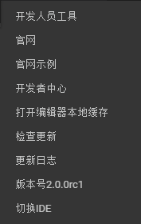

#메뉴 표시줄 설명

코드 모드 메뉴 표시줄에는 일련의 기능과 옵션이 포함되어 있습니다.이 장절에서 우리는 코드 모드 메뉴 표시줄에 대해 상세하게 소개할 것이다.

 < br >>
(그림 1) 메뉴판

 

##문서

​< br >>
(그림 2) 파일 목록

​**새 프로젝트**새 항목 창구를 팝니다. 새 항목 이름, 위치, 항목 형식으로 현재 항목 형식은 AS, JS, TS 세 가지 항목 형식을 지원합니다.

​**새 파일**새 파일은 보기 창에 새 코드 문서를 만들 수 있습니다. 문서 위치는 자원 보기 창에 있는 작업 파일을 찾을 수 있습니다. 새 코드 문서는 저장할 때만 생성됩니다.

​**새 창**새 창은 새 코드편집 창이 새 항목을 생성하거나 다른 항목을 편집할 수 있도록 새 창구를 팝니다.

​**프로젝트 열기**항목을 열면 WINDOWS 자원 관리자 스타일의 웹 브라우저 창의 위치를 팝니다.확인 후 ID는 열린 새 항목으로 전환합니다.

​**폴더 열기**폴더를 열면 WINDOWS 자원 관리자 스타일의 웹 웹 웹 웹 폴더가 위치를 선택하여 다음 자원 보기 창에서 열린 폴더를 자동으로 추가합니다.

​**보존하다**현재 조작된 파일을 저장합니다.

​**따로 두다**현재 조작된 파일을 새 파일로 저장합니다.

​**소유 보존**모든 파일에 대한 작업 실행을 실행합니다.

​**편집기 새로 고침**편집기의 실시간 상태를 새로 고침

  

##편집

​< br >>
(그림 3) 목록 편집

​**철회하다**현재 작업에 대한 취소를 진행합니다.

​**다시 하다**이미 취소된 조작에 대한 회복.

​**자르다**선택한 단락이나 파일을 편집합니다.

​**붙이다**복사하거나 편집된 단락이나 파일을 붙여넣기 위한 작업입니다.

​**복제**선택한 단락이나 파일을 복사합니다.

​**전선**현재 파일 내용을 전선 조작하기

​**찾다**보기 창 오른쪽 위로 검색 창을 편집하고 키워드 찾기

​< br >>
(그림 4) 판넬 찾기

​**교체**보기 창 오른쪽 위쪽에 변환 창을 편집하고 키워드 바꾸기

​**전체 검색**자원 보기를 전체 검색창으로 바꾸고, 키워드를 전체 항목으로 검색하고, 이 키워드를 포함한 파일의 경로, 키워드 영역, 키워드 수량을 목록합니다.또한 코드 편집 창에서 키워드를 높게 표시합니다.

 

##셋, 보기 (보기)

​< br >>
(그림 5) 보기 목록

​**파일**자원 관리 보기가 차단된다면 이 옵션은 자원 관리자 창을 재현합니다.

​**수색**전체 검색 창이 차단된다면 이 옵션은 전체 검색 창을 재현합니다.

​**GIT**GIT 창이 차단된다면 GIT 창 재현됩니다.

​**디버깅**디버그 창이 차단된다면 이 옵션은 디버그 창을 다시 나타냅니다.

​**명령 패널**이 옵션은 보기 창 위에 명령 창을 표시합니다.

​< br >>
(그림 6) 명령 패널

​**오류와 경고**이 옵션은 보기 창 위에 오류와 경고 창을 편집합니다.

​**출력 패널**이 옵션은 보기 창 아래에서 출력 창을 편집합니다.

​**터미널**이 옵션은 시스템 명령 단말기를 시작할 것입니다.

​**디버그 패널**이 옵션은 보기 창 아래에서 디버그 콘솔 창을 편집합니다.

​**전체 스크린**IDE 전체 화면 최대화 표시

​**분별 편집기**보기 창 편집을 다분할 스크린 분해합니다.

​**사이드바 전환**사이드바 표시 / 숨기기

​**사이드바 이동**사이드바퀴를 맨 왼쪽 / 맨 오른쪽으로 이동합니다.

​**확대**LayairIDE의 디스플레이 비율을 전체적으로 확대합니다.

​**축소하다**LayairIDE의 디스플레이를 전체 축소합니다.

​**크기 초기화**LayairIDE의 디스플레이를 기본값으로 초기화합니다.

##도구

​        < br >>
(도 7) 도구 패널

##--**SWF 변환**SWF 자원 전환 도구 창을 열기 위해 SWF 전환 작업이 시작됩니다. **JS 압축 도구**JS 압축 도구 창을 열고 JS 파일을 압축과 헷갈리게 합니다.
##--**용골 애니메이션**용골 애니메이션 창을 열 때, Dragonbones 골격 애니메이션을 Layair 식별의 형식으로 변환할 수 있습니다. **Spine 애니메이션 전환**：打开Spine动画转换窗口，以供用户将Spine骨骼动画转换为LayaAir识别的格式。

##--**Psd2UI**pad 파일을 UI 페이지로 직접 바꾸고 자원 이름 규칙을 참고할 수 있습니다[这里](https://ask.layabox.com/question/7365) **도집 포장**：打开图集打包窗口，以供用户进行图集打包操作。

##--**운행기 다운로드**실행기 다운로드 창 열기 **APP 포장**APPP의 환경 설정과 작업창: Layaiair 항목을 안탁으로 포장하는 APP (apk 파일)
##--**app 구축**구축 기능 창: Layair 엔진 항목을 Android-eclipse, Android-studio, XCode (IOS) 3가지 이동단의 APP 프로젝트입니다. **3D 변환 도구**3D 변환 도구를 열 URL 링크, 압축 패키지에 3DMax 와 유닛 3D 편집기의 자원 변환 도구를 제공해 3DMax 와 유닛 3D의 자원을 Layair 엔진에 지원하는 자원이 되었다.

##프로젝트

​< br >>
(그림 8) 프로젝트 패널

​**라이브러리 관리**현재 항목에 사용할 라이브러리 버전을 설정합니다.

##돕다

​< br >>
##(그림 9) 도움말 패널 **개발자 도구**편집기의 디버그 페이지를 열 때 사용합니다.
##--**관문**레이박스 홈페이지 링크 열기. **관망 예시**홈페이지를 열고 있는 레이아라 엔진 예제 링크.
##--**개발자 중심**Layabox 개발자 센터 링크 열기. **편집기 로컬 캐시 디렉터리 열기**편집기의 로컬 캐시 파일의 소재 디렉터리를 엽니다.
##--**갱신 검사**LayairIDE 버전 다운로드 목록 링크 열기 **로그 업데이트**gitHub 의 엔진과 IDE 버전 업데이트 로그 링크를 열기
--**현재 버전 번호**LayairIDE 현재 버전 번호를 표시합니다.