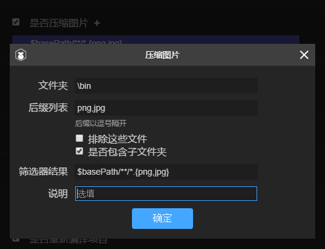

#프로젝트 발표 상세 (새 버전)

>>*author:charley vesion:Layaiair IDE 2.1 update:2019-06-25*

[TOC]

Layaiair IDE 는 프로젝트 발표 기능에서 끊임없이 최적화되고 있으며, 중간 크기 버전의 업그레이드 업그레이드까지 역력하고 있다.새로운 버전에서는 프로세스의 사용자 정의를 강화할 뿐만 아니라 선별 발표를 더욱 원활하게 하고 작은 게임 프로젝트를 위한 더 편리한 사용자 체험을 향상시켰다.

 


(1-1)

다음은 여러 가지 기능에 대한 자세한 소개:

###플랫폼 옵션

본문으로 작성할 때 IDE 2.1 버전 발표 플랫폼에는 현재 6가지 선택 옵션이 있습니다. 각각 VIVO 작은 게임, OPO 작은 게임, 소미게임, 백도 작은 게임, 웹, 웨이브, 마이크로 게임.1-2의 지시대로.

 


(1-2)

다른 플랫폼 형식을 선택하면 발표할 때 다른 플랫폼을 맞추게 된다.

`Web`HTML5 버전으로 브라우저 환경, webView, LayaNative APP 환경을 실행하는 것입니다.

`微信小游戏`위챗 작은 게임에 적합한 프로젝트를 발포한 다음 프로젝트를 발표할 수 있는 위챗 개발자 도구 안에서 (마이크로게임 관련 문서를 읽을 수 있다.

`百度小游戏`바이두의 작은 게임에 적합한 프로젝트를 발표한 다음 프로젝트는 바이두 개발자 도구 내에서 실행할 수 있는 바이두의 작은 게임에 대한 읽을 수 있는 문서입니다.

`小米快游戏`소미 스피드 게임에 적합한 프로젝트를 발표한 뒤 발표된 항목은 샤오미 개발자 도구 중 (좁쌀놀이에 관한 문서를 읽을 수 있는 것으로 나타났다.

`OPPO小游戏`OPPO 의 작은 게임에 적합한 프로젝트를 발표한 후 OPPO 개발자 도구 중 (OPO 작은 게임에 대한 읽을 수 있는 문서를 실행할 수 있다는 뜻이다.

`VIVO小游戏`VIVO 작은 게임에 적합한 프로젝트를 발표한 다음 프로젝트를 실행할 수 있는 VIVO 개발자 도구 중 (VIVO 작은 게임에 대한 읽을 수 있는 문서입니다.

###둘째, Node-glob 모듈 압축 및 버전 관리 기능 적용

압축과 버전 관리를 혼동하는 것은 발표할 때 비교적 자주 사용하는 기능이다.그러나 어떤 디렉터리와 파일을 더 잘 관리하고, 어떤 것들을 압축하거나, 어떤 것들은 버전 관리를 시작할 것인지, 어떤 것이 필요치 않다.LayaiairIDE 역시 여러 차례 최적화와 개판을 진행하며 새 버전의 발표를 시작으로 발표 기능에 노de-glob 모듈을 내장해 디렉터리와 파일의 일치 작업을 더욱 원활하게 할 수 있다.

LayaiairIDE의 발표 기능은 기본적으로 일반적인 배제와 포함 기능을 포함하고 개발자 사용자 정의 파일 필터를 선택할 수 있습니다.게시판의 기능을 결합하여 설명을 합니다.

####1, 압축 기능 (JSON, JS, 그림)

JSON, 압축 사진, JS 파일 압축 여부 등을 압축할지 여부를 선택하면 이 같은 압축 기능을 시작할 것입니다.색 블록 영역에 기본 파일 필터 일치 규칙을 보여 줍니다. 기본값의 파일 일치 규칙을 수정하려면 색 블록 영역을 클릭할 수 있습니다.그림 2-1

 


(2-1)

색 블록의 영역을 클릭한 후 구덩이에 대응하는 규칙 편집 인터페이스에 들어갈 수 있습니다. 예를 들어 그림을 압축한 색괴 구역을 누르면 압축 그림의 규칙 편집 인터페이스를 열 수 있습니다.

 


(2-2)

`文件夹`폴더는 기본적으로 bin 디렉터리를 압축할 수 있습니다. 하위 디렉터리나 더 낮은 디렉터리로 지정할 수 있으나 bin 디렉토리를 찾을 수 없습니다.

`后缀列表`압축 유형 클릭 클릭 후 접미사 목록 기본값도 다르다. 예를 들어 JSON 의 기본값은 json, 압축 이미지의 기본 값은 png, jpg 이다.JS 파일을 압축하는 기본값은 js 입니다.

접미사 목록에서 변경하거나 새로 증가할 수 있지만, 각 분류의 호출 처리메커니즘은 구별이 있기 때문에 개발자는 아무렇지 않은 접두사를 늘리지 마라. 그렇지 않으면 오류가 발생할 수 있다.예를 들어 JSON 의 접미사 규칙을 압축해 다른 접미사 이름을 새로 늘려도 파일은 json 형식으로 되어야 한다.예를 들면 js 접미사, 압축과 동시에 문법에 대한 검출 문법과 혼동을 일으킨다.이는 json 형식의 압축 메커니즘과 다르다.그림 압축의 기능은 더 말할 필요가 없고, 동리적이다.

`排除这些文件`이 옵션은 접미사 목록에서 선택한 보조 필터 기능을 선택하여 이 기능을 선택하면 현재 일치하는 파일을 압축하는 것이 아니라 현재 일치하는 파일을 제외합니다.이 메커니즘은 일반적으로 많은 일치 규칙을 결합시키는 데 쓰인다.예를 들어 bin 디렉토리의 모든 png 과 jpg 파일을 압축할 것입니다.하지만 나는 빈 디렉토리 아래 res 디렉토리를 무시하고 싶어 압축되지 않는다.그럼 그림을 압축할 수 있는 오른쪽 더하기 번호를 누르고 새 규칙을 만들 수 있습니다.

 


(2-3)

이 배제 규칙을 늘린 후 클릭을 누르면 결합 후 일치 규칙은 그림 2-4의 제시와 같다.

(2-4)

`包含子文件夹`이 옵션은 접미사 목록에 기반된 보조 선별 기능이다.선택을 하지 않으면 일치하는 것에만 제한된다`文件夹`선택한 현재 디렉터리 파일을 선택하면 일치하는 규칙에 포함되는 모든 하위 폴더 목록을 포함합니다.

`筛选器结果`필터 결과 표시줄에는 현재 설정된 필터 기능을 표시할 뿐만 아니라, 이 표시줄에서 더 복잡한 필터 조건을 편집할 수 있으며, 반드시 직접적인 채별 조건을 편집한 후 우선 클릭하십시오`确定`저장할 때, 그렇지 않으면 다른 필터 인자를 설정한 후 이곳의 설정을 자동으로 바꿀 수 있습니다.

필터 내의 규칙은 정규 표현식의 glob 일치 규칙이며, 경로 모형을 분석할 때, 대괄호에서 여러 개의 쉼표를 구분할 수 있으며, 안에 있는 부분은 '/ / c / c / c, bcd} 으로 전개됩니다

일치자
------------------------------------------------------------------------------------------------------------------------------------------------------------------------------------------------------------------------------------------------------------------------
124대`*`1244의 파일 경로 중 0개 또는 다자 문자를 일치하지 않습니다. 경로 구분 부호가 아닌 경로 1244로 나타납니다.
124대`**`1,124대 경로 중 0개나 여러 디렉터리와 그 카탈로그를 따로 나타내야 하는데, 즉, 그 좌우에는 다른 물건이 있을 수 없다는 것이다.마지막에 나타날 경우 파일과 일치할 수 있습니다.124대
124대`?`파일 경로에 일치하는 문자 (일치하지 않는 경로 구분) 124토글
124대`[...]`자 괄호에서 나타난 문자의 임의한 자 중 첫 번째 글자는 ^ 또는 ^ 또는 ^ 또는, 괄호 중 일치하는 다른 문자의 다른 문자 중 임의로 표시합니다.조합이 되지 않도록 주의하십시오. 그 중 하나밖에 없습니다.예를 들어, [x y z].js 는 x.js, y.js, z.js, z.js, xyz, xyz, js 등
124대`!(pattern｜pattern｜pattern)`1244대 괄호 중 주어진 임일 모드 모두 일치하지 않습니다
124대`?(pattern｜pattern｜pattern)`js 정규 정규 1회 또는 1회`(pattern｜pattern｜pattern)?`124대
124대`+(pattern｜pattern｜pattern)`124대 괄호 중 주어진 임일 패턴은 최소 1회, j 정칙 중`(pattern｜pattern｜pattern)+`124대
124대`*(pattern｜pattern｜pattern)`124대 괄호 중 주어진 임일 모드, 여러 차례, Js 정규 중`(pattern｜pattern｜pattern)*`124대
124대`@(pattern｜pattern｜pattern)`124대 괄호 중 주어진 임일 모드`(pattern｜pattern｜pattern)`124대

개발자가 더 많은 glob 작성 규칙을 알고 싶다면, 바이두 등 검색엔진에서 node-glob 관련 문서를 찾을 수 있다.이곳은 상세하게 소개하지 않겠다.

`说明`설명란에서 일부 규칙적인 메모를 작성할 수 있으며, 이 규칙에 대한 힌트를 기재할 수 있으며, 장기간 사용하지 않고 이 규칙의 역할을 잊지 않도록 할 수 있다.예를 들어 2-3 중 이 규칙은 "binres 디렉토리 내 그림의 압축" 이라고 적었다.

####압축 사용 알람

압축 기능을 사용하면 발표 시간이 느려지고 압축된 파일이 늘어나면서, 소모의 압축시간이 길어질수록 최종상선이나 필요한 테스트가 아니라면 된다.상선 디버깅 단계는 최대한 선택하지 않도록 한다. 특히 JS 가 압축한 후 코드를 혼동하게 해 코드를 읽을 수 있어 디버깅에 영향을 준다.

####2, 버전 관리 사용

버전 관리에 관해 맨 처음에는 링크 후 랜덤 수를 추가하는 방식으로 관리하고 있지만, 위신 등 환경에서 캐시 문제가 심각하고, 랜덤 수 방식은 캐시 문제를 해결할 수 없으며, 아니면 업데이트 버전으로 페이지 혼란을 초래하는 현상이 나타난다.이에 따라 레이어이더는 발표할 때 캐시 문제를 근본적으로 해결할 수 있는 방안을 늘렸다. 바로 직접 개명 파일 이름도 달라졌고, 캐시 문제가 자연히 존재하지 않는다.

#####버전 관리 메커니즘

개발자가 버전 관리를 활성화한 후 발표할 때 hash 문자열의 파일 이름을 자동으로 생성할 것입니다. version.json 파일 이름 맵 파일을 생성합니다.버전 관리를 통해 ResourceVersion 자동 연결 코드의 실제 파일 이름과 이름을 바꾸는 버전 관리 제어 파일입니다.개발자가 버전 관리를 활성화하는 파일이 바뀌면 파일 이름을 자동으로 바꾸는 hash 문자열을 자동으로 업데이트하는 것은 실행환경에서 새로운 파일을 적용하는 데 해당하는 것은 자연히 캐시 파일이 존재하지 않을 것이다.

개발자가 개발하는 과정에서 판본관리가 최종 생성된 파일명을 주목할 필요가 없다.레이레이어이드의 2.0이 프로젝트를 창건할 때 이미 자동으로 코드관리류 Resourceversion, 개발자는 Resourceversion을 어떻게 사용하는지도 주목할 필요가 없다. 버전 관리를 할 때 항목 게시 인터페이스를 적용할 수 있는 옵션을 선택하면 된다.

#####버전 관리 효과 사용하기

항목 게시 인터페이스, 버전 관리를 활성화하고, 선별 규칙은 압축과 같은 것이며, 모두 채택된 glob 규칙은 어떤 파일의 참여 버전 관리와 어떤 파일의 참여 버전 관리에 참여하지 않습니다.기본 html 페이지에 참여하지 않습니다. 이 개발자는 삭제하지 마세요. html 변경 후에는 문제가 생기기 쉽기 때문입니다.다른 파일이 개발자가 특정 수요가 있다면 스스로 통제할 수 있다.

주의해야 할 것은 마이크로게임 등 특정한 소규모 게임 루트를 발포한다면, 이 작은 게임들의 프로젝트파일과 기본 지정 파일 이름의 파일을 자동으로 무시하고, 버전 관리에 가입하지 않고, game.js 및 game.json 등이다.

 


(그림 3)

그림 3의 효과를 보면 왼쪽은 개발 환경 아래 bin 디렉토리, 오른쪽은 버전 관리 후 발표 디렉터리를 볼 수 있습니다. game.js 와 game.json 이 같은 작은 게임 프로그램이 존재하는 파일이 자동으로 무시됩니다. js 디렉토리 아래 js 파일과 res 디렉토리 아래 png 이미지 파일 이름으로 hash 문자열에 포함됩니다.


###3. 로컬 가방 추출

마이크로신, 바이두 등 작은 게임의 플랫폼이 비교적 뜨겁다.그러나 이 플랫폼은 로컬 가방의 개념이 존재하고 가방에 제한되어 있어 로컬 가방의 기능과 사용성이 매우 중요합니다. 현재의 버전도 여러 차례 최우호 버전으로 최우호 버전을 최우호 버전으로 최우호 버전을 최적화시켜 기존 불편을 최적화하고, 개발자 1건은 작은 게임 프로젝트에 대한 요구를 충족시킬 수 있습니다.구체적인 로컬 가방 관련 소개와 문서가 직접 대응하는 문서를 직접 살펴보고, 어떻게 추출할지 중점적으로 소개합니다.

####1. 파일 선택

클릭`选择文件`오른쪽 입력 상자는 그림 4 같은 빈 디렉터리 트리를 팝니다.개발자가 로컬 가방에서 사용할 코드나 자원을 선택하였다.클릭**확정**선택한 디렉터리와 파일을 자동으로 저장하여 공구 사별과 지정한 로컬 백을 복사하기 편리합니다.

 


(그림 4)

####2, 대상 디렉터리

기본값으로 선택되지 않을 때 로컬 백 디렉터리는 release 디렉터리에 wxgameu pack 디렉토리를 생성하여 로컬 가방을 보관하는 데 사용됩니다.물론 개발자도 작은 게임 항목을 저장하는 로컬 패키지 내용을 마음대로 지정할 수 있다.

조회도 5`目标目录`오른쪽 입력 상자에 대응하는 디렉토리를 선택하면 됩니다.


(그림 5)

작은 게임 추출 파일은`选择文件`과`目标目录`이 두 가지 핵심 기능은 조작이 단순하지만 매우 실용적인 기능이다.

최초의 버전은 로컬 가방을 추출할 수 없고, 전당 복제의 추출은 비교적 번거롭다.또 복사할 때 작은 게임 프로젝트 파일이 빠진다면 다시 수공복제해야 한다.이 문제들은 이 판본에서 모두 해결되었고 로컬 패키지 목록은 자체적으로 채택할 수 있다.이 플랫폼을 선택한 다음 플랫폼에 대응하는 항목 파일은 로컬 백파일 목록을 선택하지 않아도 자동으로 추출되고 작은 게임 항목의 완정성을 보장합니다.


###기타 기능

 


(그림 6)

####1, 개방역 프로젝트

위신과 바이두 등 작은 게임 개방 도메인 항목의 기본 입구 파일과 주역의 입구 파일이 다르기 때문에 선택`是否为微信/百度开放数据域项目`이후 자동으로 입구 문제를 처리할 것이며, 개발자는 매번 발표 후 수공으로 처리한다.개발자의 작은 게임 발표는 유용성을 크게 증가시켰다.

> Tips: 개방 영역을 지원하지 않는 플랫폼을 선택하면 자동으로 기능을 차단합니다.

####2, 인dex.js 인용된 라이브러리

기본값은 선택된 상태입니다. 선택하면 인dex.js 에서 인용되는 라이브러리 (일반적으로 편집 모드에서 F9 의 라이브러리 설정을 사용하여 라이브러리를 제어합니다.그렇지 않으면 libs 밑에서 사용되지 않은 모든 것을 복제할 수 있다. 이렇게 하면 전체 가방체의 부피를 늘릴 수 있다. 특별한 용도가 없으면 움직이지 말고 선택하도록 건의한다.

####3、발표 전에 다시 번역

개발자가 번역을 잊어버렸다면, 발포된 코드가 최근 코드가 아니라면 선택할 수 있다.`是否重新编译项目`선거 후에는 매번 발표할 때마다 프로젝트를 편집한 뒤 유포를 집행한다.잊혀진 번역으로 인한 프로젝트 발표 후 오류는 피할 수 있다.


###5, 발표 과정의 체험 최적화

최종적으로 발표될 때, 보통 그림, js, json 등 압축을 불가피하게 된다. 만약 프로젝트가 커질수록 번역된 시간이 길어질수록 피하기 어렵다. 특히 JS 의 압축은 문법을 분석하고 혼동할 필요가 있다.

그동안 이해가 안 되는 개발자들의 피드백 발표 시간이 너무 길다. 이 시간의 단점은 선택의 압축 내용과 항목의 크기에 달려 있기 때문에 개발자가 최종 발표가 아닌 경우 디버그 단계에서 헷갈리거나 압축을 하지 않도록 건의할 수밖에 없다.

이번 3.0 버전 최적화 시 개발자의 수요를 고려해 개발자 자유 선택을 압축할 수 있는 파일을 선택하는 대신 번역 과정을 발표한 실시간 인쇄 표시도 늘렸다.개발자는 현재 소재의 제품 번역 진도를 대충 파악하고 미지의 상태에 처할 때의 급박한 정서를 줄일 수 있게 한다.

> 레이아라 엔진 공식 측은 개발자의 체험 피드백을 비교적 중시하고 지속적으로 최적화하고 있다.

 


(그림 7)

###6, 좁쌀, OPO, VIVO 의 특수 설정

소미의 빠른 게임, OPO의 작은 게임, VIVO 작은 게임에서 디버그 개발 도구가 없기 때문에 LayairID에서 관련 인자를 설정할 수 있으며 8-1과 제시한 것으로 보인다.그리고 바로 레이어이더에서 성공적으로 발표 (rpk 의 가방을 생성한다).디버그 방식은 샤오미 휴대전화에 apk 디버깅 환경을 설치해 apk 에서 rpk 파일을 열고 chrome 을 통해 PC 에서 데이터 라인으로 휴대전화를 연결해 디버깅을 한다.

   


(사진 8-1) 왼쪽은 좁쌀놀이와 VIVO 작은 게임의 인터페이스, 오른쪽은 OPO의 작은 게임으로 인터페이스를 발표한다.


다음은 이 기능 인자 작성을 소개해 보도록 하겠습니다.

####1, 게임 이름

일반적으로 모두 중국어 한자를 쓰고 영어도 된다.응용 상점, 데스크톱 아이콘, 탄창 등 게임 입구에 사용됩니다.좋은 이름은 게임이 섭취할 수 없는 중요한 요소다.여기에 주의해야 할 것은 좁쌀과 VIVO 의 요구는 반드시 6개 한자 이내, OPO는 10글자 이내로 가능합니다.우리의 건의는 모두 6개 한자를 넘어서는 안 되고, 게임 이름이 너무 길어서 좋은 것은 아니다.

####2, 게임 가방 이름

게임 가방 제목은...`com.company.module`1위닷컴은 변하지 말고 2위는 회사, 3위는 종목이다.모두 영어를 써야 하는데 예를 들면:`com.layabox.demoGame`.

####3, 게임 아이콘

게임 아이콘도 중요한 게임 입구 표시, 게임 명칭과 마찬가지로 중요한 흡수원소입니다. 게임 아이콘 디자인이 좋으면 게임 명칭이 잘 지어집니다.같은 위치는 다른 게임보다 더 많은 조회수를 얻을 수 있다.게임 아이콘 제공`192 * 192`정사각형 사이즈.

####4, 게임 버전 이름

게임 버전 명칭은 진실한 버전으로 일반적으로 기능성 버전의 구별이다.예를 들어 나는 큰 버전이 변경되어 있다.1.0으로, 2.0으로 변할 수 있다. Bug 만 고치면 1.0은 1.1로 바꿀 수 있다.이 유추하여 우리는 부유한 점수 이름을 채택할 것을 건의합니다.예를 들면'0.1','1.3','5.0'...

####5, 게임 버전

게임 버전과 버전 이름의 용도는 달리 채널 플랫폼이 구별 버전으로 업데이트됩니다.매번 심사를 할 때마다 최소한 귀납 + 1, 자신의 테스트는 상관없다.그러나 이곳의 수치는 지난번 재판의 수치보다 최소한 + 1 + N 도 가능합니다. 전번 버전보다 작거나 저번 버전보다 작게 평가할 수 없습니다. 건의는 지판 번호 + 1로 귀속합니다.여기에 주의해야 할 것은 게임 버전이 정정수를 위한 것이다.

####6、최소 플랫폼 번호

최소 플랫폼 번호, 좁쌀과 OPO는 현재 1050(실제 테스트 앱 버전을 기준으로, 미래가 변경되거나 다른 업데이트 방식이 있으므로 이 문서를 제때에 지켜봐 주세요.

vivo 는 다른데, vivo는 현재 홈페이지에서 다운로드하는 빠른 응용 디버깅, 내장 버전 번호는 1034입니다.Google은 1041이나 더 높은 버전을 추천합니다. 디버그에 표시된 버전은 1041보다 낮다면 모두 vivo 홈페이지에 가서 작은 게임 엔진을 업데이트하는 apk 설치백을 먼저 가셔야 합니다.인터넷 주소를 열다[[https://minigame.vivo.com.cn/documents/](https://minigame.vivo.com.cn/documents/#/download/engine)#[/download/engine](https://minigame.vivo.com.cn/documents/#/download/engine)새 버전으로 다운로드를 누르고 설치하면 작은 게임 플랫폼의 엔진 버전을 업그레이드할 수 있습니다.설치가 완료된 후 ID의 최소 플랫폼 번호는 디버그 위에 표시된 플랫폼 번호에 따라 기입하면 됩니다.

####7. 화면 방향

여기에 마이크로 게임 가로세로 화면 설정과 마찬가지로 게임의 실질과 엔진의 가로세로 화면 설정을 유의해야 한다.

####8. 포장 완료 후 휴대폰 디버깅

이 옵션은 진공 디버깅에 사용된다.

샤오미의 발표는 필요 없다. 레이아아이디는 소미게임을 성공한 후 2차원 코드를 생성할 수 있다. 개발자는 휴대전화에서 IDE 생성된 2차원 코드를 사용하면 본기 디버깅을 시작할 수 있다.

OPPO 는 리얼리티 디버깅을 필요로 할 때 반드시 선택해야 하고, PC 환경에 ADB 가 설치되어 있습니다[ ADB官网下载:  [http://adbshell.com/downloads](http://adbshell.com/downloads)], 휴대전화와 PC 가 연결돼 USB 디버그 권한도 확보해야 한다.

####9、공식 서명 사용 여부

테스트 버전 디버깅만 한다면, 여기에 걸지 않아도 된다.본격 상선 발표 전에 플랫폼까지 반드시 뽑아야 한다.

만약 선거가 되면 공식 서명을 사용하도록 하겠습니다.release 서명:

① 회사에는 일반적으로 한 회사만 서명하고, 회사가 서명이 있다면 회사 서명을 추천합니다.만약 없다면 IDE 의 게시물이 이 기능으로 집성되어 개발자가 서명을 생성할 수 있습니다.

② 개인 개발자에게 정식 서명을 많이 할 수 있다.한 번만 생성해야 된다.

이미 release 서명이 되었다면, 서명 파일을 Laya 프로젝트 sign/release 폴더에 저장하면 그림 8-2의 시사됩니다.

 


(8-2)

####10, release 서명 생성

이 기능은 정식 버전 서명을 생성하기 위해 이전 기능을 선택하지 않거나 이미 레이스 서명이 있을 때 여기를 설정할 필요가 없다.체크 후, 인자 설정 (release 서명 활성화됨)`OpenSSL`환경:

 


(8-3)

서명 내용은 영어를 쓸 것을 건의하고, 번역 및 예례는 다음과 같습니다.


```

//国家简称，例如中国CN
Country Name (2 letter code) [AU]:
CN 

//省或直辖市名字，例如北京市BeiJing
State or Province Name (full name) [Some-State]:
BeiJing 

//区或市县的名称，例如海淀区HaiDian
Locality Name (eg, city) []:
HaiDian 

//公司或组织名,例如Layabox
Organization Name (eg, company) [Internet Widgits Pty Ltd]:
Layabox 

//单位或者是部门名称，例如游戏部门Game
Organizational Unit Name (eg, section) []:
Game 

//Email地址,例如：游戏对接合作 bd@layabox.com
Email Address []:
bd@layabox.com 
```


###특별 일깨우다

####1, 구판 게시 publish.js 필요성

Layaiair 2.0.2beta 버전을 시작으로 publish.js 에 대한 수정(좁쌀 증가) 지원을 진행하고, 구판 publish.js 개발자가 자체적으로 수정된 내용을 새 버전으로 바꾸세요.그림 9 텍스트 내용이 제시한 것과 같다.2.1.0베타 버전의 OPO도 비슷한 힌트가 있다.

 


(그림 9)

####2, 새 프로젝트 최초 발표 시간이 길다.

클릭 발표 후 편집 발표를 진행합니다.그림 10개처럼 보이다.

 


(그림 10)

발표 전에 rpk 게시 환경(rpk 가방 생성에 쓰여 있다)이 없다면 다운로드가 시작되기 때문에 새 프로젝트가 처음 발표한 지 10분 정도 걸릴 것이며, 구체적인 시각 시각 네트워크 속도가 느리고 차이가 있다.그러나 정상 인터넷 속도 아래 30분 넘지 않을 것이다. 30분이 넘으면 바로 게시 인터페이스를 닫고 다시 발표할 필요가 있다. 만약 다시 발표해도 성공할 수 없다면 Layabox 공식 측에서 피드백(QQ 군 관리자)을 연결할 수 있다.

>> 미래 버전의 최적화 방안을 제시합니다.현재 발표는 모든 새로운 프로젝트이며, 게시 환경을 검사하고, 항목에서 발표 환경을 발표하지 않은 것은 다시 다운로드해야 한다.여러 항목은 새 항목마다 검사하고 업데이트해 새로운 항목의 첫 발표가 늦어졌다.OPO의 작은 게임은 이 문제가 없다. OPO의 메커니즘은 처음이라 뒤가 늦지 않을 것이다.
>>
>> 미래 버전에서 좁쌀놀이도 첫 프로젝트를 발표하거나, 환경을 업데이트할 때 다운로드한다.그렇지 않으면 새 프로젝트는 기존 프로젝트를 채택할 수 있는 환경복제 사용.이렇게 하면 다운로드 환경의 발표 시간을 줄일 수 있다.

####3, 샤오미 게임 발표 성공 후 QR코드가 없다면

발표 전에 다른 게시 인터페이스를 닫아야 하며, 그렇지 않으면 2차원 코드가 나오지 않습니다.

샤오미는 빠른 게임의 성공을 정상적으로 발표한 후 11개의 시사와 같다.그렇지 않으면 다른 인터페이스가 있는지 확인하고 닫고 다시 발포하면 된다.

 


(도 11)

>주의: OPO 작은 게임은 QR코드가 없습니다.좁쌀은 빨리 게임과 VIVO 의 작은 게임이 있어야 있다.


###7、명령행 발포

일부 제작 자동 가방 도구 수요 의 개발자 에 대해 항목 발표 도 제공 했 다`layaair2-cmd`명령행 발포 방식.개발자가 사용할 수 있다`layaair2-cmd`IDE 열지 않는 상황에서 레이야air 2.0프로젝트에 대한 압축, 버전 관리, 엔진 적용 등 번역 발표 등의 작업을 수행합니다.여러 항목의 발표 시 번거로운 흐름을 피할 수 있다.

####1, layaiaiair2-cmd 설치 방식


```

npm install layaair2-cmd -g
```


>> npm 설치가 있어도 사용하지 않는 개발자가 있으면 벽을 맞대고 명령문을 발포하고 노련하게 LayairIDE 인터페이스를 사용합니다.

####2, layaiaiair2-cmd 모두 어떤 명령을 지지하는지

저희가 입력을 통해서...`layaair2-cmd -h`차가 돌아간 후 라yair2-cmd 의 도움말 메시지를 볼 수 있다.

회전 후 출력 내용은 다음과 같습니다:


```

Usage: layaair2-cmd [command] [args]

Options:
  -v, --version  output the version number
  -h, --help     output usage information

Commands:
  compile        compile project.
  publish        publish project.
  help [cmd]     display help for [cmd]
```


####layaiair2-cmd 의 도움말 설명:

도움말 중 우선 명령의 사용 범례:


```

Usage: layaair2-cmd [command] [args]
```


설명: 레이야air2-cmd 뒤에는 구체적인 대응 명령이 있으며 이 명령의 인자 입니다.


```

Options:
  -v, --version  output the version number
  -h, --help     output usage information
```


명령을 입력하지 않을 때`-h`출력 출력은 방금 본 layaiair2-cmd 의 도움말 설명이다.`-v`인쇄 출력은 레이야air2-cmd 버전 번호입니다.물론 구체적인 명령을 입력하면-h-v 는 명령에 대한 도움과 버전 번호다.


```

Commands:
  compile        compile project.
  publish        publish project.
  help [cmd]     display help for [cmd]
```


설명: 그 layaiaiair2-cmd 모두 어떤 명령을 지원하는가, -h 도움말 설명에서 바로 세 명의 명령을 제시했습니다. compille, publish, help.

`compile`프로젝트 컴파일링을 명령합니다. 이 명령은 편집된 자바스크립트 파일을 생성할 것입니다. IDE F8 에 해당합니다.여기에 주의해야 할 것은, 패널에 걸쳐 고르면 된다.`是否重新编译项目`그 개발자는 자신의 명령행에 프로세스를 발포할 때 이 명령을 더 이상 호출하지 마라. 그렇지 않으면 프로젝트가 두 번 번역되어 발표 시간을 낭비하게 된다.

`publish`프로젝트의 발표 패널에 게시 버튼을 클릭한 셈이다.이것은 비교적 중요하니, 이따가 꺼내서 단독 소개를 한다.

`help`layaiair2-cmd 의 도움말, 그리고`layaair2-cmd -h`효과가 똑같다.

####3, 프로젝트 명령의 사용 및 주의사항

저희가 일단 통과를 하도록 하겠습니다.`layaair2-cmd publish -h`명령을 발포하는 도움을 살펴보다.

되돌려 입력 내용은 다음과 같습니다:


```

    Usage: layaair2-cmd publish [options]

    Options:
    -v, --version              output the version number
    -c, --config <configPlatform>  Set the publishing platform name[web|wxgame|qqw
    anyiwan|bdgame]
    -h, --help                     output usage information
```


우리는 도움으로 볼 수 있고, 가장 중요한 인자수는`-c`현재 web, wxgame, qqwanyiwan, bdgame 네개의 인자를 지원합니다.

`web`HTML5 를 발표한 웹 버전입니다.

`wxgame`마이크로폰 플랫폼입니다.

`qqwanyiwan`Q 경게임 플랫폼(QQ, 한 게임)입니다.

`bdgame`바이두 소규모 플랫폼입니다.

#####사용 예례는 다음과 같습니다:


```

layaair2-cmd publish -c wxgame
```


####주의사항을 발포하다

1.layaiaiair2-cmd 의 프로젝트 번역 (compille) 프로젝트와 프로젝트에 대한 명령을 실행해야 합니다.
2. 프로그램을 호출할 명령을 실행하기 전에 플랫폼에 대응하는 json, 예를 들어 웹판, 프로젝트 폴더`.laya`디렉토리에는 웹.json 이 있어야 한다.마이크로 게임 발표는 wxgame.json 이 있다.동기화, Q 가벼운 게임은 qqwanyiwanyiwan.json, 바이두의 작은 게임은 bdgame.json 이 있어야 한다.
없다면 레이어이드의 배포 3.0 도구로 대처하는 플랫폼 수공으로 한 번 발표 (특별히 알람, 3.0 게시 도구를 사용하여 공구를 자동으로 대응하는 json 을 생성할 수 있다.json 에서 저장된 것은 발표 도구에서 선별 규칙과 프로필 정보를 발표합니다.


이 편은 이로써 끝난다.

만약 궁금한 점이 있으면 동네에 가서 제출하십시오:[https://ask.layabox.com](https://ask.layabox.com/)


##본문 칭찬

만약 본문은 당신에게 도움이 된다고 생각하시면, 스코드가 작가님을 환영합니다. 당신의 격려는 우리가 더 우수한 문서의 동력입니다.

