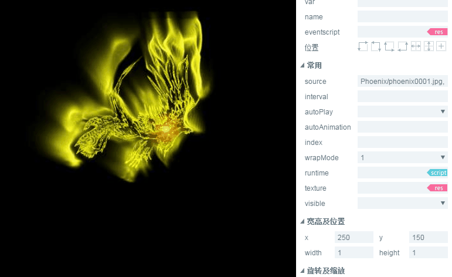

#애니메이션 구성 속성 상세

>> 많은 구성 속성은 통용적이기 때문에 상용 및 통용 구성 요소 속성이 있습니다.`属性设置器`문서 중 이미 소개되었습니다.본 내용을 읽기 전에 우선 속성 설정기를 읽으십시오.

##1, 애니메이션 구성 요소 초기 인식

애니메이션 구성 요소는 애니메이션 구성 요소로 편리한 그림 만들기 혹은 레이어이더를 사용하여 만든 애니메이션이다.동도 1개.

 

(동도 1)

애니메이션 API 소개 참고해주세요.[https://layaair.ldc.layabox.com/api/?category=Core&class=laya.display.Animation](https://layaair.ldc.layabox.com/api/?category=Core&class=laya.display.Animation)

##2, LayairID를 통해 애니메이션 구성 요소 만들기

###2.1 애니메이션 만들기

애니메이션은 항상 쓰는 UI 구성 요소도 아니고 용기 구성 요소도 아니다.그래서 애니메이션 구성 요소를 생성할 때 먼저 시작해야 해요.`组件库`애니메이션 구성 요소를 IDE 로 끌어 넣습니다.`场景编辑器`가운데동도 2 개처럼.

 

(동도 2)

###2.2 source 속성을 통해 애니메이션 데이터소스를 접수

Layaiairide에서 애니메이션 구성 요소를 작성한 후 애니메이션 속성을 통해 애니메이션 데이터를 수용해야 합니다.source 속성은 그림 집합 (여러 장의 그림, 통상 서열 프레임, 그래픽 파일 (.atlas 나 json 접미사), 애니메이션 파일 (.

####2.2.1용 서열 프레임 이미지 생성

열다`资源管理器`미술 자원`同时选中`,`拖拽`이르다`source`속성 표시줄, 그리고 선택한 장면에서 방금 만든 애니메이션 애니메이션, 누르기`回车`키, 애니메이션 재생 효과를 미리 보기 가능합니다.동도 3 개처럼.

 

(동도 3)

**Tips**이 형식으로 만든 애니메이션을 사용하면 모듈 캐시 파일에 캐시 파일이 필요하다면 loadImages () 를 사용합니다.

####2.2.2 그림 파일 만들기

만약 우리가 그림 파일을 저장하면`资源管理器`디렉토리, 도화 파일 직접`拖拽`이르다`source`속성 표시줄, 그리고 선택한 장면에서 방금 만든 애니메이션 애니메이션, 누르기`回车`키, 애니메이션 재생 효과를 미리 보기 가능합니다.동도 4 개처럼.

 

(동도 4)

**Tips**이 형식으로 만든 애니메이션 모듈은 모듈 캐시 캐시 파일에 저장되지 않습니다. 캐시 또는 완료된 반전이 필요하다면 loadAtlas () 를 사용합니다.

####2.2.3 애니메이션 파일로 만들기

작성한 시간축 애니메이션 파일 (접미사) 도 애니메이션 애니메이션 애니메이션 구성 요소로 사용할 수 있으며, 동영상 5개에 직접 보여 줄 수 있다.`拖拽`이르다`source`속성 표시줄, 그리고 선택한 장면에서 방금 만든 애니메이션 애니메이션, 누르기`回车`키, 애니메이션 재생 효과를 미리 보기 가능합니다.

 

(동도 5)

###2.3 애니메이션의 재생 모드 제어 (wrapmode)

애니메이션 재생 패턴 속성 wrapMode 는 3개의 가치가 있으며 기본값은 0, 정렬 재생입니다.1 시 역으로 재생.2 시, pingpong(탁구) 패턴을 선택하면, 자백을 반복한다.다음 그룹의 서열도 자원을 각각 다른 모드 아래 재생 차이를 보여 드리겠습니다.

####2.3.1 정렬 모드 재생

기본 wrapMode 속성을 설정하지 않거나 wrapMode 속성값을 0 시 정렬 재생 방식으로 설정합니다.서열도가 예전부터 뒤의 순서로 방송되는 것이다.

동영상 6이 제시한 바와 같이 서열도 phoenix0001 부터 phoenix025까지 순서대로 방영됩니다.재생 후 다시 phoenix0001 부터 phoenix025까지 종료, 반복 재생.

 

(동도 6)

####2.3.2 카운트 모드 플레이

WrapMode 속성치를 1 시 재생 방식으로 설정합니다.서열도를 앞서가는 순서로 방송하는 것이다.정렬 재생 패턴과는 완전히 상반된다.

동영상 7이 제시한 바에는 서열도 포니x0025부터 포니x0001까지 순서대로 방영된다.재생 후 다시 phoenix025부터 phoenix0001 까지 종료, 반복 재생.

 

(동도 7)

####2.3.3 pingpong (탁구) 모드 재생

자세하게 살펴보면 정서인지 정서인지 역서인지, 이 봉황의 동작이 원활하지 않다는 것을 알 수 있다.이 조화를 설계할 때 미술은 날개가 위에서 아래로 내려오는 춤만 설계해 동작 프레임의 결실이 유창하지 않아 보였다.

wrapmode 속성치를 2 시의 pingpong 모드로 맞추어 이 문제를 해결할 수 있도록 한 동작으로 정서적으로 포니X0001부터 포니X0025까지 틀어 놓았고, 바로 포니X00001로 돌아가는 것이 아니라 phoenix000024에서 포니X0001에서 시작된다.따라서 동작이 더 매끄럽고 온전하게 한다.이에 따라 pingpong 모드도 게임에서 자주 사용하는 모드 중 하나이며, 효과 보장 전제에서 미술자원량을 크게 줄일 수 있다.효과는 동도 8소와 같다.

 

(동도 8)

####2.4 애니메이션의 프레임 간격 시간 (interval)

`interval`속성은 애니메이션의 프레임 간격 시간 (단위: 밀리초) 을 설정할 수 있습니다. 기본값은 50밀리초입니다.예를 들어 우리는 방금 방영된 봉황애니메이션을 한 배 늦춰 100밀리초로 설정한다.효과는 동도 9 소와 같다.

 

(동도 9)

**Tips**：*애니메이션이 재생된다면 설정 후 프레임순환 타이밍을 초기화하는 시간의 초기 시간이 현재 시간으로 재생된다면 interval 을 자주 설정하면 애니메이션 프레임 업데이트 시간이 예상보다 늦을 수도 있고, 업그레이드되지 않는다는 것이다.*

####2.5 설정 자동 재생 (autoPlay)

autoPlay 속성이 자동으로 재생 여부를 설정할 수 있으며 기본적으로 false, 자동으로 재생되지 않습니다.true 로 설정되면 애니메이션이 생성되어 무대에 추가되어 자동으로 방송됩니다.이 속성 설정은 IDE 에서 즉시 미리 보기를 할 수 없습니다. 실행 시 속성 설정 효과를 볼 수 있습니다.

####2.6 효과 이름 자동 재생 (autoAnimmation)

Layaiair IDE 에서 만든 시간축 애니메이션 파일 (.ani 접미사) 안에는 여러 개의 애니메이션 집합이 있을 수 있으며 autoAnimation 속성을 통해 한 애니메이션 이름을 선택할 수 있다.

**Tips**：

##- 레이어이더에서`autoAnimation`속성은 데이터 원본에 불과하다`source`속성은 시간축 애니메이션 파일의 (.ani 접두사) 를 설정할 수 있다. `autoAnimation`속성 값 대응`时间轴动画`편집 중`帧属性`패널`动效名称`이름 중

####2.7 재생 시작 위치 (index)

index 속성은 애니메이션의 프레임 색인을 지정할 수 있으며, 기본값의 색인은 0, 애니메이션의 임의로 설정됩니다.설치 후 설정된 애니메이션 프레임으로 이동합니다.

Tips: 이 속성은 정적 지정에만 사용됩니다. 예를 들어 코드 또는 클릭 이벤트를 통해 애니메이션 프레임을 수동으로 전환합니다.자동으로 방영된다면 0 프레임부터 방영되고 색인의 설정과 상관없다.

####2.8 믹스 모드 설정 (blende)

혼합 모드`blendMode`속성 기본값은 열 수 없습니다. lighter 옵션으로 설정된 후 혼합 모드를 열 수 있습니다.시작하면 효과는 동도 10개와 같다.

< br />

(동도 10)

**Tips**：*혼합 패턴의 배경은 반드시 무대 화보 속에 있어야 한다.예를 들어 Laya.stage.bgColor 만 설정하는 것은 혼합 모드를 실현할 수 없습니다.동영상 10에는 Graphics 사각형이다.*

