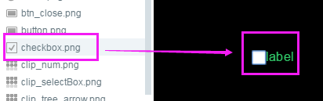
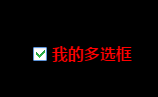

# CheckBox 组件详解

>> 많은 구성 속성은 통용적이기 때문에 상용 및 통용 구성 요소 속성이 있습니다.`属性设置器`문서 중 이미 소개되었습니다.본 내용을 읽기 전에 우선 속성 설정기를 읽으십시오.

##1, Checkbox 구성 요소 만들기

Checkbox (다선 상자) 구성 요소는 두 부분으로 구성되어 상태 상자 및 내용 설명 레이블 label.이 중 상태 상자는 사진 자원, 태그 텍스트로 되어야 합니다.Checkbox 구성 요소를 사용할 때 선택 상자만 사용할 수 있으며 탭 label 만 설정할 수 있습니다.

###1.1 자원 준비

Checkbox 구성 상자의 그림은 Checkbox 구성 요소의 피부 (skin), 그림 자원 이름 통상`check`、`checkbox`혹은`check_`접두사를 위해 그림 1과 같이 보이다.Checkbox 구성 요소는 일반적으로 세 형태나 두 형태의 skin 그림 구성 요소입니다.

< br / > (그림 1)

*Tips: 구성 요소 피부 스킨과 다태 커트스타틴 관련'속성 설정기'문서를 살펴보세요.*

###1.2 엔진으로 바로 Checkbox 구성 요소 만들기


Layaiair 엔진을 사용하여 CheckBox 구성 요소를 만들기는 간단하지만, 일반적으로 몇 단계 불러오기`laya.ui.CheckBox`가방 경로, 자원을 불러오기, Checkbox 실례를 생성하고, Checkbox 구성의 속성을 설정합니다.구체적으로 참고 아래 코드 및 주석을 실현하다.

**입구 종류 CompontDemo.a를 생성하여 다음 코드를 작성합니다:**


```java

package
{
	import laya.ui.CheckBox;
	import laya.utils.Handler;
	import laya.webgl.WebGL;	
	import ui.ComponentDemoUI;

	public class ComponentDemo
	{
      	//资源路径
		private var skin1:String="res/component/check.png";
		private var skin2:String ="res/component/check_2.png";
		
		public function ComponentDemo()
		{
          	//初始化引擎，设置宽高并开启WebGL渲染模式
			Laya.init(1334,750, WebGL);
			
			//设置舞台背景色
			Laya.stage.bgColor = "#ffffff";
			//加载图集成功后，执行onLoad回调方法
			Laya.loader.load([skin1,skin2], Handler.create(this, onLoaded));

		}
		
		private function onLoaded():void {
			
			//创建一个CheckBox实例cb1
			var cb1:CheckBox = new CheckBox(skin1);
			//添加到舞台上显示
			Laya.stage.addChild(cb1);			
			//设置checkbox的坐标位置
			cb1.pos(300,200);			
			//文本标签内容
			cb1.label="我是多选框1";
			//label文本字体大小
			cb1.labelSize = 20;
            //设置为默认选中状态
			cb1.selected = true; 

			//再创建一个CheckBox实例cb2
			var cb2:CheckBox = new CheckBox(skin2);
			//添加到舞台上显示
			Laya.stage.addChild(cb2);			
			//设置checkbox的坐标位置
			cb2.pos(300,300);			
			//文本标签内容
			cb2.label="我是多选框2";
			//label文本字体大小
			cb2.labelSize = 20;
	
		}
	}
}
```


부호 실행 효과 동영상 2개 시사:

< br / > (동영상 2)


**Tips:**Checkbox 구성 요소의 속성 인터페이스 소개 참고해주세요.[CheckBox API](https://layaair.ldc.layabox.com/api2/Chinese/index.html?category=Core&class=laya.ui.CheckBox).


##둘째, LayairID를 통해 CheckBox 구성 요소 만들기

###2.1 Checkbox 만들기

ui 의 DEMO 페이지 생성, 선택 클릭`资源管理器`Checkbox 구성 요소 자원, 장면 편집기, Checkbox 구성 요소를 페이지에 추가하는 데 성공했습니다.

< br / > (그림 3-1)


###2.2 Checkbox 상용 속성 설정

구성 요소를 만듭니다. 속성 설정기를 통해서 구성 요소에 속성을 설정할 수 있습니다.예를 들어 Checkbox 구성 요소의 기본 텍스트는 'label' 입니다. 기본 텍스트를 '나의 다선 상자' 로 수정하고 label 태그 색상, 상태, 글꼴, 크기 등을 설정합니다.3-2, 3-3의 시사와 같다.

< br /> (그림 3-2)


< br /> (그림 3-3)


####2.2.1 label 관련 다른 속성

124대**속성 이름**124대**기능 설명**124대
------------------------------------------------------------------------------------------------------------------------------------------------------------------------------------------------------------------------------------------------
124대 라벨Align (124타) 라벨벳 태그 모드, 기본적으로 정렬되어 있습니다.주: Checkbox 중 무효
1244 labelColors  124타 상태 아래의 텍스트 색상을 표시합니다.형식: upColor, overColor, downColor, disableColor.기본'블루, 그린'이라고 합니다.124대
라벨볼드124테는 라벨볼드의 라벨이 굵은 글꼴인지 여부를 표시했다.124대
텍스트 태그 서명 문자열 이름으로 문자열 형식으로 표시합니다.IDE 중 선택 가능합니다.124대
124대 라벨파딩은 텍스트 탭의 변두리를 표시했다.격식: “ 위쪽 거리, 오른쪽 거리, 밑 거리, 왼쪽 거리 ”124대
텍스트 탭 글꼴 크기를 표시합니다.124대
124대 라벨스트로크 텍스트의 넓이 (픽셀 단위) 입니다.기본 값 0 은 변경 을 표시합니다.124대
1244 labelstroke Color 124사 텍스트 네트 색상을 문자열로 표시합니다.기본 값은 "입니다.#00,000 "(블랙);124테오
124스트로키콜로르 (stroke Color) 는 각 상태의 네모난 색상을 나타낸다.형식: upColor, overColor, downColor, disableColor.124대


####2.2. 다선 상자 크기와 구궁격

특히 구궁격(sizeGrid)이 CheckBox 구성 요소에서 효력이 없다.**다선 상자**크기는 미술 자원을 만들 때 설치한다.


####2.2.3 스킨과 statteNum이 피부자원을 바꾼다


 **skin:**상자의 그림 자원을 선택하십시오.버튼과 유사한 상태나 3태 미술 자원.IDE 또는 프로그램에서 모두 수정할 수 있습니다.

**statteNum:**테두리 상태를 표시하고, 다중 상자의 구성 요소는 기본값으로 세 개의 상태로 지정하면, 그림 4의 형태로 변경되면, 설정이 2, 정상적인 상황에서 최소한 2개의 상태를 선택해야 한다.

< br />(도 4) 양태 미술 자원도
*Tips: 특수한 상황에서도 단태를 사용할 수 있다.예를 들어 label 텍스트만 구성된 Checkbox 구성 요소입니다.*

**두 형태의 Checkbox 조정 사례:**

다음은 우리 상례의 다선 상자가 다른 두 형태의'음악 스위치'다선 상자로 바꾼다.자원 관리자에서 두 가지 형태 자원을 skin 속성으로 끌어당겨 statteNum을 2, label 텍스트를 음악으로 바꾸고 라벨 태그 글꼴 크기와 경계 거리를 조정합니다.5-1, 5-2의 시범.


< br / > (그림 5-1)


< br /> (그림 5-2)


####2.2.4 기본 체크 selected

부엘은 다중 상자가 선택되었는지, 프로그램을 사용하거나 IDE 설정을 사용하여 CheckBox seleced 속성값을 true, 표시 후, 그림 6에 표시할 수 있습니다.

<br/>  （图6）


####2.2.5 설정할 수 없는 속성 togle

togle은 눌렀을 때 구성 요소의 디스플레이 상태를 바꿀 지 여부를 결정합니다.이 속성은 Checkbox 구성 요소에서 false 로 바꾸지 말아야 한다. 그렇지 않으면 버튼 모드로 변할 수 있으며, 영원히 선택되지 않는다는 것이다.


