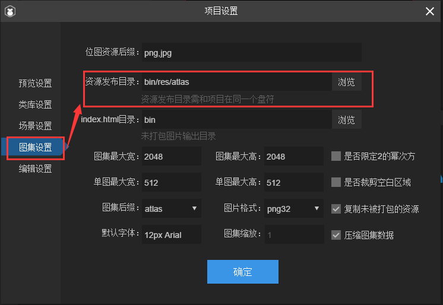

#도집 제작 및 사용 상세

>> author:charley Language:Action Script3 update:2019.01.11.

*【주의】 이번 교정은 레이어이드의 2.0.0 버전을 채택하고 있으며, 글에는 다른 LayairIDE 버전으로 최신 LairIDE 버전을 기준으로 합니다.*


그림 (Atlas) 는 게임 개발에서 흔히 볼 수 있는 미술 자원을 사용하여 여러 장의 그림을 합병하고, 아트las와 json 등 형식의 파일을 통해 원시 사진 자원 정보를 저장합니다.그림 1은 레이레이어이더가 포장한 png 그림 자원을 채택하는 것이다.


   


(그림 1)


##1. 도화자원을 왜 사용합니까?

**게임에서 여러 장의 그림이 합성된 도집 자원을 미술 자원으로 사용하여 다음과 같은 장점이 있습니다:**

####1.1 메모리 최적화

합성 도집은 그림 주위의 공백 지역을 제거하고 전체적으로 각종 최적화 알고리즘을 실시할 수 있으며, 합성 도집 후에는 게임 패키지와 메모리 점용을 크게 줄일 수 있다.

####1.2 CPU 연산 감소

여러 개`Sprite`만약 렌더가 동일한 그림에서 온 그림이라면 이런 것들`Sprite`같은 보카시 도매를 사용하여 처리할 수 있으며 CPU 의 연산 시간을 크게 줄여 실행 효율을 높일 수 있다.


##2. 그래프 패키지 지원 형식

LayaiairIDE는 PNG 와 JPG 두 가지 자원 형식에 대한 포맷을 모음으로 지원합니다.하지만 그래픽 패키지는 원시 자원을 추천하며 PNG 를 사용하는 것은 JPG 의 부피가 크기 때문이다.

*Tips: PNG 원본 자원의 깊이가 32를 넘으면 안 된다. 그렇지 않으면 포장된 그림이 꽃화면이 나타난다.또 PNG 와 JPG 자원은 다른 형식의 자원을 PNG와 JPG 형식으로 바꾸는 것이 아니다.*


##3. LayairierIDE 그림 만들기 방식

Layaiairide에서 패키지 패키지 방식은 모두 두 가지입니다.

####3.1 IDE 그림 패키지 도구

IDE 내비게이션`工具`메뉴 중 클릭`图集打包`그림 세트 패키지 패널 열기

  


(2)

　　(그림 3)


**도집 포장 도구 패널 설명**

**`资源根目录`**

`资源根目录`그래픽 패키지 전에 원시 자원 디렉토리의 아버지 급 디렉토리 아래에 모든 디렉토리가 도집 파일을 원본 디렉토리에 맞추어 여러 디렉터리가 생성됩니다.(패키지 후 그래픽 파일은 자원 루트 디렉토리의 하위 디렉터리로 이름을 지어서 그림 4, 그림 5개

 


(그림 4)

　  


(그림 5)


####조작 힌트:

직접 디렉토리를 끌다`资源根目录`입력 상자 혹은 클릭`浏览`디렉터리 경로를 얻는 동시에`输出目录`자동 작성`资源根目录`상당한 경로.

#### **`输出目录`**

`输出目录`패키지 후 도집 자원 보관 디렉터리를 가리킨다.

기본 자원 루트 디렉터리가 같을 때 클릭할 수 있습니다`浏览`가다`输出目录`입력 상자 안에 경로를 변경합니다.

*Tips: 출력 디렉토리를 디렉터리를 채택할 수 없습니다. 그렇지 않으면 자원 루트 디렉토리에 영향을 끼칠 것입니다.*

#### **`图集最大宽\高度`**

기본 값`2048×2048`이 값은 단일 도화의 최대 치수를 결정한다.원시 그림이 너무 많으면 1개 도집이 가장 넓을 때, 포장할 때 새 도집 파일을 생성할 수 있다.

#### **`单图最大宽\高度`**

기본 값`512×512`이 사이즈가 넘는 싱글 사진은 사진에 싸이지 않을 것이다.

*Tips: 512×512를 넘는 싱글 사진은 도화에 집중할 것을 제안하지 않고 단독으로 이 그림을 불러올 수 있지만, 가재도 1024×1024를 넘을 수 없다. 그렇지 않으면 성능에 영향을 미칠 수 있다.*

#### `缩放系数`

그림 크기를 줄일 수 있다. 예를 들어 0.5 로 변경하면 공구는 0.5 로 각각 0.5로 생성할 수 있다. 그림의 크기를 끌어 올리고 원도 크기를 유지할 수 있다. 이렇게 처리한 후에는 그림의 크기가 작아질 수 있지만, 보이는 효과도 영향을 미칠 수 있어 하나의 그림의 다른 압축 방안으로 볼 수 있다.설계 시 그림의 정도를 유지하려면 기본값을 조정하지 않도록 하세요.

#### **`2的整次幂`**

만약 선택하면 생성된 그림의 크기가 높으면 2차 정멱이다.이곳에서는 미술을 설계할 때 2차 정차로 설계하고, 그래프 도구를 통해 2차 정차로 유지할 것을 권장할 때, 그래프 체적이 커질 것이다.따라서 일부 강제 요구 요구 사항 중 2의 전체 제곱 최적화 Runtime 환경, 일반적 상황에 걸릴 필요 없이 미술 설계 인원, 32, 64, 128, 256 등 2의 전체로 설계 그림의 폭이 높습니다.

#### **`空白裁剪`**

만약 선택하면 생성된 그림 그림은 자동으로 원본 그림의 공백 구역을 잘라낸다.기본은 체크 상태입니다. 빼지 마세요.

#### `数据文件后缀`

데이터 파일 접미사 기본값은 atlas 이며 json 을 선택할 수 있습니다.하지만 Google은 Layair 엔진을 사용할 때 아일라스가 그림으로 되어 있는 접두사를 사용할 것을 건의합니다.


###3.2 자원 관리자 내 자동 도집

####3.2.1 도화 포장 방식

#### **LayaiairIDE 내보내기 시 자동으로 Assets 디렉토리 안의 자원 백**

자원 관리자 디렉토리 (Assets) 내 모든 그림 자원 자원은 그림 6-1에 보여 준다.누르다`F12`혹은`Ctrl+F12`내보낼 때**자동 디렉토리 이름에 따라 도집**6-2의 시범.

 


（6-1）

####자원 관리자 내보내기 경로

UI 등을 프로젝트로 내보내면 자동으로 좋은 그림집 기본값에 위치합니다.`项目根目录/bin/res/atlas/`"디렉토리 아래에서 그림 명칭은 포장 도구의 도집 이름과 같이 Assets 내의 하위 디렉토리 이름으로 그림 6-2의 보여 줍니다.


   


(사진 6-2)

####기본 도화 내보내기 경로 변경

그림% 1개의 캡션을 편집했습니다.`项目设置`패널의`图集设置`난의`资源发布目录`그림 세트 내보내기 경로를 변경합니다. 그림 6-3의 시사입니다.도화가 가장 큰 폭과 포장을 하지 않는 단도폭 제한 기준을 설정할 수 있다.각 인자 의 의미 와 윗글 의 도집 도구 소개 같은 것 이다.

  


(사진 6-3)

#### **어떻게 사용하지 않은 자원을 도집 안에 저장하지 않음**

`资源管理器`항목 장면에서 사용하지 않으면 메뉴를 통과하는 자원`导出`->`发布（不打包未使用）`기능, 예를 들면 6-4.사용하지 않은 자원을 도집 안에 포장하지 않고 도집 크기를 줄일 수 있습니다.그러나 이러한 패키지는 모든 자원의 사용 상태를 두루 옮겨야 하므로 패키지 속도가 느리기 때문에 이 방식은 일반적으로 선상 버전만 발표할 때 사용된다.

 


(사진 6-4)

#### **어떻게 한 장의 자원 설정 에 도집 에 설치 하지 않 았 다**

자원, 왼쪽 단추를 두 번 누르거나 오른쪽 단추 선택`设置默认属性`6-5에 제시한 것처럼.자원 속성 설정의 패널 열기.

   


(사진 6-5)

속성 패널 설정 중`打包类型`설정`不打包`유형은 6-6의 시사와 같다.이 자원은 그림에 집중되지 않는다.

 


(사진 6-6)


##4. 생성된 그림 파일 소개

####4.1 생성된 그림 파일

도집 을 포장한 후, 도집 전용 자원 을 생성할 수 있다`.atlas`파일 (또는)`.json`파일`.png`파일), 그래픽 패키지`rec`파일 (* 이 rec 파일 클러치 소프트웨어 사용, 개발자는 상관하지 마세요 *), 위의 그림 6-2

####4.2 atlas json 의 그림 접미사 구별

`.atlas`과`.json`파일은 모두 png 그림의 프로필 파일이다.초기 Layaiair 엔진은 기본적으로 json 을 도집 프로필 형식으로 사용한 후 엔진의 사용을 최적화시키기 위해 기본 변경`.atlas`그러나 오래된 버전을 호환하기 위해 도집을 생성할 때, 오랜 시간 IDE 버전 두 가지 형식이 존재한다. 현재 LayairIDE 버전은 기본 생성`.atlas`json 을 생성하려면 그림 접미사 설정을 변경해야 합니다.

사용할 때 이 두 가지 접미사의 차이는:

`.atlas`LayaiairIDE 특유의 그림 형식입니다. 그래픽에만 사용되어 있습니다.`.atlas`유형에 기입할 필요는 없고 일반 싱글 방식과 같이 더욱 편리하고 추천하는 그림의 다운로드 방식입니다.atlas 방식으로 도집을 불러오는 사례 코드:


```typescript

//atlas方式图集使用示例
Laya.loader.load("./res/atlas/test.atlas", Handler.create(this, onLoaded));
```


`.json`세 번째 도집 설정 방식을 겸용`.json`파일 응용은 광범위하고, 도집 뿐만 아니라, 도집 설정 정보를 인식하기 위해서, 다운로드하는 중`.json`파일의 그림은 형식을 기입하여 구분해야 한다.json 방식으로 도화를 다운로드하는 예례 코드:


```typescript

//json方式图集使用示例
Laya.loader.load([{url: "res/atlas/test.json", type: Laya.Loader.ATLAS}], Handler.create(this, onLoaded));
```


##5. 도집을 포장하는 실수

####그림 파일 삭제 후 다시 내보낼 수 없는 문제

사용자가 그림 파일을 수동적으로 삭제하였으나, rec 파일을 삭제하지 않았을 때, 그림 7-1의 보여 줍니다.이런 상황에서**원본 자원이 바뀌지 않았다면 F12 를 직접 사용하면 도집 파일을 다시 내보낼 수 없습니다.**

이때 단축키를 통과할 수 있다`Ctrl+F12`제거하고 내보내기.아니면 바로 rec 파일도 삭제하고 F12 로 내보내기.도화를 정상적으로 내보낼 수 있습니다.

 


(7-1)


##6. 프로젝트에서 그림 사용을 어떻게 하는지

프로젝트에서 집중된 자원을 사용한다면 그림을 미리 업로드하고 그림을 설치한 피부 (* skin *) 속성치를 ‘ 원소도 목록 / 원소 자원 이름.


 

（6-1）

   


(그림 1)

####자원 관리자

예를 들어: 윗글 중 6-1 의 자원 포장을 한 뒤 그림 1개처럼 보여, 현재 우리는 6-1 중`test`디렉토리의 작은 그림`c1.png`항목에서 그림 집합 방식으로 표시, 예시 코드 8개 표시:

 


(그림 8)

Layaiair 2.0 IDE 가 프로젝트를 만들 때 초기화, 그래픽 가재 등 기초 코드를 잘 작성하기 때문에 C1.png 그림에 집중할 수 있는 그림을 직접 쓰기로 합니다.

핵심 코드 다음과 같습니다:


```javascript

    //创建Image实例
    var img = new Laya.Image();
    //设置皮肤（取图集中小图的方式就是 原小图目录名/原小图资源名.png）
    img.skin = "test/c1.png";
    //添加到舞台上显示
    Laya.stage.addChild(img);
```


코드 실행 효과는 그림 9개처럼 표시됩니다:

(그림 9)

그림 9시에 제시한 그림에서 작은 그림 자원을 집중하여 항목에 응용할 수 있는 중`sink`값`test/c1.png`그래픽 패키지 앞에 대응하는 디렉터리와 자원 이름과 경로다.

이 글이 끝나면, 만약 의문이 있으면 동네에 가서 제출하십시오.[https://ask.layabox.com](https://ask.layabox.com/)


##본문 칭찬

만약 본문은 당신에게 도움이 된다고 생각하시면, 스코드가 작가님을 환영합니다. 당신의 격려는 우리가 더 우수한 문서의 동력입니다.

