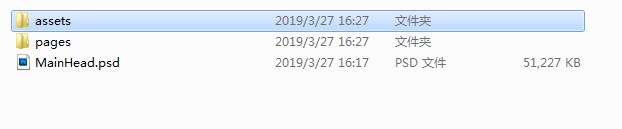

#PsDToUI 와 사용 자세한 해석

>> author:Laya update:2019.03.27

*【주의】 이번 교정은 레이어이드의 2.0.0 버전을 채택하고 있으며, 글에는 다른 LayairIDE 버전으로 최신 LairIDE 버전을 기준으로 합니다.*

laya 의 집적 도구 속 Psd2UI 는 일정한 규칙에 따라 psd 파일을 공구로 바꿀 수 있는 UI.

도구를 열면 아래의 인터페이스를 볼 수 있습니다. psd 가 포함된 폴더를 끌어들여 확인할 수 있습니다.

psd 를 작성하려면 일정한 규칙에 따라 laya 사용된 UI, 규칙을 변경할 수 있습니다.

1, 식별할 수 없는 유형은 모두 image, 이 점과 IDE 편집기와 일치합니다;

2, box 와 Label 을 제외하고 다른 것은 모두 IDE 의 ui 이름과 일치, 접두사 또는 접두사

3, 컨트롤 모두 접두사, 접두사 규칙, 3은 아래와 같은 그림, 하위 폴더 normal, over, down

4, Container 접두사가 Box 용기로 인식되며 Label 텍스트 컨트롤뿐만 아니라 소문자 txt 를 접두로 하거나 대문자 Txt

   

변환 후 두 개의 폴더를 볼 수 있습니다.

asets 폴더에 있는 내용을 항목의 asets 폴더에 넣어야 합니다. pages 폴더에 대한 내용을 프로젝트의 pages 폴더에 넣을 수도 있습니다.

그리고 항목의 편집 모드를 열면 유이가 제작된 것을 볼 수 있으며 다음과 같습니다:

더 많은 문제는 ask.layabox.com 방문해주세요