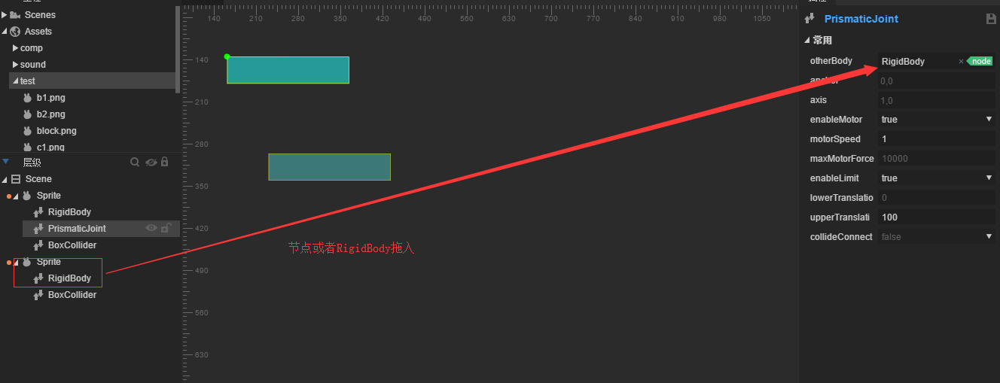
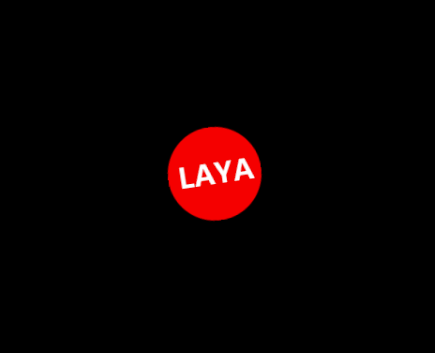

#회전,톱니바퀴 관절

##내용 개술

게임 개발에서 관람카드 디자인은 벨트, 기어 전동, 이동 플랫폼 등 장치를 사용하여 다음 관절 조합을 사용하여 빠르게 구속 관계를 만들 수 있는 시스템을 만들 수 있다.

이 내용은 세 가지 관절에 쓰여야 한다:

관절 평정`PrismaticJoint`회전 관절`RevoluteJiont`톱니바퀴 관절`GearJoint`.

관절 조합을 사용하여 일부 기관장치를 사용할 수 있으며, 예를 들면 가로로 이동하는 플랫폼이 기어를 회전하고, 작은 모퉁이를 들어올릴 수 있다.

​

###1. 관절 소개

관절 평정`PrismaticJoint`이동 관절은 두 개의 물체가 지정된 축을 따라 상대적으로 이동하도록 허용한다.

#####속성 소개

#####otherbody

[첫 설정 유효] 관절의 연결 강체는 설정할 수 없습니다. 기본값은 왼쪽 왼쪽 왼쪽 좌측 공콩체로 연결되어 있습니다.

#####anchor

[첫 설정 유효] 관절의 컨트롤 포인트는 자신의 강체에 대한 왼쪽 왼쪽 좌측 위치 이동이다.

#####axis

[첫 설정 유효] 벡터 값, 운동 방향 설명, 예를 들어 1, 0은 X축을 따라 오른쪽으로.

#####enableMotor

모터가 열리는지 모터가 열리는 것은 목표 강체 운동을 할 수 있다.

#####mortorSped

모터 사용 후 axis 좌표축에서 최대 속도를 이동합니다.

#####maxMotorForce

모터 사용 후 최대의 힘을 가할 수 있습니다.

#####enableLimit

강체의 이동 범위에 대한 구속이 가능한가.

#####lowerTranslation

제한 후, 강체 이동 범위의 하한을 사용하면, 간격 anchor 의 편도량 (마이너스) 입니다.

#####upperTranslation

제한 후, 강체 이동 범위의 상한을 사용하면, 거리 anchor 의 편일량이다.

#####collideConneced

[첫 설정 유효] 두 개의 강체의 충돌이 발생할지, 기본적으로 false 입니다.

####실례 연습

가장 기본적인 이동 관절 을 단독 으로 사용하는 것 은 매우 간단한 것 이고, 네모난 것 을 끌어서 첨가한다`boxcollider`충돌체는 그에게 평이관절을 첨가한다`PrismaticJoint`강체`rigidbody`중력`gravityScale`0, axis 설정 (1, 0) 과 모터가 켜지고, 속도를 1, 최대 최소 이동량을 제한합니다. 효과는 그림에 따라 표시됩니다.

실행 효과는 다음과 같습니다 (아래는 물리 보조선의 효과를 나타내고, 상편 문서는 소개되어 있으며, f9 에 따라 선택할 수 있습니다.)

​      

게임을 더 재미 있게 하기 위해서는 플랫폼과 플랫폼의 연결을 사용하여 네모난 부분을 끌어 당겨 장사각형을 만들어 충돌을 첨가하고 강체적으로 사용해야 한다`rigidbody`중력`gravityScale`0으로 설정하고, 첫 번째 네모난 변두리 관절에 강체를 끌어들인다.`PrismaticJoint`의`otherbody`위에서 모터를 켜고, 속도를 1, 방향을 1, 0, 크기 변환 제한을 진행하고, 그림에 제시한 것처럼 설정합니다.

실행 효과는 문제가 된다. 두 번째 방도 하나의 평이관절이 필요하기 때문이다. 두 번째 네모듈에 평이관절을 추가하여 실행 효과가 다음과 같다.

여기까지만 해도 반삼의 개발자는 이 평이가 서로 향하거나 등을 평평하게 움직일 수 있다는 것을 알아볼 수 있다. 단 한 축에서 다가서거나 멀리서거나 동시에 한 방향으로 이동할 수 없다는 것이다.관절은 상대적으로 이동할 뿐 필자는 국내외의 문서를 검열하고, 공식 수첩을 상세하게 소개하지 않고, 필자는 실험용 방법을 거쳐 기능을 실현하였기 때문에, 물리 시스템을 사용할 때 반드시 물리사상에 따라 설계해 생각해야 한다.

우리 는 이전 의 예 를 계속하여 위 쪽 쪽 쪽 의 평선 관절 을 이어간다`PrismaticJoint`안의`otherBody`삭제

그리고 간격관절 하나 더 넣어주세요.`DistanceJoint`아래쪽 네모퉁이에 고정관절을 추가합니다`PrismaticJoint`그리고 이 물체의 강체`RigidBody`위 물체의 거리 관절에 끌어들인다`otherBody`그림 같다

설치된 후 실행 효과는 아래와 같습니다 (위쪽 모터가 오른쪽으로 이동하고, 다음 거리 관절에서 아래의 네모난 물체를 오른쪽으로 이동합니다):

###2. 회전관절 소개

회전 관절`RevoluteJiont`두 개의 물체를 강제로 공유하여 닻점을 두 개의 물체가 상대적으로 회전한다.

#####속성 소개

#####otherbody

[첫 설정 유효] 관절의 연결 강체는 설정할 수 없습니다. 기본값은 왼쪽 왼쪽 왼쪽 좌측 공콩체로 연결되어 있습니다.

#####anchor

[첫 설정 유효] 관절의 컨트롤 포인트는 자신의 강체에 대한 왼쪽 왼쪽 좌측 위치 이동이다.

#####enableMotor

모터가 열리는지 모터가 열리는 것은 목표 강체 운동을 할 수 있다.

#####mortorSped

모터를 사용하면, 달성할 수 있는 최대 회전 속도.

#####maxMotorTorque

모터를 사용하면 가장 큰 간격을 가할 수 있으며, 가장 큰 트임이 너무 작아지면 회전하지 않습니다.

#####enableLimit

강체의 회전 범위에 대해 구속을 가할 것인가.

#####lowerAngle

제한 후, 강체 이동 범위의 하한을 사용하면, 간격 anchor 의 편도량 (마이너스) 입니다.

#####uperAngle

제한 후, 강체 이동 범위의 상한을 사용하면, 거리 anchor 의 편일량이다.

#####collideConneced

[첫 설정 유효] 두 개의 강체의 충돌이 발생할지, 기본적으로 false 입니다.

####실례 연습

새로 한 장면 을 짓고, 그 후 원형 그림 을 끌어서 원형 충돌체 를 첨가한다`CircleCollider`IDE 는 자동으로 강체를 추가합니다`RigidBody`그리고 회전 관절 추가`RevoluteJoint`관절의 닻점은 원심에 설치되어 모터를 켜고 회전속도를 1로 설정했다.그림:

돌아가는 원형을 볼 수 있습니다:

단독 사용 아주 간단 한, 다음은 그룹: 이 예를 바탕 에 네모난 충돌체 를 추가합니다`BoxCollider`길이의 사각형 은 플랫폼으로 되어 마치 그림 같다

그리고 관절`PrismaticJoint`다각형 충돌 추가`PolygonCollider`삼각형은 원형으로 삼각형에 빙빙 돌릴 수 있도록 한다. (삼각형 노드 부분은 원형 노드 윗부분에서 아래쪽의 맨 앞에 표시되어 있으며 최종 효과는 아래와 같이 아래쪽을 추가하여 개발자가 스스로 완성해야 한다.

동작을 누르면 효과가 다음과 같습니다:

###3. 톱니바퀴 관절 소개

톱니바퀴 관절`GearJoint`두 개의 톱니바퀴 사이의 구속 관계에 쓰여, 기어가 회전할 때 발생하는 동량은 두 가지의 출력 방식을 가지고 있으며, 하나는 기어 자체의 각 속도이며, 다른 하나는 기어 표면의 선 속도이다.

#####속성 소개

#####joint1

[첫 설정 유효] 묶는 첫 관절, 유형은 RevoluteJoint 또는 Prismaticjoint.

#####joint2

[첫 설정 유효] 묶을 두 번째 관절, 유형은 RevoluteJoint 또는 Prismaticjoint.

#####ratio

두 톱니바퀴 속도 비율, 기본 1.

#####collideConnct

두 개의 강체는 충돌이 발생할 수 있는지, 기본적으로 false 로 인식된다.

####실례 연습

평이관절을 파악하고 회전 관절이 끝난 후에는 톱니바퀴 관절이 두 개의 관절과 연관되어 연결이 되므로 관절에 따라 단속하여 하나의 전체적인 시스템을 완성할 수 있다.우리는 조금 복잡한 꼬마 조합을 만들어 보자.

새로 빈 장면을 짓고 gear 로 이름을 지어서, 장면에서 네모난 모양을 끌어들이고, 둥근 모양을 아래로 늘어놓는다.

위에서부터 아래까지 sprite 이름을 다음으로: box, circle1, yellow, circle2, sprite.명명은 우리가 구체적인 물체를 정비하기 위한 것이다.그리고 물체마다 충돌체를 첨가하면 ID는 자동으로 강체를 첨가할 수 있습니다. (이 단계는 전문에서 소개하는 지식이 필요합니다. 어떻게 첨가할지 모르면 이전 내용으로 공부하십시오.

위치를 잡고 맨 윗부분에 평이관절을 추가합니다.`PrismaticJoint`상응하는 속성을 설정하여 아래와 일치하게 하다

그리고 circle1 물체에 해당하는 관절을 추가하여 회전 관절을 추가합니다`RevoluteJoint`톱니바퀴 관절`GearJoint`그리고 고정관절과 회전 관절을 조인t1, joint2 위치로 끌어 두 개의 연관과 연결시킨다.

동리적으로 남은 원형에 회전 관절을 첨가하다`RevoluteJoint`톱니바퀴 관절`GearJoint`두 개의 물체 연결, yellow 연결 circle1, circle2 연결 yellow, sprite 연결 circle2, sprite`PrismaticJoint`아래와 같이 설정, 그의 y 축 기호를 주의하십시오:

가장 먼저 네모드 박스 모터가 열릴 때 모든 물체의 이동 또는 회전 효과가 다음과 같습니다:

더 많은 문제는 커뮤니티 htp: / ask.layabox.com