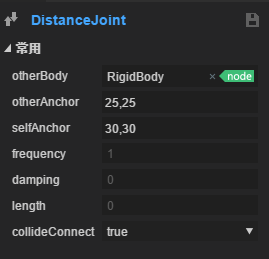
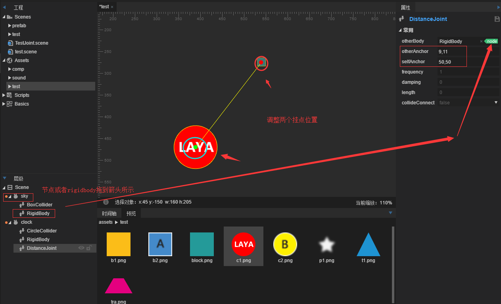

#2D 관절 시스템

###1. 2D 관절

물리 게임 개발에서 복잡한 시스템을 향상시키려면 물체 사이에 각종 구속을 해야 하고, 보이스2D는 관절시스템을 제공한다.관절은 두 개나 여러 물체에 대해 일종의 구속을 할 수 있다.

**Box2D 지원하는 관절이 있습니다.**：

거리 관절`DistanceJoint`두 개의 물체 위에 각각 조금씩, 두 시 사이의 거리가 고정되어 있다.

톱니바퀴 관절`GearJoint`두 개의 톱니바퀴 사이의 구속 관계에 쓰여, 기어가 회전할 때 발생하는 동량은 두 가지의 출력 방식을 가지고 있으며, 하나는 기어 자체의 각 속도이며, 다른 하나는 기어 표면의 선 속도이다.

엔진 관절`MotorJoint`

마우스 관절`MouseJoint`마우스 조종 물체에 사용합니다.그것은 물체를 현재 마우스 커서 위치로 끌어올리려고 합니다.회전 면에서는 제한이 없다.

관절 평정`PrismaticJoint`이동 관절은 두 개의 물체가 지정된 축을 따라 상대적으로 이동하도록 허용한다.

도르래 관절`PulleyJoint`두 개의 물체의 접지 (ground) 를 서로 연결하여 하나의 물체가 상승하고 다른 물체가 떨어지게 된다.

회전 관절`RevoluteJiont`두 개의 물체를 강제로 공유하여 닻점을 두 개의 물체가 상대적으로 회전한다.

밧줄 관절`RopeJoint`두 시 사이의 최대 거리를 제한하다.큰 부하 아래 연결을 막는 물체 사이의 스트레칭.

용접관절`WeldJoint`두 개의 물체를 상대적으로 운동할 수 없게 하고 두 개의 강체의 상대 위치와 각도가 모두 변함없이 유지되어 하나의 전체와 같다.

바퀴관절`WheelJoint`노드 회전을 둘러싸고 탄성 속성을 포함하여 강체는 노드 위치에 탄성 변동이 발생한다.

모든 관절은 모두 Compont에서 이어진다.

###2. 관절 구성 요소 소개

####2.1거리 관절

 

관절에서 두 노드 를 구속 하는 거리 는 시종 변함 을 유지 하 고 나무 막대, 뼈, 스프링 같은 구속 관계 다.

#####속성 설명

#####otherbody

[첫 설정 유효] 관절의 연결 강체는 설정할 수 없고, 기본값은 왼쪽 왼쪽 좌측 공강체입니다.

#####otherAnchor

[첫 설정 유효] 링크 링크 링크 지점은 otherBody 의 왼쪽 좌측 위치 이동입니다.

#####selfAnchor

[첫 설정 유효] 자체 강체 링크 지점은 자신의 강체에 대한 왼쪽 좌측 위치 이동이다.

#####frequency

스프링 시스템 의 진동 주파수 는 스프링 의 탄성 계수 로 볼 수 있다

#####damping

강체는 노드를 넘어 받는 저항으로 0~1 수준을 제안한다.

#####length

구속의 목표 정지 길이.

#####collideConnct

[첫 설정 유효] 두 개의 강체의 충돌이 발생할지, 기본적으로 false 입니다.(true 로 캡처해서 헷갈리지 않도록 주의하세요)

#####예를 들어 훈련하다.

저희가 일단 거리 관절로.`DistanceJoint`단자 효과:

새 2d 사례 항목을 만들기, test, Assets 디렉토리 아래 test 폴더를 시작하면 미리 남겨진 도형을 볼 수 있으며, 테스트 물리 엔진을 사용하여

편집 모드에서 f9 를 선택하거나 물리 보조선을 표시하지 않습니다.그림:

클릭 클릭 후, 화면에서 block.png, c1.png, 효과가 그림처럼 나타났습니다.

그리고 우리는 이 두 개의 sprite 구성 요소를 추가하고, 네모난 모듈을 선택하면 오른쪽 속성 패널 추가하기 단추를 누르고 추가합니다.`BoxCollider`구성 요소, IDE 자동 강체 추가`RigidBody`다음과 같이

동리`CircleCollider`joint 메뉴 안에 있는 거.`DistanceJoint`IDE 자동 추가`RigidBody`최종 효과:

CTRL + S 를 저장한 후 실행하면 다음과 같습니다:

단자적인 효과가 나타나지 않은 것은 네모난 강체 유형이기 때문이다`dynamic`동태적 으로 우리 는 그 에게 설치 해야 한다`kinematic`운동 유형은 중력의 영향을 받지 않고 고정한다.네모난 물체 선택, type 속성 하위 메뉴 중 선택`kinematic`그림:

저장한 후 실행 후 우리는 볼 수 있습니다. 단자적인 효과는 바로 만들어졌습니다.

다음, 우리는 조금 풍부한 물리 효과를 만들어야 한다.

장면 에서 두 개의 원형 을 끌어들이고 원형 충돌기 를 첨가한다`CircleCollider`원 거리 관절 추가`DistanceJoint`또 다른 동그란 강체를 묶어 두개의 닻점을 둥근 중심에 설치하고 IDE 왼쪽'층급'패널에 sprite 를 추가하고 선형 충돌기를 추가합니다`ChainCollider`클릭`ChainCollider`두 가지 거리를 길게 늘린 후 단기'선'은 온라인에 한 개의 접점을 첨가하고, 이런 절차를 반복하여, 계단형 충돌체를 만들어, 접선의 강체`RigidBody`의`type`속성 설정`static`정적 유형 (우리는 그가 물리 운동을 할 필요가 없다) 이후 충돌체 위에 네모난 부분을 끌어들이고 사각형 충돌기를 추가한다`BoxCollider`그를`restitution`마찰력 속성은 0.5로 설정되어 탄력을 갖게 한다.다시 계단 밑 에 작은 언덕 을 만들어 삼각형 을 끌어 다각형 충돌기 를 첨가했다`PolygonCollider`삼각형`RigidBody`텍스트 형식 설정`Kinematic`운동 유형은 힘을 받지 않도록 한다.최종 효과와 계층 구조가 그림처럼 보여집니다:

이 단계를 완성한 후 실행을 저장하면 다음과 같습니다:

이 편은 예례가 완성되면 이해와 파악, 모든 유형의 충돌체, 세 가지 강체 타입, 탄력계수 및 거리 관절의 사용을 할 것입니다.

후속된 문서는 다음 그림에서 보여준 모든 효과를 속속 소개한다.

