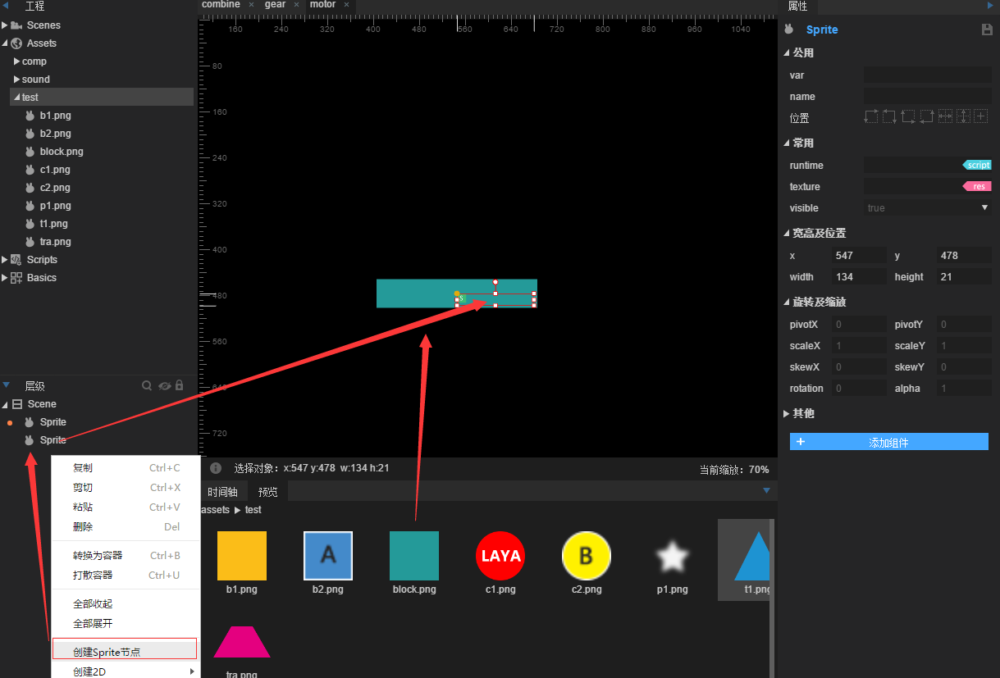
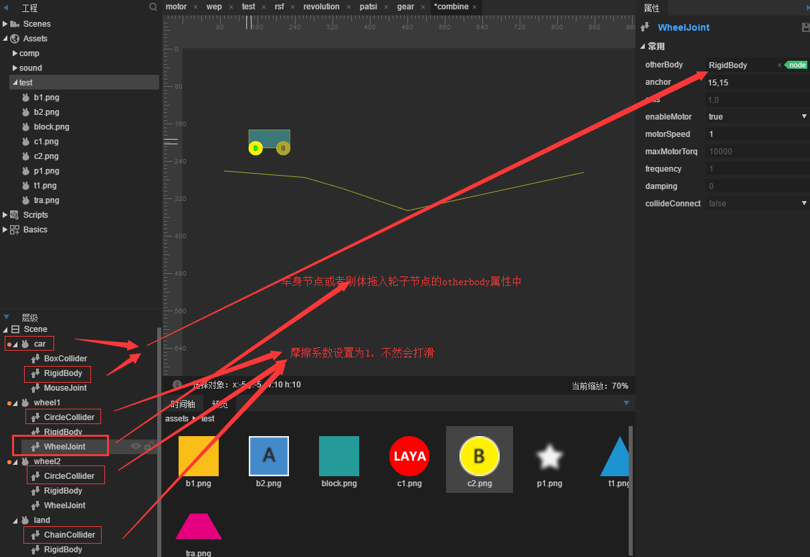
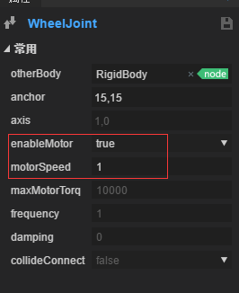
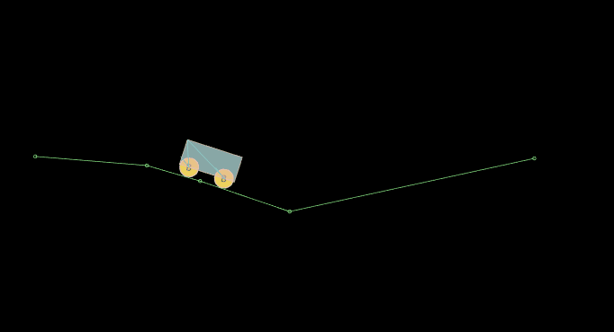

#모터 관절

###1. 모터 관절

모터 관절`MotorJoint`두 개의 강체를 제한하는 데 쓰여 상대적인 위치와 각도가 변하지 않게 하고,

모터 관절은 목표점으로 영원히 이동하고 특정한 각도를 유지한다.

#####속성 설명

#####otherbody

[첫 설정 유효] 관절의 연결 강체.

#####linearOffset

otherBody 좌표 위치에 기반된 편일량도 selfBody 의 목표 위치다.

#####angularoffset

otherBody 에 기반된 각도 셀피보이의 목표 각도다.

#####maxForce

selfBody 가 목표 위치를 찾을 때 목표 위치를 회복하기 위해 모터 관절에 가장 큰 힘을 썼다.

#####maxTorque

솔피보이디가 목표 각도와 달리 목표 각도를 달성하기 위해 모터 관절의 가장 큰 역력이다.

#####correction Faction

selfBody 가 목표 위치를 이동할 때 유동 인수, 값을 0~1 치르면 속도가 빨라진다

#####collideConnct

두 개의 물체는 충돌이 발생할 수 있는지, 기본적으로 false 입니다.

####실례 연습

모터 관절의 소개는 이해가 안 된다. 우리는 간단한 예로 모터 관절을 잘 이해하고, 한 장면을 만들기 위해 모터.scene 을 만들기 위해 네모나 슬라이드 를 끌어들이고, 층급에서 마우스 오른쪽 키보드 를 생성하고, 노드 의 닻점(왼쪽 뿔)을 길게 이동하는 중심점(모터 관절 때문에 강체에 작용한다.강체는 물체의 왼쪽 좌각에서 고칠 수 없으므로 이런 부위의 노드 방식으로 그래픽 sprite 는 렌더 노드를 사용한다)

그리고 긴 sprite 를 빈 sprite 노드 로 끌어 넣으면 빈 노드 노드가 될 수 있습니다.그림:

아버지의 노드 에 사각형 충돌기 를 첨가 하다`BoxCollider`이때 충돌기 크기는 길이의 그래프와 크기가 아니라, 아버지의 노드 sprite 크기와 크기를 조정해야 한다. 크기와 위치를 조정해야 한다.

그리고 아비 노드 sprite 에 모터 관절 추가 (기본 속성), 마우스 관절 (끌기, 마우스 관절에 닻점을 설치하지 않고 어디에 추가합니까? 닻점을 설정하면 고정 위치로 지정합니다.부친 노드 sprite 에 graphic 사각형을 추가하여 크기 설정과 도형처럼 크기를 크기 조정하고, renderType 를 hit 으로 설정하여 이 아이콘을 마우스 클릭 영역으로 눌렀습니다.원형 충돌체가 모터 관절의 목표점을 원형으로 끌어들인다.

이 단계를 완성한 후 사각형 위치를 길다란 그래프와 함께 겹쳐줍니다.

그리고 원형 노드 또는 강체 rigidbody 를 모터 관절에 끌어들인 otherbody 중 그림:

이 단계에 이르렀을 때, 아주 간단하고, 운행을 저장하면, 모터 관절의 효과를 볼 수 있습니다.

###2. 바퀴관절

바퀴관절`WheelJoint`노드 회전을 둘러싸고 탄성 속성을 포함하여 강체는 노드 위치에 탄성 변동이 발생한다.

물리 차바퀴를 만드는 데 쓰다.

#####속성 설명

#####otherbody

[첫 설정 유효] 관절의 연결 강체.

#####anchor

[첫 설정 유효] 관절의 링크 포인트는 자신의 강체에 대한 왼쪽 좌측 위치 이동이다.

#####axis

[첫 설정 유효] 벡터 값, 운동 방향 설명, 예를 들어 1, 0은 X축을 따라 오른쪽으로.

#####enableMotor

모터가 열리는지 모터가 열리는 것은 목표 강체 운동을 할 수 있다.

#####mortorSped

모터를 사용하면, 달성할 수 있는 최대 회전 속도.

#####maxMotorTorque

모터를 사용하면 가장 큰 간격을 가할 수 있으며, 가장 큰 트임이 너무 작아지면 회전하지 않습니다.

#####frequency

스프링 시스템의 진동 주파수는 스프링의 탄성 계수로 볼 수 있다.

#####damping

강체는 노드 복귀 과정에서 저지, 0~1.

#####collideConnct

[첫 설정 유효] 두 개의 강체의 충돌이 발생할지, 기본적으로 false 입니다.

####예를 들어 훈련하다.

바퀴의 노드 는 바퀴를 만드는 것이고 예도 매우 간단하고 군더더기 없이 하도에 따라 바닥을 내리고 있다(강체 정적 형식)와 작은 차의 모양을, 바퀴의 관절의 otherbody 는 납치해야 할 차체를 끌어들이고 다음 그림을 설치하고 마찰력이 미끄러지는 것을 방지하고 운행하고, 하나의 물리적 차들이 만들어졌다.

실행 효과는 다음과 같습니다:

우리는 작은 차가 중력으로 굴러가는 바람에 우리가 바퀴를 열지 않았기 때문이다.

다음으로 두 바퀴의 관절의 enableMotor 속성을 true, mortorSped를 3: 그림:

이렇게 작은 차는 바퀴의 자신의 모터로 동력을 제공하며 운행을 보존한다.

모터 동력의 바퀴가 움직이는 작은 차가 완성되었다.

###도르래 관절

도르래 관절`PulleyJoint`두 개의 물체의 접지 (ground) 를 서로 연결하여 하나의 물체가 상승하고 다른 물체가 떨어지게 된다.슈퍼 마리의 새끼 로프로 매달린 플랫폼처럼 다른 한 사람을 밟으면 상승한다.

#####속성 설명

#####otherbody

[첫 설정 유효] 관절의 연결 강체.

#####otherAnchor

[첫 설정 유효] 링크 링크 링크 지점은 otherBody 의 왼쪽 좌측 위치 이동입니다.

#####otherGroundpoint

[첫 설정 유효] 노드 otherAnchor 와 연결되는 노드, otherBody 의 왼쪽 좌측 위치에 대한 설정이다.

#####selfAnchor

[첫 설정 유효] 자체 강체 링크 지점은 자신의 강체에 대한 왼쪽 좌측 위치 이동이다.

#####selfGroundpoint

[첫 설정 유효] 슬라이드와 노드 슬피어링과 연결되는 노드, 자신의 강체에 대한 왼쪽 좌상각 위치를 이동한다.

#####ratio

[첫 설정 유효] 두 강체 이동 거리 비율.

#####collideConnct

[첫 설정 유효] 두 개의 강체의 충돌이 발생할지, 기본적으로 false 입니다.

####예를 들어 훈련하다.

한 장면을 새로 건립한 후, 네모난 네모난 판자로서 두 개의 둥근 모양을 공으로 삼고, 해당 충돌체를 추가하고, ball1 에 마우스 관절과 활륜관절을 추가하고, 바일2를 활륜관절에 끌어들인 otherbody 에 관절의 4개의 닻점을 설치해 보여 줍니다.

두 개의 원형 연결이 필요합니다. 널빤지는 배경으로 참조되어 있습니다. 한 번 운행하면 두개의 활륜이 있어 보이며 마우스로 볼륨을 끌 수 있습니다.

더 많은 문제는 커뮤니티 htp: / ask.layabox.com