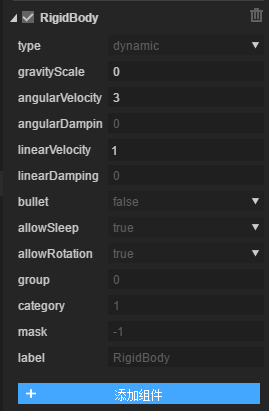

#2D 물리 시스템

###1. 2D 물리 시스템 개요

게임 개발에서 물리 시스템은 매개 필용은 아니지만 게임 사용자 체험을 높이는 중요한 요소 중 하나, 일부 클래식의 물리 게임: 분노의 작은 새, 악어 장난감 목욕 등, 물리 시스템으로 만들어진 풍부한 관람카드, 광대 게임 개발자 수요 및 엔진 수요, 레이ya2.0 집성 Box2D 물리 시스템은 Box2D 에 봉쇄를 한 후 개발자가 Box2D 물리 시스템을 접수하는 데 필요한 어려움을 면하고 사용이 불편하다.

Layair 엔진에 집성된 Box2D 물리 시스템은 우선 강체를 알아야 한다`rigidbody`충돌체`collider`물체가 강체를 포함할 때 물리 엔진의 영향을 받을 수 있으며, 물체가 충돌체가 포함될 때 물체에 충돌이 발생할 수 있으며, 물체에는 충돌체가 함유되어 있지 않을 때 충돌할 수 있지만 물리 운동력은 발생하지 않는다.

강체`rigidbody`강체는 운동 중과 힘 작용 후 형태와 크기가 변하지 않고 내부의 상대적인 위치를 가리킨다.

충돌체`collider`충돌체는 물체에 하나의 판정틀을 더하여 겹칠 때 두 물체가 충돌했다.

관절`joint`관절은 두 개나 여러 개의 물체에 대해 구속할 수 있다.

**Box2D 지원하는 관절이 있습니다.**：

거리 관절`DistanceJoint`두 개의 물체 위에 각각 조금씩, 두 시 사이의 거리가 고정되어 있다.

톱니바퀴 관절`GearJoint`두 개의 톱니바퀴 사이의 구속 관계에 쓰여, 기어가 회전할 때 발생하는 동량은 두 가지의 출력 방식을 가지고 있으며, 하나는 기어 자체의 각 속도이며, 다른 하나는 기어 표면의 선 속도이다.

모터 관절`MotorJoint`두 개의 강체를 제한하여 상대적으로 위치와 각도를 유지하고, 모터관절은 영원히 목표점으로 이동하고 특정한 각도를 유지한다.

마우스 관절`MouseJoint`마우스 조종 물체에 사용합니다.그것은 물체를 현재 마우스 커서 위치로 끌어올리려고 합니다.회전 면에서는 제한이 없다.

관절 평정`PrismaticJoint`이동 관절은 두 개의 물체가 지정된 축을 따라 상대적으로 이동하도록 허용한다.

도르래 관절`PulleyJoint`두 개의 물체의 접지 (ground) 를 서로 연결하여 하나의 물체가 상승하고 다른 물체가 떨어지게 된다.

회전 관절`RevoluteJiont`두 개의 물체를 강제로 공유하여 닻점을 두 개의 물체가 상대적으로 회전한다.

밧줄 관절`RopeJoint`두 시 사이의 최대 거리를 제한하다.큰 부하 아래 연결을 막는 물체 사이의 스트레칭.

용접관절`WeldJoint`두 개의 물체를 상대적으로 운동할 수 없게 하고 두 개의 강체의 상대 위치와 각도가 모두 변함없이 유지되어 하나의 전체와 같다.

바퀴관절`WheelJoint`노드 회전을 둘러싸고 탄성 속성을 포함하여 강체는 노드 위치에 탄성 변동이 발생한다.

###2. 강체 구성 요소 소개

####2.1 강체

RigidBody 종류가 Compont에서 이어지고, 강체적으로 세 종류를 지원합니다:`static`,`dynamic`과`kinematic`기본`dynamic`.

`static`정적 형식을 위해 정지 하지 않고 중력의 영향을 받지 않고 품질이 무한히 크며 노드 이동을 통해 회전, 축소 제어를 할 수 있다.

아날로그 환경에서 정적 물체는 이동하지 않을 것이며 무한한 품질이 있는 것 같다.Box2D 의 내부에서는 품질을 반대로 저장합니다.정적 물체는 제로 속도가 있다.정적 물체는 다른 정적 또는 운동학 동물체와 충돌할 수 없다.

`dynamic`동적 유형을 위해 중력의 영향을 받는다;

동적 물체는 전모의 시뮬레이션을 진행할 수 있다.사용자의 수동으로 이동할 수 있지만, 일반적으로 힘에 따라 이동할 수 있다.동적 물체는 어떤 물체와 충돌할 수 있다.동적 물체는 항상 제한된 비제로 품질을 가지고 있다.만약 동물체의 품질을 제로 설정한다면 자동으로 1킬로그램의 품질을 설정할 것이다.

`kinematic`운동 유형을 위해 중력의 영향을 받지 않으면 가속도나 힘을 발휘하는 방식으로 운동을 할 수 있다.

동물체는 모의환경에서 자신의 속도에 따라 움직인다.동물체는 스스로 힘을 받지 않는 역할을 한다.사용자가 수동적으로 그것을 움직일 수 있지만, 일반적으로 그 속도를 설정하여 이동할 것입니다.운동학 물체의 행위는 마치 무한한 품질이 있는 것 같다. 그럼에도 불구하고 Box2D 내부에서는 운동학물체의 질과 반대 설정을 제로 한다.움직이는 동물체는 다른 정적 또는 운동학 동물체와 충돌할 수 없다.

강체의 유형은 강제적이며, 강체 구성 요소는 아래와 같다.

< br >>

####속성 설명

#####type

전문에서 세 가지 유형을 언급합니다:`static`,`dynamic`과`kinematic`기본`dynamic`.

#####gravityScale

중력 조정 계수, 기본값은 1, 즉 정상중력으로, 0은 중력이 없다.

#####angularvelocity

각 속도, 설정은 회전, 단위 호도, 실제 사용 중 구속이 필요합니다.

#####angulardampin

회전 속도 저항 계수, 범위는 0 에서 무한대, 0 은 저항 없이 큰 표시 를 표시 하지 않 고, 일반적 으로 저지 의 가치 는 0.1 사이다.

#####linearVelocity

선형 운동 속도는 10, 10, 10, x 축이 오른쪽으로 10, y 축이 아래로 10.

#####lineardamping

선성 저항 계수, 범위는 0 에서 무한대, 0 은 저항 없이 큰 표시 를 표시 하지 않 았 고, 통상 저지 의 가치 는 0.1 사이다.

#####bullet

고속으로 이동하는 물체를 true 로 설정할 수 있는지, 고속 유출을 방지할 수 있습니다.

#####allowsleep

휴면을 허용할지, 휴면 성능을 높이는 것은 일반적으로 true 로 설정해야 한다.

#####allowRotation

회전을 허용할지 여부, 조정 회전을 원하지 않으면 false 설정입니다.

#####group

이 주체 소속의 충돌팀을 지정하여 기본적으로 0.

충돌 규칙은 다음과 같다:

1. 두 대상 group 같은 경우에는

group 값은 0보다 높고, 그것들은 시종 충돌이 발생할 것이다

group 값은 0보다 작아서, 그것들은 영원히 부딪치지 않을 것이다

group 값은 0, 규칙 3

2. group 가치가 같지 않다면 규칙 3

3. 각 강체마다 category 분류가 있습니다. 이 속성 접수 비트 필드는 [1,2^31] 범위 내의 2

각 강체마다 mask 분류가 있습니다. 충돌하는 유형치와 지정합니다.

#####category

충돌 분류를 사용하면 2의 차자수 수치가 지정되어 32가지 다른 충돌류가 사용된다.

#####mask

충돌 비트 마스크 충돌 유형, category 비트 조작 결과를 지정합니다.

#####label

사용자 정의 태그

####2.2 충돌체

충돌체는 물리 충돌의 틀을 검측하고, 그는 영원히 물체의 강체 이동을 따라다니며 편차가 생기지 않는다.

충돌체는 네 가지입니다:

사각형 충돌체, 원형 충돌체, 선형 충돌체, 다각형 충돌체.만약 모든 충돌체는 접촉체 기류를 상속시킨다.

#####충돌체 기류 속성

#####x, y

상대 노드 x, y 축 이동.

#####friction

마찰력, 치수 범위 0-1, 값은 커질수록, 기본값은 0.2.

#####restitution

탄성 계수, 가치 평가 범위 0-1, 값은 커질수록 탄성이 커지고, 기본값은 0.

#####density

밀도값은 0이나 정수를 위해 비슷한 밀도를 사용할 수 있으며, 이를 개선할 수 있으며, 기본값은 10이다.

#####issensor

센서 인지 센서가 충돌 사태를 촉발할 수 있지만 충돌 반응은 생기지 않는다.트리거로 이해할 수 있다.

#####label

사용자 정의 태그

####사각형 충돌체

#####속성 설명

#####width, height

사각형의 너비와 높이.

#####fitsize 단추

이 버튼을 누르면 충돌체의 크기는 노드 넓이가 된다.

####원형 충돌체

#####속성 설명

#####radus

원의 반경은 반드시 정수를 위하여 해야 한다.

####선형 충돌체

#####속성 설명

#####points

쉼표로 구분된 지점의 집합, 형식: x, y, y, y... 설치된 후 첫 번째 지점에서 마지막 지점으로 연결되는 연결, 선형 충돌체입니다.편집기에서 왼쪽 단추를 누르면 한 점을 끌어당기고, 두 번 누르면 이 점을 삭제할 수 있습니다.

####다각형 충돌체

#####속성 설명

#####points

쉼표로 구분된 지점의 집합, 형식: x, y, x, y..

2D 다각형 충돌체, 당분간 오목 다각형 을 지원하지 않습니다. 만약 오목다각형 이라면, 우선 수동으로 분할 하여 다각형 으로 나누십시오

노드 개수가 가장 많기 때문에 8개를 넘지 않습니다.

###3. 물리 시범

####물리 시스템

2d의 예시 항목을 새로 짓고 편집 모드에서 한 장면을 만들었고, 그 다음 일련의 작업은 다음과 같습니다. 후속된 장절은 어떻게 제작할지 자세히 소개합니다.

