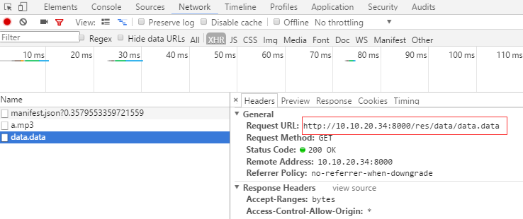

#자원 버전 관리

항목이 상위되면 자원 버전을 갱신할 수 있다.하지만 브라우저의 캐시 문제가 끌어올리는 자원이 최신 버전이 아니라 항목 버전이 일치하지 않아 실행이 정상화되지 않았다.그래서 합리적인 관리 자원을 갱신하는 것이 특히 필요하다.Layair 엔진이 제공한 자원 버전 관리 도구는 이 문제를 효과적으로 해결했다.다음은 구체적인 용법을 보자.**주의: 엔진의 버전 번호는 1.7.3 이상이 필요합니다.**

이곳에서 우리는 명령행에 맞춰 사용한다.다음 단계를 보자.

- nodejs 설치, 홈페이지 다운로드[https://nodejs.org/en/](https://nodejs.org/en/%E3%80%82)

- layacmd 도구를 설치합니다.주소 다운로드[https://www.npmjs.com/package/layacmd](https://www.npmjs.com/package/layacmd%E3%80%82)

여기 나는 윈 시스템으로 보여 준다.cmd 창을 열 때 npm 인스타ll layacd-g 입력하면 됩니다.

이 명령행 도구는 번역, 자원, 내보내기, 정적 서버 만들기 등의 기능을 제공하고, 관련 교정을 참고할 수 있습니다.이곳은 우리는 자원 관리의 기능을 가지고 설명을 한다.

- Layair 프로젝트 새로 만들기.

그리고 h5 디렉터리에 들어가면 res 의 폴더를 res 디렉터리에 추가합니다.여기에 음성 폴더를 추가하여 소리 파일 a.mp3, 외부에 img 폴더를 넣어 그림 1.png 을 넣습니다.

bin 디렉토리에서 명령줄 입력 열기`layacmd resourceVersion -i res -o . -n 1.0.0`이곳-i 대표 자원 경로, -o. 대표 버전 자원 수출 경로가 현재 경로, 물론 개발자 역시 출력 경로를 사용자 정의 경로를 vesion 폴더 등, -n 1.0 초기화 버전은 1.0.0.0.0.0.0.차가 돌아오자 우리는 몇 개의 서류와 폴더가 생성된 것을 보았다.그림 아래에 제시한 것처럼:


  (1)</br>>

1.0.0의 폴더에는 1.0 버전의 자원이 있습니다.`.record`파일의 기록은 파일의 md5 정보입니다. 삭제하지 마세요.`manifest.json`파일 안에 기록된 자원 버전 번호.

프로그램에서 어떻게 응용할지 아래에 보세요.

​


```typescript

Laya.init(500,500);
//设置资源配置文件的地址，我这里加了随机参数，保证每次加载的都是最新的。
this.configUrl = "manifest.json?"+Math.random();
Laya.ResourceVersion.enable(this.configUrl,Laya.Handler.create(this,completeHandler));

function completeHandler(e){
    Laya.loader.load([{"url":"res/sound/a.mp3","type":Laya.Loader.BUFFER}],Laya.Handler.create(this,loadSound));
}
function loadSound(){
    var obj = Laya.loader.getRes("res/sound/a.mp3");
}
```


-엔진을 초기화한 후, 우리가 해야 할 첫 번째 일은 바로 이걸 가재한다.`manifest.json`이 서류.엔진은 상응하는 방법을 제공하여 버전 관리를 활성화하였다.

`ResourceVersion.enable`이 방법은 manifest.json 파일의 경로, Resourceversion 종류로 URL.customFormat 방법으로 변경되었습니다.load 자원을 사용할 때 manifest.json 안의 자원 버전 번호를 맞추어 가재합니다.manifest.json 파일을 다운로드한 후 우리 프로젝트의 공식 논리를 시작합니다.

우리는 항목 논리에 소리 파일을 가재합니다.위의 부호를 편집하다.구글의 콘솔을 열다.파일의 정보를 다운로드하다.그림:

(2)</br>>

다운로드가 보이는 건...`1.0.0/res/sound/a.mp3`폴더 아래의 자원.우리는 자원을 추가하고 텍스트 파일을 새로 만들고 있습니다.data.data.res/data/data.data 파일에 넣어줍니다.다운로드 코드 다음과 같습니다:


```typescript

Laya.init(500,500);
//设置资源配置文件的地址，我这里加了随机参数，保证每次加载的都是最新的。
this.configUrl = "manifest.json?"+Math.random();
Laya.ResourceVersion.enable(this.configUrl,Laya.Handler.create(this,completeHandler));

function completeHandler(e){
    var obj = Laya.loader.getRes(this.configUrl);
    var data =[
        {"url":"res/sound/a.mp3","type":Laya.Loader.BUFFER},
        {"url":"res/data/data.data","type":Laya.Loader.TEXT}
    ]
    Laya.loader.load(data,Laya.Handler.create(this,resComplete));
}
function resComplete(){
    
}
```


위 코드를 번역하여 구글 관리자를 열어 가재 경로를 보다.

(2)</br>>

Google은 개발모드에서 우리의 자원은 여전히 res 디렉토리에 포함되어 정식으로 발행할 때 명령행 도구로 버전을 관리하고 있습니다.

다음 우리는 명령행에서 방금 명령을 입력하였는데, 우리가 그래도 1.0 버전으로 정의하였습니다`layacmd resourceVersion -i res -o . -n 1.0.0`실행 후 새로 고침:

(사진 4)</br>>

이미 가재된 것은 1.0.0 폴더의 자원이다.

위에서는 자원을 늘렸다고 하는데, 만약 자원을 수정했다면?그럼 저희가 버전을 발표할 때 버전 번호를 늘리면 됩니다.예를 들어 우리는 data.data 의 내용을 수정한다.그리고 발표 아래.

`layacmd resourceVersion -i res -o . -n 1.0.1`명령행에서 집행하다.그리고 페이지를 새로 고침 해서 다운로드 상황을 봅니다.

(图5)</br>


 **이 때를 보면 1.0.1 폴더에 있는 자원, a.mp3 이 파일은 수정되지 않았고, 그는 1.0.0.0 폴더 아래 자원을 가재할 것이다.**

총괄:

이로써 우리는 자원 수정만 있으면 바로 발포된 버전 번호를 수정할 수 있는 것을 보았다.이렇게 되면 해당하는 폴더에 자원을 가재할 수 있다.manifest.json 파일에 기록된 버전 정보가 변경됩니다.