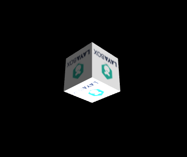

#Layair3D 카메라 Camera

Layaiair의 카메라는 영화나 드라마를 찍을 때 카메라로 이해하고 3차원 세계화면을 포착해 스크린에 나선다.한편, 레이이아르3D 엔진에도 VR 카메라를 늘리고 개발자들은 VR 입체 응용이나 게임을 개발할 수 있다.

물론 카메라는 더 중요한 속성, 다음 기능을 하나하나 소개한다.


###유닛에서 카메라 내보내기.

엔진 1.7.10판과 유닛 내보내기 플러그인또한 파일을 내보내기 위해 카메라가 3D 공간의 위치, 시각, 배경색, 재단, 시야 등 파라메트로 내보내는 장면을 가재해 화면효과가 유닛에서 완전히 일치하여 개발자들의 카메라 시각에 대한 통제를 편리하게 했다.

또한 레이야아 3D 엔진이 다중 카메라를 지원하기 때문에 유닛에 카메라를 설치하고 내보낼 수 있다. 다중 카메라에 대한 비주얼 설정은 이번 수업의 마지막'카메라 사용'소절을 살펴보세요.

그렇다면 유닛에서 카메라를 만들어 내보내며 파일을 내보내면 어떻게 카메라를 가져올까요?이 장면의 노드 색인이나 이름을 통해 가져올 수 있으며, 이동 회전, 스카이박스, 스크립트 추가 동작도 가능합니다.

코드 다음과 같습니다:


```java

var LayaAir3D = (function () {
    function LayaAir3D() 
    {
        //初始化引擎
        Laya3D.init(0, 0, true);

        //适配模式
        Laya.stage.scaleMode = Laya.Stage.SCALE_FULL;
        Laya.stage.screenMode = Laya.Stage.SCREEN_NONE;
        //开启统计信息
        Laya.Stat.show();		
        //预加载角色动画资源
        Laya.loader.create("monkey/monkey.ls",Laya.Handler.create(this,this.onSceneOK));
       
	}
 	  var _proto = Main.Prototype;
      _proto.onSceneOK = function(s)
        {
          //添加3D场景
          var scene = Laya.stage.addChild(s);  
          //从场景中获取摄像机
          var camera= scene.getChildByName("Main Camera");
          //后续对摄像机的逻辑操作.......
        }
	return LayaAir3D;
} ());
LayaAir3D();
			
```


Untiy 에서 카메라는 기본적으로 "Main Camera"라는 이름으로 이 같은 코드에서 Scene의 getChildByName('Main Camera'를 통해 카메라를 얻었고, 후속 논리에 조작했다.개발자들도 유닛에서 카메라의 이름을 정의할 수 있다.


**(tips: 다음 사례 코드`快速开启3D之旅`문서 중 코드 기초 수정**

###카메라 이동과 회전

카메라는 Sprite3D 를 계승하기 때문에 3D 변환을 할 수 있으며 트랜스form 속성을 3D 장면에서 이동 변화를 거듭하고, 관중이나 유희자들이 더 리얼한 공간 체험을 얻을 수 있다.

카메라의 회전 설정:


```typescript

 //实例化一个相机，设置纵横比，0为自动匹配。0.1是最近看到的距离，100是最远看到的距离
var camera = new Laya.Camera();
//移动相机，设置相机向z轴移动3米，true代表的是局部坐标，false是相对世界坐标
camera.transform.translate(new Laya.Vector3(0,0,3),false);
//加载到场景
scene.addChild(camera);
```


카메라의 회전 설정:


```typescript

//欧拉角旋转相机。局部坐标，弧度制（false为角度制）
camera.transform.rotate(new Laya.Vector3(0,0,3),true,true);
```


###카메라 투영과 투시 투영

우리가 세계를 관찰할 때는 ‘가까운 크기’의 시스루 효과를 가진 세계, 3D 엔진에서 더 나은 시뮬레이션의 세계를 위해 묵묵한 카메라는 ‘투시 투시 투영’의 효과를 가지고 있다.

</br>(그림 1) 기본 투시 투영

그러나 일부 게임이 있다. 특히 45도 시각을 기울인 2D, 3D 혼합게임으로, 게임 화면은 시스루를 할 수 없다. 그렇다면 이때 카메라를 ‘정교투영’으로 설정해야 한다. 큰 크기의 시스루 효과를 내지 않게 한다.


```typescript

//正交投影属性设置
camera.orthographicProjection = true;
//正交垂直矩阵距离，控制3D物件远近与现实大小
camera.orthographicVerticalSize = 7;
//移动摄像机位置
camera.transform.translate(new Laya.Vector3(0,26.5,45));
//旋转摄像机角度
camera.transform.rotate(new Laya.Vector3(-30,0,0),true,false);
```


</br>(2) 정교투영


###카메라 재단과 시야

**원거리 재단**

카메라는 원거리의 재단도 설치할 수 있고, 원거리 사이의 장면 모형만 보이며, 이외의 모형은 보카시 디스플레이를 하지 않는다.그것의 가장 큰 장점은 게임의 성능을 높이는 데 있다.

카메라를 생성할 때 카메라구조 함수는 기본적으로 0.3m로 잘라 1000m로 멀리 떨어져 있다.개발자는 구조 함수에 설치하거나 카메라 속성을 통해 설정할 수 있다.

</br>(图3)


```typescript

//创建摄像机时初始化裁剪（纵横比，近距裁剪，远距裁剪）
var camera = new Laya.Camera(0,0.1,100);
//近距裁剪
camera.nearPlane = 0;
//远距裁剪
camera.farPlane = 100;
```


tips: 일반적으로 게임에서 우리는 안개 효능과 카메라를 잘라 동시에 사용한다. 안개 효능이 멀리 떨어진 곳은 거의 잘 보이지 않는다. 이럴 때 원거리 커팅을 설치해 게임 성능을 높일 수 있다.

**카메라 시야**

카메라 시야가 초점 거리와 유사한 것으로, 시야의 인자 변수 조정을 통해 볼 수 있으며, 보기의 광범위 범위, 시스루의 가까운 변화를 볼 수 있다. 각도를 통해 조정하고, 각도가 높을수록 시야가 넓을수록 개발자는 자신의 수요에 따라 설정할 수 있다.


```typescript

//设置相机的视野范围90度
camera.fieldOfView = 90;
```


###카메라 목표 포착

카메라를 생성할 때, 카메라의 위치를 항상 조정해야 하며, 어떤 3차원 물체를 나타내거나 어떤 영역을 나타내는 데 사용된다.초보자는 공간 사유가 습관이 되지 않아 위치를 조정하는 시간이 많다고 말한다.

Layaiar3D 엔진에서 3D 변환은 lookAt () 방법을 제공하여 목표를 포착하고, 자동으로 3D 대상을 목표에 맞추는 데 사용된다.카메라도 우리가 시각을 조정하는 목적을 사용할 수 있다.코드 다음과 같습니다:

look At (target 목표 벡터, up 위쪽 벡터, islocal 부분 공간 여부)


```typescript

//添加3D场景
var scene = new Laya.Scene();
Laya.stage.addChild(scene);
//添加自定义模型
var box = scene.addChild(new Laya.MeshSprite3D(new Laya.BoxMesh(1,1,1)));
box.transform.rotate(new Laya.Vector3(0,45,0),false,false);
scene.addChild(box);
//添加摄像机
var camera = scene.addChild(new Laya.Camera());
camera.transform.translate(new Laya.Vector3(0,1,5));
//摄像机捕捉模型目标
camera.transform.lookAt(box.transform.position,new Laya.Vector3(0,-1,0));
```


우리는 카메라의 up 을 (0, -1, 0) 방향으로 설정하여 카메라의 y 축에 거꾸로 돌아서 화면이 거꾸로 변한다.다른 여러 방향의 초학자들은 많이 시도할 수 있다.

</br>(그림 4) 목표를 잡다


###카메라 배경색과 하늘상자

**배경색**

3D 장면에서 배경색 색상은 카메라로 제어하고, 카메라 클레어콜로r 속성을 설정하여 3D 공간의 배경색을 바꾸고, 색은 3차원 벡터 Vector3(레드, 녹색, 파란) 방식을 조정하고 엔진은 기본 검은색으로 설정한다.


```typescript

//设置背景颜色
camera.clearColor = new Laya.Vector3(0.5,0.5,0.6);
```


**하늘상자**

큰 장면에서 하늘의 원경을 표현할 필요가 있다. 예를 들면 푸른 하늘의 백운, 황혼, 별하늘 등과 같은 레이야아아일드 엔진에서 카메라 속성에 하늘박스(SkyBox)를 추가하는 방식이다.

하지만 카메라가 정교투영을 사용하면 하늘상자가 효과를 보지 못하고 개발자들이 시도할 수 있다.

하늘상자는 스테레오 마네킹 및 6장 사이의 소재 스티커로 구성되어 360 전경 지도와 비슷하다. 시각의 회전이 바뀌면서 사방팔방까지 먼 효과를 관찰할 수 있다.


```typescript

class Main{
    constructor(){
        Laya3D.init(0, 0);
        Laya.stage.scaleMode = Laya.Stage.SCALE_FULL;
        Laya.stage.screenMode = Laya.Stage.SCREEN_NONE;
        Laya.Stat.show();
        var scene = Laya.stage.addChild(new Laya.Scene3D());
        this.camera = scene.addChild(new Laya.Camera(0, 0.1, 100));
        this.camera.transform.rotate(new Laya.Vector3(10, 0, 0), true, false);
        this.camera.addComponent(CameraMoveScript);
        this.camera.clearFlag = Laya.BaseCamera.CLEARFLAG_SKY;
        this.exposureNumber = 0;
        //天空盒
        Laya.BaseMaterial.load("https://layaair.ldc.layabox.com/demo2/h5/res/threeDimen/skyBox/DawnDusk/SkyBox.lmat", Laya.Handler.create(this, this.loadMaterial));
    }
loadMaterial(mat){
		var skyRenderer = new Laya.SkyRenderer();
		skyRenderer.mesh = Laya.SkyBox.instance;
		skyRenderer.material = mat;
		this.camera.skyRenderer = skyRenderer;
		Laya.timer.frameLoop(1, this, this.onFrameLoop);
    }

    onFrameLoop(){
        this.camera.skyRenderer.material.exposure = Math.sin(this.exposureNumber += 0.01) + 1;
		this.camera.skyRenderer.material.rotation += 0.01;
    }
  
  new Main();
```


</br>(그림 5) 하늘상자 사용


###다중 카메라 사용

같은 장면에서 다양한 카메라를 사용할 수 있으며, 장면에 가재된 후에는 각자의 게임 보기 화면이 생길 수 있다.우리가 이전에 만났던 게임에서 2인3D 게임을 사용하면 23D 카메라를 사용했고, 왼쪽 스크린에서 한 게이머를 나타내며, 오른쪽 스크린에서 다른 것을 보여, 매우 풍부한 게임성을 보여 준다.

하지만 멀티카메라의 단점은 성능을 많이 소모하고, 모형 삼각면수와 DrawCall 수량이 배로 상승할 수 있으며, 몇 배의 기능이 소모되므로 개발자들은 심사숙고해야 한다.

3D 장면의 크기는 위치와 2D 게임과 다르게, 주로 카메라의 시선(Viewport)을 통해 스크린 분할을 진행한다.

다음에는 3D 장면을 추가하고 Viewport를 통해 좌우 시각 분리를 진행하고, 코드:


```java

var Main = (function () {
    function Main() 
    {
        //初始化引擎
        Laya3D.init(1280, 720, true);

        //适配模式
        Laya.stage.scaleMode = Laya.Stage.SCALE_FULL;
        Laya.stage.screenMode = Laya.Stage.SCREEN_NONE;
        //开启统计信息
        Laya.Stat.show();		
        //预加载资源
			  Laya.loader.create("LayaScene_loveScene/loveScene.ls",Laya.Handler.create(this,this.on3DComplete));
	}
  		var _proto = Main.prototype;
        _proto.on3DComplete=function(s)
        {
          //创建场景
          var scene= Laya.stage.addChild(s);
          
          //创建摄像机1添加到场景
          var camera1=new Laya.Camera();
          scene.addChild(camera1);
          
          //摄像机1添加控制脚本
          camera1.addComponent(CameraMoveScript);

          //修改摄像机1位置及角度
          camera1.transform.translate(new Laya.Vector3(0,2,8),true);
          camera1.transform.rotate(new Laya.Vector3(-23,0,0),true,false);
          //设置视口为左半屏
          camera1.viewport=new Laya.Viewport(0,0,640,720);
          
          //创建摄像机2添加到场景
          var camera2=new Laya.Camera();
          scene.addChild(camera2);
          //修改摄像机2位置及角度
          camera2.transform.rotate(new Laya.Vector3(-45,0,0),false,false);
          camera2.transform.translate(new Laya.Vector3(0,0,25),true);
          //设置视口为右半屏
          camera2.viewport=new Laya.Viewport(640,0,640,720);
        }
	return Main;
} ());
new Main();
```


상술한 코드를 편집해서 실행 효과는 그림 6과 같다.개발자들은 동시에 테스트를 할 수 있고, 싱글 카메라 아래에서 드래wCall과 삼각면수는 절반이 줄어든다.

< br > (그림 6) 쌍카메라는 스크린