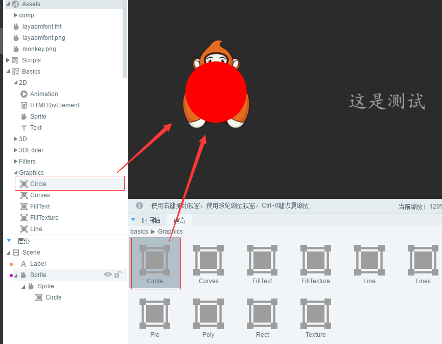
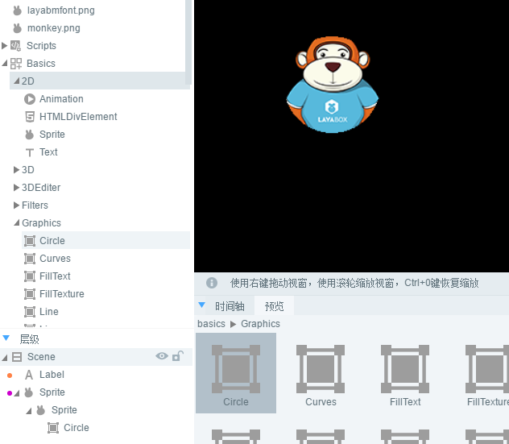

#커버를 설치하다

>> Layair의 커버는 대상 (비디오 및 벡터도 지원, 대상 모양에 따라 커버를 할 수 있습니다.
>>


##커버 API 소개

에 자리잡다,...[laya.display.Sprite](http://layaair.ldc.layabox.com/api/index.html?category=Core&class=laya.display.Sprite%3Ch1%3Emask)API 내, 이 속성 설명은 그림 1의 보여 주기:

< br / > (그림 1)


##둘째, 간단한 커버 사례

###2.1. Layair 엔진으로 한 장의 비트맵을 보이도록 하겠습니다.

하나 만들기`MaskDemo.ts`입구 종류, 편집 코드 다음과 같습니다:


```typescript

// 程序入口
class MaskDemo{
    private Res:string;
    private img:Laya.Sprite;
    constructor()
    {
        Laya.init(1336,640);
        //设置舞台背景色
        Laya.stage.bgColor = "#ffffff";
        //资源路径
        this.Res = "res/img/monkey1.png";
        //先加载图片资源，在图片资源加载成功后，通过回调方法绘制图片并添加到舞台
        Laya.loader.load(this.Res,Laya.Handler.create(this,this.graphicsImg));
    }
    private graphicsImg():void{
        this.img = new Laya.Sprite();
        //获取图片资源，绘制到画布
        this.img.graphics.drawTexture(Laya.loader.getRes(this.Res),150,50);
        //添加到舞台
        Laya.stage.addChild(this.img);
    }
}
new MaskDemo();
```


실행 효과는 그림 2의 시사와 같다:

< br / > (그림 2)

###2.2 원형 커버 영역 만들기

부호로 원형의 커버 영역을 생성합니다.마스크 속성을 통해 커버 효과를 실현할 수 있습니다.코드와 주석을 계속 보시고, 우리는 2.1의 사례 코드를 다음과 같이 변경합니다:


```java

// 程序入口
class MaskDemo{
    private Res:string;
    private img:Laya.Sprite;
    private cMask:Laya.Sprite;
    constructor()
    {
        Laya.init(1336,640);
        //设置舞台背景色
        Laya.stage.bgColor = "#ffffff";
        //资源路径
        this.Res = "res/img/monkey1.png";
        //先加载图片资源，在图片资源加载成功后，通过回调方法绘制图片并添加到舞台
        Laya.loader.load(this.Res,Laya.Handler.create(this,this.graphicsImg));
    }
    private graphicsImg():void{
        this.img = new Laya.Sprite();
        //获取图片资源，绘制到画布
        this.img.graphics.drawTexture(Laya.loader.getRes(this.Res),150,50);
        //添加到舞台
        Laya.stage.addChild(this.img);

        //创建遮罩对象
        this.cMask = new Laya.Sprite();
        //画一个圆形的遮罩区域
        this.cMask.graphics.drawCircle(80,80,50,"#ff0000");
        //圆形所在的位置坐标
        this.cMask.pos(120,50);
        
        //实现img显示对象的遮罩效果
        this.img.mask = this.cMask;
    }
}
new MaskDemo();
```


실행 효과는 그림 3의 시사와 같다:

< br / > (그림 3)

대비 코드를 통해 커버가 간단하게 이루어지고 있는 디스플레이 대상 cMask 을 가리기 상대로 임g 대상에 대한 mask 속성으로 img 디스플레이 대상의 커버 효과를 이룩했다.


##3. 레이어이더에 커버 설치

>> 직접 코드에 커버를 설치하는 것 말고도 Layaiaiairide를 통해 커버를 설치할 수 있다.다음은 우리가 순서대로 조작하도록 안내한다.

단계: UI 페이지 만들기`maskDemo.ui`자원 도입.*(이 단계는 알 수 없는 IDE 장절에 UI 생성 및 자원 가져오는 문서를 살펴보세요)*


절차 2: 자원 판넬에서 하나 끌어 넣기`Image`구성 요소가 장면 편집 구역에 도착하면, 그림 4개가 제시하는 것과 같다.

< br / > (그림 4)


절차 3: 더블 클릭 진입`Image`구성 요소 내부, 그리고 구성 패널 하나 끌어 넣기`Sprite`구성 요소는 그림 5개처럼 보여 준다.

< br / > (그림 5)


단계 4: 선택`Sprite`구성 요소, 오른쪽 속성 패널에서 공유 속성`renderType`설치하다`mask`여섯을 바라다.

< br / > (그림 6)


절차 5: 쌍격 진입`Sprite`구성 요소 내부, 그리고 구성 패널 하나 끌어 넣기`Graphics`원형 구성 요소, 위치 및 크기 조정.계급 관계는 7 시에 제시하는 것과 같다.

< br / > (7)


단계 6: 연속 클릭 편집 구역의 공백 영역 하차`Image`구성 요소 내부에서는 커버의 효과를 볼 수 있고, 그림이 8개처럼 보여 준다.

< br / > (그림 8)


##4, 프로젝트 중 LayairierIDE 설정 커버 적용

###4.1 발표 UI

IDE 인터페이스에 누르기`F12`커버 효과를 내는 UI 페이지가 발표됩니다.`src/ui`디렉토리에서 UI 종류를 생성하여, 그림 9개처럼 보여 줍니다.

< br / > (그림 9)


###4.2 IDE 생성된 종류와 그림으로 커버 효과

편집 모드 아래 F9 설정 엔진 미리 보기


주 코드 다음과 같습니다:


```java

import GameConfig from "./GameConfig";
import { ui } from "./ui/maskDemoUI";
class Main {
	constructor() {
		//根据IDE设置初始化引擎		
		if (window["Laya3D"]) Laya3D.init(GameConfig.width, GameConfig.height);
		else Laya.init(GameConfig.width, GameConfig.height, Laya["WebGL"]);
		Laya["Physics"] && Laya["Physics"].enable();
		Laya["DebugPanel"] && Laya["Physics"].enable();
		Laya.stage.scaleMode = GameConfig.scaleMode;
		Laya.stage.screenMode = GameConfig.screenMode;

		//打开调试面板（通过IDE设置调试模式，或者url地址增加debug=true参数，均可打开调试面板）
		if (GameConfig.debug || Laya.Utils.getQueryString("debug") == "true") Laya.enableDebugPanel();
		if (GameConfig.stat) Laya.Stat.show();
		Laya.alertGlobalError = true;

		//激活资源版本控制，version.json由IDE发布功能自动生成，如果没有也不影响后续流程
		Laya.ResourceVersion.enable("version.json", Laya.Handler.create(this, this.onVersionLoaded), Laya.ResourceVersion.FILENAME_VERSION);
	}

	onVersionLoaded(): void {
		//激活大小图映射，加载小图的时候，如果发现小图在大图合集里面，则优先加载大图合集，而不是小图
		Laya.AtlasInfoManager.enable("fileconfig.json", Laya.Handler.create(this, this.onConfigLoaded));
	}

	onConfigLoaded(): void {
		//加载IDE指定的场景
		GameConfig.startScene && Laya.Scene.open(GameConfig.startScene);
	}
}
//激活启动类
new Main();

```


실행 효과는 그림 10개처럼, 우리는 빠르게 커버의 효과를 실현했다.

< br / > (그림 10)

