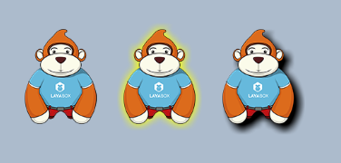

#필터 효과 설정

>> Layair 엔진은 색상 필터, 발광(혹은 음영) 필터, 모렴 필터 3가지 효과를 제공한다.이 중 색 필터는 Canvas 와 WebGL 패턴을 지원하며 발광 필터와 모호한 필터가 성능에 대한 소모가 커서 WebGL 모드로만 지원한다.


##1, 색 필터 설정

###1.1 색 필터 API 약술

색상 필터 종류 ColorFilter 는 laya.filters 가방에 위치해 지정 행렬(* 4x 5의 행렬 *) 로 각 색상 채널을 변경합니다.

클릭[laya.filters.ColorFilter ](http://layaair.ldc.layabox.com/api/index.html?category=Filter&class=laya.filters.ColorFilter)API 설명 보기.


###1.2 색상 필터 설정

한 비트맵에 색상 필터를 설정하려면 우선 색상 행렬을 설정하고 ColorFilter 방법으로 색상 필터를 생성할 수 있습니다. 아래의 코드 표시:


```typescript

//颜色滤镜矩阵，红色
var colorMatrix:any = 
  [
  1, 0, 0, 0, 0, //R
  0, 0, 0, 0, 0, //G
  0, 0, 0, 0, 0, //B
  0, 0, 0, 1, 0, //A
];

//创建红色颜色滤镜
var redFilter:Laya.ColorFilter = new Laya.ColorFilter(colorMatrix);
```


마지막으로 Spriter 의 filters 속성을 통해 색상 필터 효과를 비디오에 겹쳐 줍니다.다음으로 Main.ts 종류를 생성하고, 다음과 같습니다:


```typescript

module laya {
    import Sprite = Laya.Sprite;
    import Stage = Laya.Stage;
    import ColorFilter = Laya.ColorFilter;
    import Texture = Laya.Texture;
    import Browser = Laya.Browser;
    import Handler = Laya.Handler;
    import WebGL = Laya.WebGL;

    export class Main {
        private ApePath: string = "../../res/apes/monkey2.png";

        private apeTexture: Texture;

        constructor() {
            // 不支持WebGL时自动切换至Canvas
            Laya.init(Browser.clientWidth, Browser.clientHeight, WebGL);

            Laya.stage.alignV = Stage.ALIGN_MIDDLE;
            Laya.stage.alignH = Stage.ALIGN_CENTER;

            Laya.stage.scaleMode = "showall";
            Laya.stage.bgColor = "#232628";

            Laya.loader.load(this.ApePath, Handler.create(this, this.setup));
        }

        private setup(): void {
            this.normalizeApe();
            this.makeRedApe();
            this.grayingApe();
        }

        private normalizeApe(): void {
            var originalApe: Sprite = this.createApe();

            this.apeTexture = Laya.loader.getRes(this.ApePath);
            originalApe.x = (Laya.stage.width - this.apeTexture.width * 3) / 2;
            originalApe.y = (Laya.stage.height - this.apeTexture.height) / 2;
        }

        private makeRedApe(): void {
            //由 20 个项目（排列成 4 x 5 矩阵）组成的数组，红色
            var redMat: Array<number> =
                [
                    1, 0, 0, 0, 0, //R
                    0, 0, 0, 0, 0, //G
                    0, 0, 0, 0, 0, //B
                    0, 0, 0, 1, 0, //A
                ];

            //创建一个颜色滤镜对象,红色
            var redFilter: ColorFilter = new ColorFilter(redMat);

            // 赤化猩猩
            var redApe: Sprite = this.createApe();
            redApe.filters = [redFilter];

            var firstChild: any = Laya.stage.getChildAt(0);
            redApe.x = firstChild.x + this.apeTexture.width;
            redApe.y = firstChild.y;
        }

        private grayingApe(): void {
            //由 20 个项目（排列成 4 x 5 矩阵）组成的数组，灰图
            var grayscaleMat: Array<number> = [0.3086, 0.6094, 0.0820, 0, 0, 0.3086, 0.6094, 0.0820, 0, 0, 0.3086, 0.6094, 0.0820, 0, 0, 0, 0, 0, 1, 0];

            //创建一个颜色滤镜对象，灰图
            var grayscaleFilter: ColorFilter = new ColorFilter(grayscaleMat);

            // 灰度猩猩
            var grayApe: Sprite = this.createApe();
            grayApe.filters = [grayscaleFilter];

            var secondChild: any = Laya.stage.getChildAt(1);
            grayApe.x = secondChild.x + this.apeTexture.width;
            grayApe.y = secondChild.y;
        }

        private createApe(): Sprite {
            var ape: Sprite = new Sprite();
            ape.loadImage("../../res/apes/monkey2.png");
            Laya.stage.addChild(ape);

            return ape;
        }
    }
}

new laya.Main();
```


위쪽 코드에서 원본 스케이트, 빨간색 필터 효과 비디오, 회색 필터 효과실행 효과는 그림 1의 보여 주기:

< br / > (그림 1)


##2, 발광과 음영 필터 설정

###2.1 발광 필터 API 약술

발광 필터 종류 GlowFilter 는 laya.filters 가방에 위치해 발광을 조절하는 편도 음영 필터로 사용할 수 있으며, 인자 설명은 그림 2의 보여 준다.주의: 이 필터는 WebGL 모드에서 유효합니다.

 <br /> (图2)


클릭[laya.filters. GlowFilter](http://layaair.ldc.layabox.com/api/index.html?category=Filter&class=laya.filters.GlowFilter)API 설명 보기.


###2.2 발광필터와 음영필터 설정

발광과 음영 필터의 설정이 비교적 간단하므로 인코딩을 통해 예례를 확인하고,

Main.ts 클래스를 만들기, 다음과 같습니다:


```typescript

module laya {
    import Sprite = Laya.Sprite;
    import Stage = Laya.Stage;
    import GlowFilter = Laya.GlowFilter;
    import Browser = Laya.Browser;
    import Handler = Laya.Handler;
    import WebGL = Laya.WebGL;

    export class Main{
        private apePath: string = "../../res/apes/monkey2.png";

        private ape: Sprite;
        private apeGlow:Sprite;
        private apeShadow:Sprite;

        constructor() {
            // 不支持WebGL时自动切换至Canvas
            Laya.init(Browser.clientWidth, Browser.clientHeight, WebGL);

            Laya.stage.alignV = Stage.ALIGN_MIDDLE;
            Laya.stage.alignH = Stage.ALIGN_CENTER;

            Laya.stage.scaleMode = "showall";
            Laya.stage.bgColor = "#aabbcc";

            Laya.loader.load(this.apePath, Handler.create(this, this.setup));
        }

        private setup(): void {
             this.ape=this.createApe();
             this.ape.pos(100,50);
             this.apeGlow = this.createApe();
             this.apeGlow.pos(250,50);
             this.apeShadow = this.createApe();
             this.apeShadow.pos(400,50);
             this.GlowFilter();
             this.ShadowFilter();
        }
 
        private createApe(): Sprite {
            var ape = new Sprite();
            ape.loadImage(this.apePath);
            Laya.stage.addChild(ape);
            return ape;
        }

        private GlowFilter(): void {
            //创建一个发光滤镜
            var glowFilter: GlowFilter = new GlowFilter("#ffff00", 10, 0, 0);
            //设置滤镜集合为发光滤镜
            this.apeGlow.filters = [glowFilter];
        }
        private ShadowFilter(): void {
            //创建一个发光滤镜
            var shadowFilter: GlowFilter = new GlowFilter("#000000", 8, 8, 8);
            //设置滤镜为阴影滤镜
            this.apeShadow.filters = [shadowFilter];
        }
    }
}
new laya.Main();
```


위쪽 코드에서, 원시 비트맵, 발광필터 효과 비디오, 음영필터 필터 효과 비디오실행 효과는 그림 3의 시사와 같다:

< br / > (그림 3)


##3. 모호한 필터 설정

###3.1 모호한 필터 API 약술

모호한 필터 종류 BlurFilter 는 laya.filters 가방에 위치해 strength 인자 설정을 통해 모조리 필터의 강도를 조절하면 더욱 높을수록 여과된다.인자 설명은 그림 4개와 같다.주의: 이 필터는 WebGL 모드에서 유효합니다.

< br / > (그림 4)

클릭[laya.filters. BlurFilter](http://layaair.ldc.layabox.com/api/index.html?category=Filter&class=laya.filters.BlurFilter)API 설명 보기.


###3.2 모호한 필터 설정

모호한 필터의 설정은 비교적 간단하고 모호한 필터 실례를 생성하고 모호한 강도를 설치하여 스켓을 설치하면 바로 인코딩을 통해 예례를 보여 줍니다.

Main.ts 클래스를 만들기, 다음과 같습니다:


```typescript

module laya {
    import Sprite = Laya.Sprite;
    import Stage = Laya.Stage;
    import BlurFilter = Laya.BlurFilter;
    import Browser = Laya.Browser;
    import Handler = Laya.Handler;
    import WebGL = Laya.WebGL;

    export class Main {
        private apePath: string = "../../res/apes/monkey2.png";

        constructor() {
            // 不支持WebGL时自动切换至Canvas
            Laya.init(Browser.clientWidth, Browser.clientHeight, WebGL);

            Laya.stage.alignV = Stage.ALIGN_MIDDLE;
            Laya.stage.alignH = Stage.ALIGN_CENTER;

            Laya.stage.scaleMode = "showall";
            Laya.stage.bgColor = "#232628";

            Laya.loader.load(this.apePath, Handler.create(this, this.createApe));
        }

        private createApe(): void {
            var ape: Sprite = new Sprite();
            ape.loadImage(this.apePath);

            ape.pos(100,50);
            
            var apeBlur:Sprite = new Sprite();
            apeBlur.loadImage(this.apePath);
            apeBlur.pos(250,50);

            Laya.stage.addChild(ape);
            Laya.stage.addChild(apeBlur);

            this.applayFilter(apeBlur);
        }

        private applayFilter(ape: Sprite): void {
            var blurFilter: BlurFilter = new BlurFilter();
            blurFilter.strength = 5;
            ape.filters = [blurFilter];
        }
    }
}
new laya.Main();
```


위쪽 코드에서 우리는 원시 비트맵, 희미한 필터 효과 비디오 위치를 만들었습니다.실행 효과는 그림 5개와 같이 나타납니다:

 <br /> (图5)


