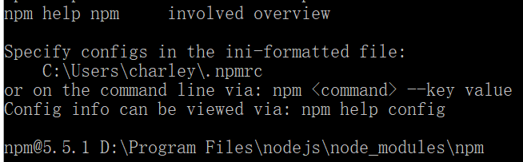

#개발 환경 만들기 (TS 코드 편집기)

>>*author: charley vesion:2.0.1 update:2019-4-8*

LayaiairIDE는 Typescript 편집 환경을 설치하기 때문에 이 편역 환경의 설치 지도에 사용되며, 편집 환경이 문제가 있을 때 참조하고, 이미 설치된 것을 사용하면 다시 설치할 필요가 없습니다.

##1, 다운로드 설치 Node 환경

####1.1 설치된 node.js 환경이 설치되었는지 확인하기

Typescript 개발을 사용하면 Node.js 환경이 필요합니다. 설치한 적이 없다면, 공식 다운로드 (LTS 버전) 으로 다운로드하십시오.

설치 전에 현재 현재 환경이 있는지 확인하지 않으면, node 환경이 설치되었는지 확인하고 명령 도구 열기 (windows cmd) 입력 명령을 입력하십시오`npm -h` 


```

npm -h
```


회차 키를 누르면 npm 의 명령 설명, 버전 번호, 설치 경로 등 정보를 볼 수 있다면, 만약 1-1의 제시 (비슷한 정보) 이 설치되었다면, 사용에 영향을 주지 않는다면 다운로드, node 환경을 설치하는 절차를 밟을 수 있다.

 


(1-1)


####1.2 Node.js 홈페이지 다운로드

설치 환경이 없다면 바로 node 홈페이지에 설치를 다운로드하면, LTS 버전을 추천합니다. 그림 1-2의 보여, URL 주소는:[https://nodejs.org/en/](https://nodejs.org/en/)

(그림 1-2) 사진은 참조로 사용하고 링크 연결을 직접 다운로드하면 됩니다.

주의: 기본 링크는 윈도우(x64), 64명의 컴퓨터를 누르면 Other Downloads, 다운로드 버전을 다운로드하면 됩니다.

####1.3, 설치 Node.js

방금 다운로드한 Node.js 설치 가방을 찾았습니다. 한 걸음 한 걸음 한 걸음 한 걸음 설치하는 설치 시 인터페이스는 그림 1-3과 같이 표시됩니다.

< br / > (그림 1-3)

설치 완료 후 1.1 소절 소개 방식으로 명령 줄 아래 입력 가능`npm -h`설치 상태를 점검하다.


##2, npm 명령으로 Typescript 환경 설치

Node 환경이 문제가 없으면 npm 로 Typecript 편집 환경을 설치할 수 있다.

####2.1 다운로드 설치

명령행 도구에 명령을 입력하십시오.`npm install -g typescript`"회전 키를 누르면 2-1의 시트를 다운로드하고 Typescript 환경이 설치되어 있을 때 인터넷의 통통을 유지해야 한다.


```typescript

npm install -g typescript
```


 <br/>

(2-1)

개발자가 설치할 때 2-2의 경우를 만나면 흔히 캐시 충돌이 발생한다.(만나지 않은 직접적으로 본 단계를 뛰어넘었다.)


(2-2)

이때, 캐시 처리 명령을 사용할 수 있다`npm cache clean --force`이 명령을 되돌려 실행하고 설치 명령을 다시 입력하면 된다.


```

npm cache clean --force
```


####2.2 설치 완료

"typescrip @ 버전 번호를 볼 때 Typescript 환경의 설치를 확인할 수 있습니다. 예를 들어 3-1의 지시 줄 닫기 도구를 닫으면 됩니다.


(사진 3-1)

그림 4 중 tsc 디렉터리는 바로 우리 TypeScript 환경을 번역하는 설치 디렉터리가 있습니다. 이것입니다. LayairID에서 이 Compiller 를 통해 Typescript를 자바스크립트로 번역할 수 있습니다.

####2.3 검사 Typescript 환경 버전

명령행에서 'tsc-v' 명령을 입력하면 현재 Typescript 편집 버전을 볼 수 있으며, 그림 3-2의 보여 줍니다.


```typescript

tsc -v
```


  


(사진 3-2)

버전 번호가 표시된다면 Typescript Compiller (tsc) 설치에 성공했다는 것을 설명할 수 있다.

>> 실제 버전 번호는 최신 캡처로 참조하는 것만으로 기존 캡처 버전과 일치하지 않습니다.