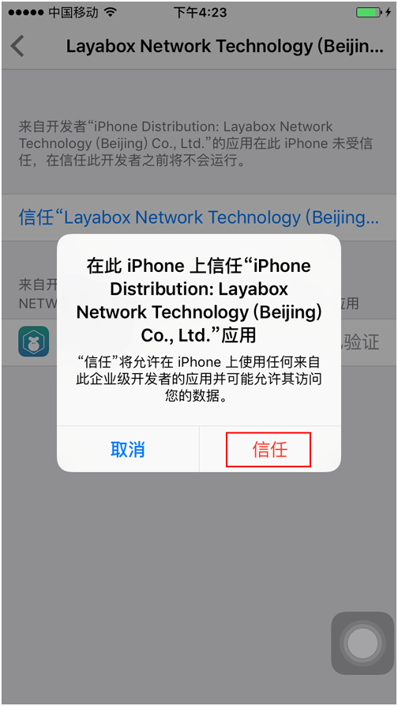

#LayaNative 테스트 Appp 실행 항목

###Appp의 다운로드 및 설치 테스트

####1. App 의 다운로드

LayairIDE 열기, 왼쪽 위 모서리 클릭메뉴 단추, 메뉴 표시줄 팝업 (그림 1).

메뉴 표시줄의 '도구' 를 누르십시오. '' 실행기 다운로드, App 의 QR코드 다운로드 주소 (그림 2)

  < br />
도

​< br />
도2

####2.Android 버전 다운로드 및 설치

앤드래드폰으로 스톡을 진행하고, apk 을 클릭하여 설치하면 됩니다.

**Tips: 마이크로 스톡 코드를 사용하면 마이크로의 안전 설정 때문에 클릭 주소를 복사해서 휴대전화 브라우저로 다운로드해야 합니다.**    

####3.iOS 버전 다운로드 및 설치

웨이보로 클릭한 후 'Safari 에서 열기' 를 누르면 Safari 브라우저에서 켜서 누르십시오**인스타**단추를 누르고 설치를 누르면 됩니다:

**단계 1:**

​< br />
도

**단계 2:**

  < br />
도

**단계 3:**

  < br />
도

**Tips:**

설치 후 자동으로 이동 기능이 없습니다. 시스템 데스크톱으로 이동할 때, Layabox 응용이 설치되어 있는지 확인하십시오. 설치 중이면 설치 후 다음 동작을 진행하십시오.

**단계 4:**

설치가 성공한 후 실행회는 '신뢰받지 않은 기업 개발자'를 팝니다. 이때 개발자는 스스로 설치해야 합니다.

'설정'-'통용'-'장치 관리'-'Layabox Network Technology.'-'신뢰 클릭'

이후 Layabox 테스트 App 을 켜면 정상적으로 사용할 수 있습니다. 구체적인 절차는 다음과 같습니다:

**단계 5:**

​< br >>
도

**단계 6:**

​< br >>
도

**단계 7:**

​< br >>
도

**단계 8:**

​< br >>
도

**단계 9:**

​< br >>
도

###2, 테스트 App 로 프로젝트 테스트

**단계 1:**

응용을 켜면 그림 11의 인터페이스를 볼 수 있습니다:

< br />
도

**단계 2:**

LayaiairIDE 사례 항목을 사용하여 메뉴 표시줄 최우측 QR코드 아이콘 클릭항목의 2차원 인터페이스 보이기 (예도 12).< br />
도

**단계 3:**

APP 내 파란 2차원 아이콘 (그림 13) 을 클릭하여 스코어의 인터페이스에 들어간다.오른쪽 layanative 의 QR코드 (그림 14) 를 스캔하면 테스트할 수 있습니다.

  < br />
도

  < br />
도

스코드가 성공한 후 App 가 사례 항목을 실행할 수 있습니다.

<!--TODO:프로젝트를 바꾸어야 할 그림 ->>

  < br />
도

**Tips:LayaNative 브라우저가 아니라 주소를 입력하십시오. 기본적으로 시작하는 것은 index.html, index.js 를 입력하십시오.**

* http://testgame.layabox.com/index.js 올바른
*http:192.168.0.100:8899/index.js 올바른
* http: testgame.layabox.com/오류
* http: testgame.layabox.com 오류
*http:192.168.100:8899/오류
*htp:192.168.100:8899 오류

<!--TODO: 보내기 후 연결 주소를 바꾸기 *** Tips: 주소를 입력한 후 화면에 화면을 표시하지 않았을 경우 항목이 가로세로 화면을 설치하지 않았기 때문에 문서를 참고하십시오: htttps: httttps: github.com/layabox/layaior-doc/tree/master/Chinese/LayaNative/screen/screen

###주의 사항

텍스트 형식의 파일 (예를 들어: ini, xml, html, json, js 등은 모두 utf8 인코딩 형식으로, IOS 장치가 비utf8 형식의 파일을 지원하지 않기 때문입니다.

###건의

개발자는 android 와 ios 가 개발하는 기본 지식을 배우고, 사용 과정에서 이동 장치를 컴퓨터에 연결할 수 있으며, 언제든지 log, log 중에는 중요한 정보가 많기 때문에 개발자 지정 문제를 도울 수 있다.예를 들어: 비utf8 형식 인코딩 파일 이름, 네트워크 오류, 다운로드 오류 등이다.