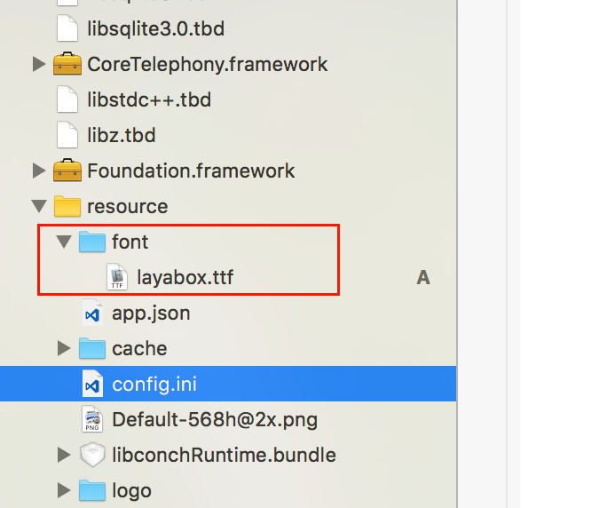

#글꼴 삽입

##1. 글꼴 소개

andriod 설비의 종류가 다양하고 android 의 글꼴 파일이 일치하지 않기 때문에 시스템 기본값의 중국어 글꼴 경로가 차이 (더 이상 국내의 많은 제조업체의 개성화 정제) 를 읽는 것은 font.tttf (난제입니다.

LayaNative 정책은 android 의 시스템 버전 번호에 따라 글꼴 파일의 경로를 일일이 들어올릴 경우 시스템 기본 글꼴을 사용합니다. Layabox 사이트에서 글꼴을 다운로드하지 않으면, 글꼴을 본지로 다운로드하고, 두 번째 입국할 때 직접 본지 글꼴을 읽습니다.

개발자는 app 을 포장할 수 있을 때 기본적으로 글꼴을 app에 포장하는 것을 피하고, 어떤 특수장치를 인터넷에 4MB의 TTF 글꼴을 다운로드해 사용자 체험에 영향을 끼친다.

##2. 글꼴 첨부

1, android 프로젝트 구성, asets 디렉토리를 찾을 수 있으며, font 디렉토리를 생성할 글꼴 파일을 'layabox.ttf' 로 변경합니다.그림 1의 보여 주기:

**Tips:** 

템플릿 프로젝트는 기본값으로 tttf 글꼴이 새겨져 있으며, apk 크기에 신경을 쓰면 asets/font/layabox.ttf 글꼴 파일을 삭제할 수 있습니다.

##3.iOS 글꼴 삽입

1, LayaNative 지원iOS 기본 글꼴을 입력하고, 구체적으로 android, resource 아래에 font 디렉토리를 생성하고, 포함할 글꼴을 layabox.ttf 로 바꾸면 됩니다:

