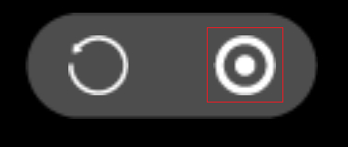

#android 리얼리티에서 자바스크립트 코드 디버깅

##주의:
최근 Crome 버전이 69로 업데이트되면서 LayaNative 환경 리얼리티 디버깅 JS 에서 수동적으로 단점 디버깅을 하지 못하고 해결 방안:
1, 개발자는 코드에 debugger 방식을 써서 디버깅을 할 수 있다.
2, Chrome68 의 버전을 설치하여 디버깅을 한다.
우리 회사의 엔진팀이 가능한 한 빨리 이 문제를 해결할 것이니 모두에게 불편을 초래할 테니 양해해 주시기 바랍니다.

##디버깅의 원리

자바스크립트 코드 디버그 디버깅은 디버깅기에 있는 Crome 브라우저입니다.Android 테스트기에서 LayaNative 시작할 때 WebSocket 서버를 동시에 시작할 것입니다.Crome 브라우저는 WebSocket 과 LayaNative 연결 통신을 통해 Chrome 프로그램을 사용한 자바스크립트 디버깅을 실현합니다.

디버그 프로젝트에서 자바스크립트의 코드 중 다음과 같은 두 가지 디버그 모드를 선택할 수 있습니다:

1. Debug/Normal 모드

이 모드에서 Android 테스트기에서 항목을 직접 시작하고 실행할 수 있으며, Chrome 브라우저는 프로젝트 실행 후 디버깅을 연결할 수 있습니다.

2. Debug/Wait 모드

이 모드에서 Android 테스트기 항목이 시작된 후 Chrome 브라우저 연결을 계속 기다리게 됩니다.Chrome 연결이 성공한 후에야 자바스크립트 스크립트를 계속 실행할 수 있다.
시작할 때 불러오는 자바스크립트 스크립트를 디버깅할 때 이 모드를 우선 선택하십시오.

**주의: 디버그 공사에서 디버깅기와 앤드로이드 테스트기가 같은 네트워크에 있습니다.**

##둘째, 디버깅 layairIDE 구축된 앤드로이드 프로젝트

###절차 1:

레이어이드의 프로젝트를 구성하고 앤드로이드의 프로젝트를 생성합니다.

<!--TODO: 링크 주소 추가.구체적으로 IDE 구축 공사를 참고할 수 있다.->

###절차2: 디버그 모드 수정

앤드로이드 스튜디오를 사용하여 구축 작업을 열었습니다.

androidustudio/ app/ src/ main/asets/config.ini, JSDebugMode 의 값을 수정하고 필요한 디버그 모드를 설정합니다.그림 1:

[] (img/androidudebugmode.png)

도

JSDebugMode 의 가치와 의미는 다음과 같습니다:

의미 1
124다오: – 124대
디버그 기능 닫기
124사 11244 Debug/Normal 모드
"Wait 모드"

**Tips:**

프로젝트가 공식적으로 발표된 후 JSDebugMode 의 값을 0 으로 설정해 주십시오. 그렇지 않으면 프로젝트의 성능에 영향을 끼칠 수 있습니다.

###절차3: 번역 및 실행 항목

Android Studio 컴파일을 사용합니다.

Debug/Normal 모드 선택**실행 및 실행**항목.

[] (img/androidu appu run.png)

그림 2 Android 테스트기는 성공적으로 실행 및 실행 항목

Debug/Wait 모드 선택**시작하다**항목.

[] (img/androidu appu boot.png)

그림 3 Android 테스트기 시작

###절차4: Chrome 연결 프로젝트를 사용합니다

디버깅 위의 Crome 탐색기를 열기, 다음 웹 주소를 입력하십시오:

>chrome-devtools://devtools/bundled/inspectoor.html? experiments = true & v8only = true & ws = 10.10.82.142:5959

**주의:**ws = 10.10.10.82.142:5959리 10.10.82.142는 Android 테스트기의 ip 주소, 5959는 절차 2중 config.ini 파일에서 JSDebugPort 설치된 포트 수치를 자신의 설비의 실제 상황과 수요에 따라 바꿉시다.

###절차5: 디버그 진행

연결이 성공하면 Chrome 프로그램에서 자바스크립트를 사용하여 디버깅을 할 수 있다.그림 2 개 시:

[] (img/debuguconneced.png)

도

##3, 테스트 앱 사용 디버그 진행

###절차1: ip 주소와 포트 번호 확인

App 을 열기 위해서는 왼쪽에서 Android 장치의 ip 주소와 디버깅 시 필요한 포트 번호를 볼 수 있습니다.

그림 1개에 따르면 설비의 ip 주소는 10.10.82.142, 포트 번호는 59599.

도

###절차2: 디버그 모드 선택

화면 아래 가운데 단추를 누르고 디버그 모드를 선택하십시오.

도

도

###단계 3: 항목의 2차원 코드

App 의 중간 파란 QR코드 아이콘을 체크하고 항목의 layanative QR코드 주소를 검색합니다.

Debug/Normal 모드를 선택하면 프로젝트가 성공을 기다리게 됩니다.**실행 및 실행**.

그림 8 사례 항목 성공 실행

Debug / Wait 모드를 선택하면 App 을 통해 다음 인터페이스를 입력할 수 있습니다:

도

###단계 4: Crome 브라우저에서 Appp을 연결하기

Chrome 브라우저 열기, 다음 웹 주소를 입력하십시오:

>chrome-devtools://devtools/bundled/inspectoor.html? experiments = true & v8only = true & ws = 10.10.82.142:5959

**주의:**ws = 10.10.10.82.142:59599는 단계1에서 본 ip 주소와 포트 번호를 자신의 설비의 실제 상황에 따라 변경하십시오.

###절차5: 디버그 진행

연결이 성공하면 Chrome 프로그램에서 자바스크립트를 사용하여 디버깅을 할 수 있다.그림 7개처럼 제시:

[] (img/debuguconneced.png)

도

**Tips:**App 의 단축 단추 테스트

App 의 실행 항목을 시험한 후 화면에 두 개의 단추를 표시합니다.두 개의 단추의 역할은 다음과 같습니다:

**1. 새로 고침 단추**

항목의 코드 변경 후 새로 고침 단추를 누르면 변경된 공사를 다시 불러올 수 있습니다.

**주의:**Chrome 연결 상황에서 App 이 새로 고침 단추를 누르면 붕괴가 발생할 수 있습니다.이 문제는 나중에 판본이 해결될 것이니 양해해 주시기 바랍니다.

**2. 귀환 버튼**

클릭 버튼을 누르면 스코어의 인터페이스로 되돌아가며 다시 스코어를 진행할 수 있습니다.

##현재 버전에 존재하는 문제

**다음 문제는 앞으로 판본에서 해결될 것이니 양해해 주시기 바랍니다.**

디버그 디버깅 과정에서 디버그 수동 첨가된 단점 (비debugger 단점) 을 사용하면 디버그 혼란이 발생할 수 있다.
만약 이런 상황에 부딪히면 다음 단계에 따라 처리해 주십시오:

절차1: 설정의 단점은 아래와 같다

[] (img/7.png)

도

절차2: 모든 단점 취소

[] (img/8.png)

도

절차 3: 시작 프로젝트를 재개하고, Chrome 연결 프로젝트를 사용합니다.

[] (img/9.png)

도

절차4: 필요한 단점 회복

[] (img/7.png)

도