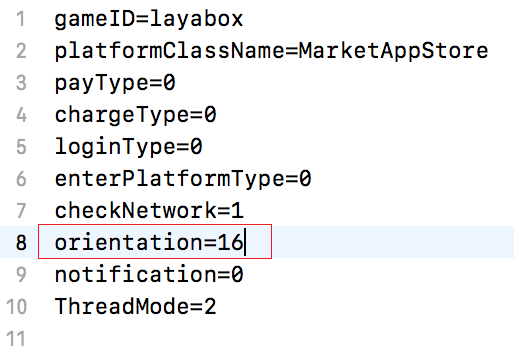
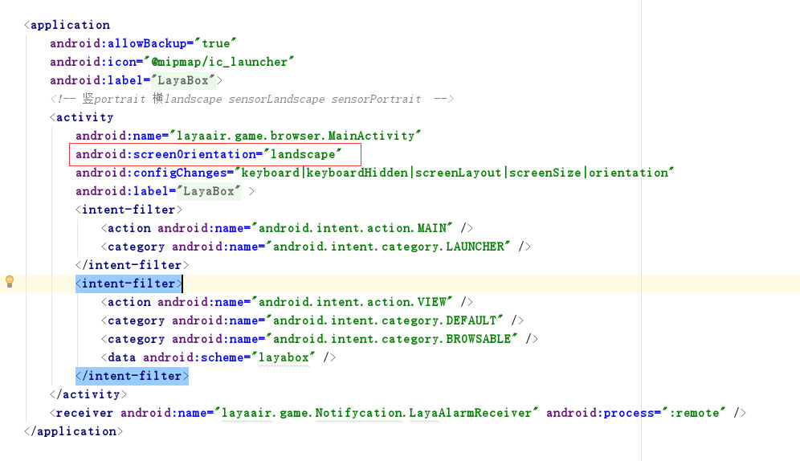

#가로 세로 화면 설정

##프로젝트 앞 가로세로 화면 설정

###1. index.js 혹은 runtime.json 에 설정

*index.js

index.js 화면 방향을 설정하면 screenOrientation 값을 수정하면 됩니다:


```javascript

window.screenOrientation = "sensor_landscape";
```


설정할 수 있는 인자가 다음과 같습니다:

화면 방향
124대: | 124대
124라ndscape
124포트트랙
1, 1244사 senscape 또는 senscape 또는 sensor landscape
1.1244사 sensoru portrait 또는 sensortrait124대 세로

* runtime.json

runtime.json 화면 방향을 설정하면 screenOrientation 값을 수정하면 됩니다:


```json

"screenOrientation":"sensor_landscape"
```


screenOrientation 의 가치와 index.js 의 window.screenOrientation 값과 같습니다.

##둘째, 프로젝트 구축 후 세로 화면 설정

###1.iOS

iOS 프로젝트 구성 성공 후 resource / config.ini 파일 열기`orientation=16`다음 그림에 제시한 값:



변수의 의미는 다음과 같습니다:

```

orientation=2   //竖屏：IOS home键在下   
orientation=4   //竖屏：IOS home键在上   
orientation=8   //横屏：IOS home键在左   
orientation=16  //横屏：IOS home键在右   
```

orientation 값은 사용할 수 있습니다`按位或`형식 설정:

```

orientation=6   //代表竖屏可以任意旋转  
orientation=24  //代表横屏可以任意旋转  
```


**주의:**iOS 프로젝트 내의 가로세로 화면 설정이 가장 좋거나 config.ini 설정이 일치한다.설정이 불일치하면 미지의 상황이 발생할 수 있다.그림 같은 설정:


###2.android

android 프로젝트 구성에 성공했습니다. AndroidManifest.xml 파일을 열기, activity 태그 안에 screenOrientation 인자 인자가 자신의 요구에 따라 수정할 수 있습니다.


설정할 수 있는 인자수는 android 의 표준입니다. 여기에서 설명을 많이 하지 않으면 다음과 같습니다.


```

"landscape","portrait","full_sensor","sensor_landscape","sensor_portrait","reverse_landscape","reverse_portrait"
```


##실행 순서

프로그램이 시작할 때 iOS 의 config.ini 에서 설정된 화면 방향이나 androidmanifest.xml 에서 설정된 화면 방향을 먼저 읽을 것입니다.index.js 또는 runtime.json 을 분석할 때 화면 가로 세로 설정된 값을 읽고 화면 방향을 다시 설정합니다.

예를 들어: androidMandManifest.xml 에서 portrait, index.js 탭을 landscape, 실행 과정에서 안드로이드 장치에서 스크린을 돌며 세로 스크린을 가로로 돌렸다.

**Tips: 개발자가 두 개의 가치 설정을 일치시켜 실행 과정에서 스크린을 돌리는 현상을 피합니다.**