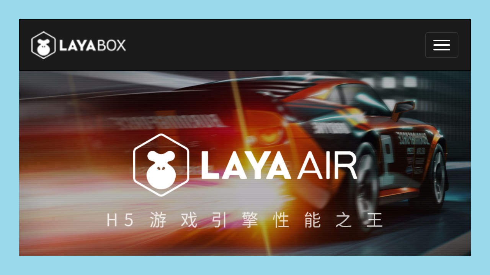
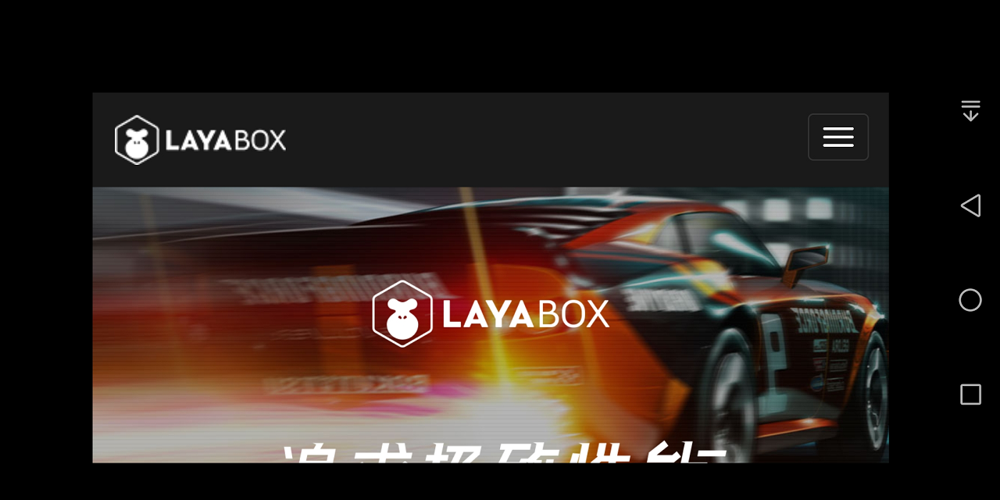

#webview

##소개

LayaNative 표준을 지원하지 않는 html 때문에 어떤 항목은 완전한 html 페이지를 보여야 할 때 LayaNative 를 통해 제공할 수 있는 webview 인터페이스 인터페이스를 보여줍니다.
###1. 인터페이스 정의


```typescript

    /**
     * 显示一个webview
     * @param url {string} 要显示的url地址。
     * @param posx {number} weview的左上角位置
     * @param posy {number} webivew的左上角位置
     * @param width {number} webview的宽度
     * @param height {number} webview的高度
     * @param canclose {boolean} webview是否可以被关掉。
     */ 
    setExternalLinkEx(url:string,posx:number,posy:number,width:number,height:number,canclose:boolean):void;
```


이 함수는 화포의 최상층에 새로운 view 를 나타내며, 그 중 url 내용을 표시합니다.

`canclose`이 webview 가 꺼질 수 있는지 관리하는 데 사용됩니다:
* 설정`false`시:

코드 다음과 같습니다:


    
```typescript

    document.addEventListener('touchstart',()=>{
        if(conch){
            var l = 50;
            var t = 50;
            var w = window.innerWidth - l * 2;
            var h = window.innerHeight - t * 2;
            conch.setExternalLinkEx('http://www.layabox.com',l,t,w,h,false); // canclose设置为false
            //conch.setExternalLink('http://www.baidu.com');
        }
    });
    ```


Webview가 나타나면 닫을 수 없습니다. 다음과 같습니다:


    

도

* 설정`true`시:

코드 다음과 같습니다:


    
```typescript

    document.addEventListener('touchstart',()=>{
        if(conch){
            var l = 50;
            var t = 50;
            var w = window.innerWidth - l * 2;
            var h = window.innerHeight - t * 2;
            conch.setExternalLinkEx('http://www.layabox.com',l,t,w,h,true); // canclose设置为true
            //conch.setExternalLink('http://www.baidu.com');
        }
    });
    ```


* ios 아래에서 작은 닫기 버튼이 있습니다. 단추를 누르면 웹view를 닫을 수 있습니다.효과는 다음과 같다:


        

도2

* 단추 닫기 때문에 일부 페이지 내용을 덮어씁니다. Android 장치에 후퇴 키를 제공합니다. 따라서 Android 장치에 webview 디스플레이 후 닫기 단추를 닫지 않으면 닫을 수 있습니다.**후퇴 키**webview 닫기다음 그림:


        

3 이 때 후퇴 키를 누르면 webview 닫기

###2. 제한
1. 현재 webview 는 app 과 대화할 수 없습니다.
2. webview 의 실현은 시스템에 의존하고, 저버전의 android 는 보일 수 없습니다.

**Tips**  
*1, conch, LayaNative 환경에서만 호출할 수 있으며, 웹 버전에서는 conch 가 정의되지 않았기 때문에 존재를 판단해야 합니다.*
*2. as 언어를 사용하면 통과할 수 있다`Browser.window['conch'] `이런 방식은 conch 대상을 받는다.*


##둘째, 어떻게 코드 중 동적 닫기 webview 페이지

다음 코드를 사용하면 동적 상태를 닫을 수 있는 webview 페이지:


```javascript

conch.closeExternalLink();
```
