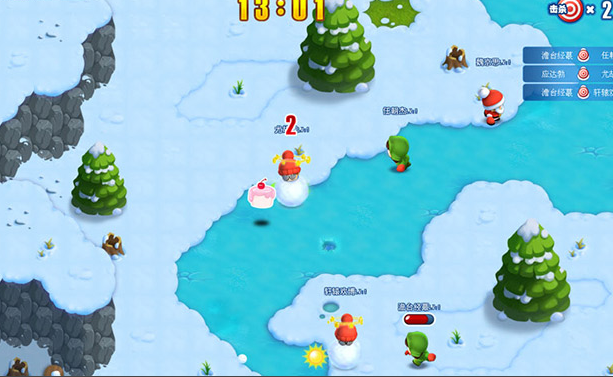

#Layabox 엔진의 게임 사례

Layabox 는 2011년 HTML5 게임 엔진 개발을 시작한 이래 비개원 HTML5 엔진 LAYA, 1세대 HTML5엔진 LayaFlash, 2세대 HTML5엔진 Layaiair, 3단계.

##부분 레이어 엔진 게임 사례

Layabox 공식 홈페이지에 가는 사례 항목 소자 체험:[https://www.layabox.com/gamelist/](https://www.layabox.com/gamelist/)

이 링크에는 대량의 3D와 2D의 정선 사례가 있는데, 여러분은 마이크로카드로 체험할 수 있습니다.

##Layabox 1세대 엔진 LayaFlash

1세대 엔진 LayaFlash는 AS3 언어 개발에 완전히 기반, Canvas 를 과장하는 방식으로 HTML5 업은 Flash AS3 언어 및 AS3 원생 API 개발의 HTML5 게임 엔진을 전면적으로 지원할 수 있다.2015년 발표 후 1년간 이 엔진에 기반된 제품은 QQ 브라우저에서 10여 건이다.2세대 엔진 Layaiair가 더 강한 성능 우세 및 언어 지원 때문에 1세대 엔진 LayaFlsah 업데이트 정지

###LayaFlash 대표 작품'취서류'

Forgam 그룹 PC 단이 총 6억원을 넘은 최고 MMMMORPG 페이지에서 LayaFlash 엔진을 채택한 이식 작품으로 HTML5 업종의 첫 APPP급 MORPG 대형 게임이다.2016년에 QQ 브라우저에서 처음으로 발행됐다.

###LayaFlash 대표 작품'모카 환상'

유명 모바일 게임 개발업체와 네트워크 천만 월 유수 수산물 레이레이레이 플래쉬를 통해 HTML5 로 이식했다.연모와 인터넷의 회사가 변고된 후 이 게임은 QQ 브라우저에서 선두를 중단하고 하선했다.

###LayaFlash 대표 작품'미니헌터'

일본 인기 클래식 만화'전직 헌터'를 개편한 RPG 카드 게임으로 AS3 스타링의 프레임으로 개발됐다. LayaFlash 엔진을 통해 HTML5 게임으로 발표됐다.

##LAYA 비개발 엔진의 사례

**JS 언어 개발에 기초하여 Canvas 를 렌더링 모델로, 주요 상선 대표 작품은 모두 3개다.**

###첫 번째'미친눈덩이'

HTML5 업종은 다양한 온라인 캐주얼 대형게임으로 2012년, 2017년까지 같은 유형의 수준이 없는 HTML5 게임 경쟁품으로 LAYA 엔진의 기술력을 과시했다.

이 게임은 현재 HTML5 버전과 안탁APK 버전, HTML5 버전은 2016년 말까지 QQ 오락홀 PC 클라이언트에서 운영되고 있다.

QQ 게임홀의'미친눈덩이'게임 주소는:[http://qqgame.qq.com/app/gamedetail_10434.shtml](http://qqgame.qq.com/app/gamedetail_10434.shtml) 

​< br >>
그림(1)‘미친눈덩이’

###두 번째'상위주공'

(증용명 3국 야옹전)은 업계 첫 카드카드 전략 HTML5 대형 게임으로 2013년, HTML5 판 대만 판권금 300만, APP 버전은 대만 차트 TOP10 에 로그인했다.2015년 HTML5 판은 안탁의 QQ 브라우저에서 상위했으며, 월유수가 최고 백만 명을 넘어섰다.현재 상위운영 상태로 레이보이스 홈페이지의 사례에서 2차원 코드를 통해 직접 체험할 수 있다.

​< br >>
도(2)‘상상샤 주공’

###제3항'사냥감2'

업종의 첫 중도 동작류 HTML5 대형 게임이다. 2015년 안탁QQQ 브라우저에 오르며 AP급의 정교한 화질과 유창한 액션 효과, HTML5 게임업계에서 막 뜨거운 단계에서 HTML5 기술이 APP 게임의 무게와 효과를 입증했다.LAYA 엔진은 제품의 표현력으로 엔진의 최고 실력을 입증했다.

​	< br >>
그림(3) ‘사냥날 2’