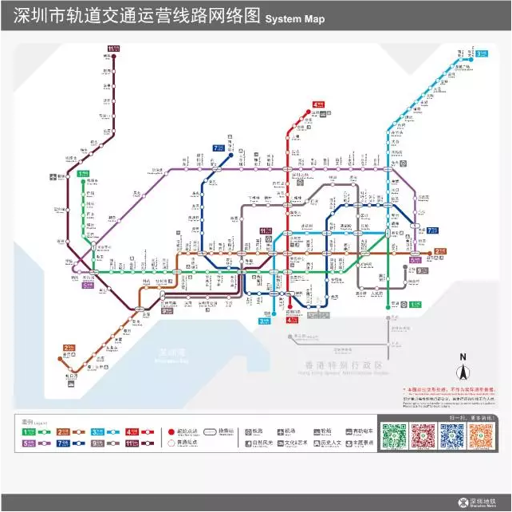

#Layabox 엔진 비게임 사례

Layabox 는 인터넷 과학 기술 (베이징) 유한회사가 만든 중국 게임 엔진 업체 브랜드, 이차세대 엔진 레이아일은 HTML5 프로토콜을 기반 엔진, 성능과 3D는 엔진의 핵심 경쟁력이다.Action Script3, 자바스크립트, Typescript 3가지 개발 언어를 함께 개발하고 APP(안탁과 아이오S), HTML5, 마이크로 게임, QQ 가벼운 게임, 바이두 소규모 플랫폼 등 다양한 플랫폼의 게임 엔진을 개발했다.2D3D  VR  AR 을 지원하는 게임 개발을 제외하고 엔진은 소프트웨어, 광고, 마케팅, 교육 등 분야에 사용할 수 있다.성능은 APP 엔진에 필적한다.

많은 비게임 사례 중 몇 개의 유명 대표작을 선택하여 개발자들에게 전시할 예정입니다.

##하나, Layair IDE

LayaiairIDE의 1.0과 2.0은 Layaiaiaia 엔진 개발으로 Layaiair UI 시스템에 기반 UI 편집, 애니메이션 편집, 코드 편집, 코드 편집 등 기능을 실현, 원생 데스크톱 소프트웨어와 차별 없어 보인다!
< br >>
그림 (1) Layabox 홈페이지

##둘째, 버버리 웨이보 H5 광고

상하이 피읍은 Layair 엔진으로 개발된 사치 브랜드 Burberrry 새해 광고를 통해 위신친구권에 등장해 화제가 되고 있다.H5 는 개인 주문, 제품 전시, 크리스 세배 등 원소를 융합해 정교한 화질, 유창한 체험, 뛰어난 영상 재생 성능을 하나로 융합해 버블리의 영식을 뽐냈다.

​< br >>
그림 (2)

​< br >>
그림 (3)

##지하철 선로

2016년 선전지하철은 시민 출입을 편리하게 하기 위해 Layaiair 엔진을 사용하여 온라인 지하철 운영 네트워크 노선도를 제작해 시민들이 실시간 방문 및 환승을 편리하게 하고 시민들의 명확한 기획 출범 선로.

​< br >>
그림(5)심천 지하철 공식 홈페이지 체험

##4、미단 마케팅 광고

 

(도6-1) 미단 H5 마케팅 광고 캡처

 

(도6-2) 미단 H5 마케팅 광고 체험 QR코드

##마케팅 광고

 

(7-1) 마케팅 광고 캡처

 

(7-2) 마케팅 광고 체험 QR코드

##6, 3D 교호 홈페이지 전시

'불가사의군도'는 게임 요소를 활용한 HTML5 교호식 3D 홈페이지다.다른 부공 섬 사이로 전환하다.한 장면마다 360도로 접어들어 섬의 모습을 볼 수 있다.

 

체험 주소는 http://dmt.juzhen01.com/dmt3

##일곱, 교육 소규모 게임

레이어 교육을 채택한 작은 게임은 이 애플릿 코드를 찾아서 직접 스코어 체험을 할 수 있다.가감승제법을 결합하여 가감승제하는 숙련도, 디지털 반응 능력에 대한 작은 게임이다.

 