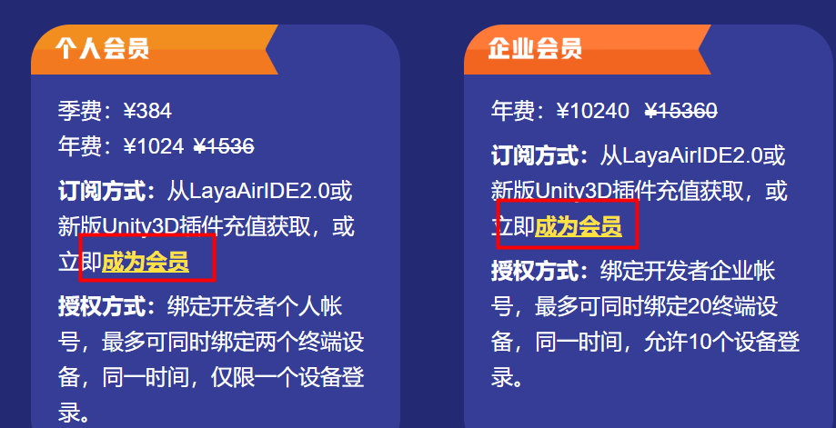
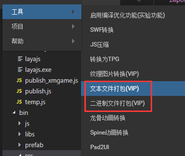

#Layair 엔진 VIP 전속 기능 소개

>> 저자: charley 본문 엔진과 도구 버전: Layaiair 2.0.2 본문 갱신 시간: 2019-04-15

다음 디렉토리를 누르면 바로 이동:

[TOC]

##하나, Layaiair 2.0 왜 VIP 전속 기능을 밀고

Layaiair 1.0 때 무료 엔진이 이익 모드 없이 엔진 그룹의 생존에 스트레스를 받고 있다.엔진 팀의 생존 스트레스를 줄이기 위해서는 문서, 동네 등 주변 서비스에 대한 인력 수축을 할 수밖에 없다.그러나 엔진이 지속적으로 발전할 수 있는 길은 아니다. 엔진의 모든 업무는 공짜로 엔진을 곤경에 빠뜨릴 수밖에 없다. 만약 엔진 기업이 생존할 수 없을 때, 그것은 절대다수의 개발과 유지엔진 능력이 없는 게임업체에 대한 나쁜 소식이다.

그래서 2.0을 내놓기 전에 우리는 균형점을 생각하고 개발자를 위해 개발비용을 낮춰 무료 엔진과 낮은 문턱을 고효율 개발하는 게임을 위해 엔진을 생존할 수 있는 지속적인 발전의 길을 찾는다.

이에 따라 Layaiair 2.0 엔진 기초 기능은 무료 전제 아래 무료 2.0 엔진 및 도구 위에서 계속 엔진의 고성능 강화 엔진 강화, 엔진 강화 엔진 기능을 끊임없이 개선 엔진 기능, 특히 3D 엔진의 성숙도.하지만 엔진 주변의 몇몇 부가가치 서비스에 대한 시도를 해 엔진을 지속적으로 발전시키기로 했다.

현재 VIP 전속 기능 요금은 이 중 한 시도, VIP 기능의 요금이 낮아 개인이라도 감당할 수 있다.또한 VIP 기능을 사용하지 않아도 게임의 상선에 영향을 주지 않는다.물론 사용하면 게임의 효과가 더 좋거나 최적화될 수 있다.

마지막으로 우리는 엔진 주변의 부가가치 요금 업무가 개발자들의 이해와 지지를 얻을 수 있기를 바란다. 엔진기업이 생존압력을 해결한 후에야 더 많은 인력과 정력을 문서와 기타 기반의 무료 서비스에 투자할 수 있다.엔진이 지속적으로 발전할 수 있는 생태를 더욱 번영하게 한다.


##둘째, VIP 전속 기능에는 어떤 서비스가 포함되어 있다

전속 기능이라면 VIP 회원은 비비VIP 개발자의 없는 독특한 기능을 가지고 있다.기능은 현재 아래의 여러 방면으로 제공됩니다:

###1, 3D 모형 파일 압축:

효과: 모형 파일 크기 약 60% 감소

기능 프로필: 3D 게임에서 모형은 게임 자원의 부피가 중요한 구성 부분이다.그래서 모형 파일의 크기를 줄이고 게임의 가재 기간을 줄이고, 게이머들이 게임에 들어가는 속도를 가속화시킨다.현재 네트워크 속도 환경에서 게임 체적 감소는 비교적 중요한 증가 기능이다.

###2, 텍스처 압축 (2D + 3D):

효과: 현존 약 75% 감소 이미지 디코딩 카드 현상 감소.

게임에서 무늬 압축을 사용하지 않을 때, 현존을 절약하기 위한 점용입니다.일반적인 시도는 저해상도의 기형에 따라 디자인을 한 뒤 게임에서 높은 해상도를 맞추는 기형입니다.이렇게 되면 게임의 모자이크 현상(많은 작은 게임들이 안탁의 일부 고청해상도 기형에 이런 문제가 생기는 것은 반드시 이 문제이다), 문리적 압축 패턴은 높은 해상도에 따라 설계를 사용하더라도 작은 현존을 점용하기 때문에 동등히 점용되는 상황에서 높은 해상도를 압축시키는 기형상, 2D 이미지 압축 효과와 연신 효과예를 들면 그림 1개.3D 스티커는 압축 후 효과가 더 좋고, 원도에 대한 손실은 시각 효과에서 거의 무시할 수 있다.

 


(그림 1)

>> 알람: 3D 텍스처를 사용하여 압축한 후, 시각적으로 볼 수 없어 추천합니다.하지만 2D는 텍스처 압축을 신중하게 하고, 정적 이미지(예컨대 UI)는 텍스처 압축 기능을 최대한 사용하지 않고 동태 이미지(2D 캐릭터 애니메이션 등)를 사용하지 않고 고청화질 표현 수요를 사용할 수 있다.

기능 프로필:

게임에서 흔히 볼 수 있는 그림 파일 형식은 일반적으로 PNG 와 JPG 등 이 그림들은 CPU 디코드를 거쳐 GPU 에 전달해 사용한다.텍스트 압축 후 형식은 디코딩이 필요 없이 GPU 에서 직접 읽을 수 있는 형식입니다. 따라서 한 쪽은 대량의 현존을 절약하고, 또 한 쪽은 이미지 해코드를 줄일 수 있는 CPU 압력을 줄일 수 있습니다.

개발자가 주의해야 하는 것은.텍스처 압축은 현카의 하드웨어에 의존하여 위bGL 모드로 사용할 수 있습니다.또 다른 플랫폼 (운영체제) 의 형식도 다르다.예를 들어 Android 플랫폼은 ktx 형식으로 iOS 플랫폼은 pvr 형식입니다.

>> 플랫폼의 형식이 다르기 때문에 플랫폼에 걸친 게임을 사용하여 현존을 낮추는 동시에 가격은 파일의 크기를 늘렸기 때문에 종목의 상황에 따라 균형점을 찾아야 한다.

###3, 3D 애니메이션 파일 압축:

효과: 3D 애니메이션 파일 크기 약 40% 감소

기능 프로필: 3D 애니메이션 파일의 압축과 모형 압축과 마찬가지로 파일 다운로드의 크기를 줄이고, 게이머의 게임에 들어가는 속도를 가속화한다.

###4, 파일 합병 (JSON + 2진수):

효과: JSON 형식의 텍스트 파일을 합병할 수 있으며, 파일 다운로드 수량을 대폭 줄이고 게임 가재 효율을 높이기

기능 프로필:

게임의 작은 파일이 비교적 많을 때 HTTP 요청을 대량으로 늘리며 파일을 합병할 수 있으며, 파일을 합병할 수 있는 파일을 합쳐 파일의 HTTP 요청수를 줄여 효율을 높일 수 있습니다.물론 무작정 합병하면 포장 후 파일을 늘리는 일회용 다운로드 길이다.개발자는 사업의 실제 상황에 따라 사용해야 한다. 특히 작은 서류가 많을 때 재활용해야 한다.

###5, 기타:

앞으로 더 많은 확장 모듈을 늘릴 것이다 (회원 수요 기능을 지속적으로 수집해 투표를 통해 더 많은 VIP 모듈을 늘릴 것이다.

###특별 설명

####1, VIP 기능은 비VIP 기능의 기술 서비스를 포함하지 않는다.

자주 몇몇 개발자들이 이런 문제를 제기하고 VIP 를 구매한 후, 우리에게 엔진을 해답할 수 없는 문제도 있다.VIP 전속 기능을 구매할 수 있는 권익은 주로 전속 기능 자체이며, 다음으로 VIP 전속 기능에 대한 답변을 제공합니다. 예를 들어 VIP 전속기능은 사용하지 않습니다. 또는 사용 과정에서 BUG, VIP 전속기능에 대한 건의와 의사를 직접 가입할 수 있습니다. QQQ군 번호:`739490368`

기술 서비스의 수요가 있다면 인력 비용에 대한 요구가 높기 때문에 현재 VIP 전속 기능의 가격이 감당할 수 있는 것은 아니다.기술 서비스 구매 수요가 존재한다면, 위신 검색을 통해 검색할 수 있다.`399050`기술 서비스를 연결하는 상업 협력 책임자는 소통이나 이해를 한다.

####2, 개인 VIP 및 기업 VIP 서비스 차이

기업 VIP 와 개인 VIP는 기능의 사용에 완전히 동일한 기능에 차이가 없다.

유일한 구별, 개인 VIP 계정은 최대 2개 단말기, 같은 시간, 계좌번호 중 하나밖에 로그인할 수 없습니다.기업 VIP 같은 계좌번호는 단말기 20개를 납치할 수 있으며, 동시에 10개의 터미널에 로그인할 수 있다.이런 식으로 기업 계좌의 관리를 편리하게 하여 직원들의 이직 인수에 문제가 생기는 것을 피할 수 있다.


##3, VIP 기능의 정가와 구매 방식 및 영수증 획득

###1, VIP 기능 정가

####개인 VIP:

1024원 / 년 / 최대 바인딩 2 터미널 / 동시에 로그인 1 단말

####기업 VIP:

10240원/년/최대 바인딩 20단말/동시에 10단말 로그인

###2, 구매 방식

####홈페이지 에서 구매 하다

링크 주소:[https://www.layabox.com/vip/](https://www.layabox.com/vip/)

절차: 홈페이지 VIP 안내 페이지에서 회원이 되려면 1-1의 지시로 구매 페이지에 들어갈 수 있습니다.



(1-1)

절차 2: 페이지에서 로그인 방식을 선택하고, 계좌와 동네의 계좌번호는 공통 통합, 조회도 1-2의 제시`手机或用户名登录`휴대폰 번호나 아이디와 비밀번호를 입력하고 로그인 확인 후 구매할 수 있습니다.


(1-2)

절차 3: 등록 후, 개인 회원 또는 기업 회원 유형을 선택하고, 지불 방식(위신 또는 보화)을 선택하고, 마지막으로 구매 즉시 1-3에 제시한 것으로 나타났다.최종 지급 완료 후 기존 등록된 계좌는 VIP 회원 계좌가 됐다.VIP 기능을 사용하기 전에 이 계정을 등록하면 VIP 전속 기능을 누릴 수 있다.

 


(1-3)

####Layairide에서 구매

단계 1:

최신 버전을 다운로드하는 LayairIDE, 오른쪽 CF 그림을 누르거나 오른쪽 오른쪽 중심 (소인 아이콘) 단추를 누르십시오.로그인 후(동네의 계좌와 비밀번호), 회원 구매 버튼을 보면 2-1회.바로 이 단추를 누르면 구매 인터페이스를 들어갈 수 있다.

 


(2-1)

단계 2:

충전 페이지에서 VIP 회원 유형을 선택하여 지불 방식을 클릭하는 버튼 (보나 위신) 을 사용하면 2차원 코드를 팝니다. 만약 2-2의 지시, 스코어는 VIP 회원이 되고 VIP 기능을 사용하기 전에 이 계정을 등록하면 VIP 전속력을 즐길 수 있습니다.


(2-2)

####레이어의 유닛 내보내기 플러그인 구매

단계 1:

최신 버전의 유닛 3D 플러그인이 아닌지 확인하기 (최소한 2.0.1) 의 업데이트입니다.또한 엔진이 플러그인 버전과 플러그인 번호를 검사해야 합니다. 그렇지 않으면 오래된 버전 엔진은 새 플러그인을 인식할 수 없습니다. 일부 기능이 사용할 수 없습니다.

최신 버전 유닛 내보내기 플러그인[点击进入插件下载地址](https://ldc2.layabox.com/layadownload/?type=layaairide)) 3-1의 지시대로.


(사진 3-1)

단계 2:

설치 후 VIP 기능을 클릭하면 계정 검증 권한이 필요합니다.3-2의 지시대로.

 


(사진 3-2)

절차 3:

이미 로그인되고 VIP 라면 VIP 기능을 직접 사용하면 됩니다.

만약 VIP 를 아직 구매하지 않았다면 3-2 오른쪽의 VIP 기능을 누르면 VIP로 직접 건너뛰게 된다.혹은 클릭 플러그인을 통해`Account`(계좌)의`Recharge`(충전) 버튼이 VIP 구매 인터페이스.3-3의 지시대로.

 


(사진 3-3)

VIP 구매 인터페이스에서 VIP 회원 유형을 선택하여 지불 방식을 클릭하는 버튼(보나 위신), 오른쪽 스코드가 지불한 후 VIP 회원이 되면 3-4의 지시를 받고 있다.VIP 기능을 사용하기 전에 이 계정을 등록하면 VIP 전속 기능을 누릴 수 있다.

 


(사진 3-4)

###3. 영수증 개설 관련

####영수증의 입구를 개설하다

영수증 주소:[https://developers.masteropen.layabox.com/dist/recharge_succ_list.html](https://developers.masteropen.layabox.com/dist/recharge_succ_list.html)

####영수증의 기록을 선택하다

영수증의 뒷부분에서 지불된 소비기록을 선택하여 다음 단계를 클릭한다.4-1의 지시대로.


(사진 4-1)

####영수증 정보 와 택배 수신 정보 를 기입하다

개표의 소비 기록을 골라 클릭하다`下一步`이후 영수증 정보가 작성된 페이지에 들어갈 것이며, 그림 4-2의 옵션과 입력 상자에 틀림없는 메시지를 적어 넣습니다.`提交`정보의 정확성을 확인하여 정보의 오류를 제공하여 발생한 영수증을 잘못하여 작성자가 책임진다.


  


(사진 4-2)

####개표 알람:

영수증에 관련된 세무 주기성 문제 때문에

만약 매달 20일 이전에 개표신청을 제출한 회의가 이달 내에 (통상 신청신청 1주일 정도) 에 종이영수증을 제출하고 부치다.

20일 이후 개표신청을 제출할 경우 10월 10일 이후(10일부터 일주일 정도) 서류 영수증을 작성해 보내야 한다.

이상 주기는 명절 연휴일에 순연된다.

마지막으로, 특별한 긴급이 있다면, VIP 전속 기능 소통QQ 군에 가입할 수 있습니다.`739490368`관리자에게 연락해서 문의드립니다.


##4, VIP 기능 사용 방식

2D의 VIP 기능은 LayairID에서 사용하고 3D의 VIP 기능을 사용하여 Layair 유닛 내보내기 플러그인에 사용해야 합니다.우선 간단하게 알아보자.

5-1의 지시대로.2D의 VIP 기능은 네비게이션 메뉴의 도구막대를 통해 찾을 수 있습니다.

  


(사진 5-1)

만약 5-2에 따르면 3D의 VIP 기능과 일반 기능이 함께 되어 있으면 직관적으로 볼 수 있다. 다만 인증 VIP 에 대한 인증 후 사용할 수 있다.


(사진 5-2)
VIP 기능의 사용 방면에서 3D 기능은 대부분 이해하기 쉽고, 스티커 무늬 압축을 제외하고는 현재 모형 압축과 애니메이션 파일의 압축은 파일 크기의 변화에 불과하고, 선택하는 기능을 직접 사용하면, 특강할 필요가 없고, 2D의 VIP 공은 사용해야 할 주의사항이 있다.다음은 주의해야 할 일부 기능에 대해 자세한 소개를 진행합니다.

###1, 텍스처 이미지 변환 (텍스처 압축)

LayairIDE를 열어보도록 하겠습니다.`纹理图片转换`기능 계면

클릭`浏览`바꿀 그림이 있는 폴더를 선택하십시오 (싱글 그림이라면 폴더를 선택하지 않으려면 이 기능을 끌어당겨야 합니다),

하지만 출력 디렉터리와 압축을 선택한 플랫폼 (안탁이나 아이오S) 를 지정하면 그림 6-1이 보여 준다.

 


（6-1）

####jpg 단도 텍스처 압축

여기에 주의해야 할 것은 무늬 압축의 사용은 플랫폼을 구분하고 압축한 후 안탁과 아이오의 서류 접미사들도 다르다.그래서 6-1 조작 후 클릭`确定`볼 수 있어요.`.ktx`과`.pvr`두 개의 접미사 서류는 그림 6-2의 시사와 같다.

 


(사진 6-2)

이 두 파일은 각각 다른 시스템 플랫폼에 사용되어 있으며, 이 중 ktx 는 안드로이드 플랫폼에 사용된다.pvr 애플의 iOS 플랫폼.

우리는 이 두 가지 다른 접미사 서류를 놓을 수 있다`bin/res`목록 아래.사용하는 방식과 jpg 및 png 자원은 다릅니다. 사용할 때 플랫폼을 구분하여 다른 접두사를 호출하면 됩니다.간단하게 코드 참조:


```typescript

//以下代码片段仅作参照
.......
    if (Browser.onAndroid) {
		this.extension = "ktx";
    } else if (Browser.onIOS) {
        this.extension = "pvr";
    }

    var sp:Sprite = new Sprite();
    sp.loadImage("res/1."+this.extension);
.......	
//以上代码片段仅作参照
```


####PNG 텍스처 압축

Android 플랫폼이 png 형식을 텍스트 압축 형식으로 바꾸지 않기 (Android 플랫폼에서 png 형식을 계속 사용하면 됩니다), png 형식의 그림은 iOS 플랫폼에서 텍스처를 사용할 수 있습니다.

도구의 사용 프로세스 측면에는 jpg 싱글 사진과 크게 차이가 없다.한편으로는 안드로이드 플랫폼이 텍스처 압축을 할 수 없는 전환으로 png 형식 자원을 계속 사용할 수 있다.한편, PNG 그림의 폭이 높으면 2차방으로 삼아야 한다.

#####도집 압축

png 접미사에 대한 그림의 압축, 용법도 단도 같지만, 그림의 처리, 그림 경로의 표시줄, png 접미사 그림이나 아트las 그래픽 파일을 끌어들일 수 있다.절차는 6-3의 제시와 같다.

 


(사진 6-3)

###2, 파일 클러치 (JSON 파일 + 바이너파일)

이 기능은 여러 개의 분산된 파일을 합쳐 파일을 합쳐 파일을 만들 수 있으며, Json 형식의 텍스트 파일을 병합하여 2진제 파일과 합병할 수 있으며, 그림 7과 같이 보여 줍니다.

 


(그림 7)

####JSON 형식 파일 합병 작업

열다`文本文件打包`VIP 기능 인터페이스는 7-1의 보여, 색상 영역을 누르면 bin 디렉토리 아래 json 형식 파일을 합병할 수 있습니다 (그래픽 atlas, scene 장면, 예제체 prefab 등이 모두 json 형식으로 되어 있습니다.

 


(7-1)

합병 규칙은 여러 개 설정하고, 클릭 추가`(+)`새 판넬에 새 합병규칙을 만들 수 있으며, 프로세스는 7-2의 시사와 같다.
  


(7-2)

주의해야 할 것은 7-2의 파일 이름`.plf`위선 접미사입니다. 처음에는 정말 접미사입니다. 하지만 위신 로컬 가방은 Plf 파일의 후두를 인식하지 않기 위해 2진과 구별하기 위해 이 타입(plf)을 기억하면 됩니다.최종 생성된 것은 7-3의 시사와 같이 json 을 배경으로 한 파일이다.

모든 합병 규칙을 다 설정한 후에 클릭을 클릭하십시오.그림 7-3의 패키지 편집 결과를 볼 수 있습니다. 켜주세요.`打开发布文件夹`단추는 합병된 파일을 볼 수 있습니다.

 


(7-3)

####바이너리 파일 합병 작업

바이너리 파일을 합쳐 JSON 형식 파일과 합병하는 동작 프로세스는 기본적으로 json 형식 파일을 합병하는 것은 2진제 파일이다.또한 json 파일 합병 형식은 plf, 출력은 json 후두의 파일입니다.바이너리 파일 통합 형식은 plfb, 출력은 zip 접미사 파일입니다.그래서 조작 과정은 더 이상 자세하게 말하지 않고 두 장의 그림을 통해 흐름과 차이를 사용한 곳을 대충 묘사해 보자.

 


(7-4)주의타입은 plfb

 


(7-5)

한 파일의 합병 규칙은 zip 파일과 같이 3Dscene.plfb 규칙, 생성된 파일은 3Dsce.zip 파일입니다.

이 zip 접미사는 표준이 아닌 zip 형식으로 지p 접미사가 있는 2진제 파일에 대해 일깨우쳐 마이크로신 작은 게임에 대해 희귀한 접미사들을 가리지 않기 위해 상용 접미사에 사용할 수밖에 없다.모두 합성출력 후 zip 파일에 대한 압박을 해제하지 않는 것이 성공적인 것이다.

####병합 후 파일 사용

그림이든, 장면이든 합병 전 및 합병 후 사용법과는 달리 원래의 그림이나 장면 이름을 포함한 열기는 원래와 똑같다.유일하게 합병 전 그림이나 장면을 사용하려면 합병 후 파일을 먼저 다운로드해야 하기 때문에 기존 논리를 사용한 후 파일을 합병한 후 파일에 저장해야 한다는 것이다.

JSON 예제 참조 코드 다음과 같습니다:


```typescript

//先加载plf类型的合并后文件Image.json
Laya.loader.load([{url: "res/Image.plf", type: "plf"}], Handler.create(this, function():void {
	
    //在回调里，正常使用原来的图集
	Laya.loader.load("res/atlas/comp.atlas", Handler.create(this, function():void {
		var img:Texture = Laya.loader.getRes("comp/comp.png");
		var sp:Sprite = new Sprite();
		sp.graphics.drawTexture(img);
		Laya.stage.addChild(sp);
		}));
    
	Laya.loader.load("res/atlas/test.atlas", Handler.create(this, function():void {
		var img:Texture = Laya.loader.getRes("test/test.png");
		var sp:Sprite = new Sprite();
		sp.graphics.drawTexture(img);
		Laya.stage.addChild(sp);
		}));
}));
```


이진 예제 참조 코드 다음과 같습니다:


```typescript

//先加载plfb类型的合并后二进制文件bone.zip
Laya.loader.load([{url: "res/bone/bone.zip", type: "plfb"}], Laya.Handler.create(this, function() {
            // 模板
            let template = new Laya.Templet();
            template.on(Laya.Event.COMPLETE, this, function() {
                let skeleton = template.buildArmature(0);
                Laya.stage.addChild(skeleton);
                skeleton.pos(300, 300);
                skeleton.scale(.5, .5);
                skeleton.play(0, true);
            });
            template.loadAni("res/bone/alien.sk");
        }));
```


반드시 주의해야 하는 것은, 텍스트 파일을 포장한 후에 불러오는 유형은 plf`type: "plf"`) 2진수 패키지 종류는 plfb`type: "plfb"`무엇


###VIP 기능 문제 소통 방식

마지막으로 VIP 기능을 구매한 개발자라면 VIP 기능을 만나게 되면 VIP 기능 소통군에 환영합니다.

QQ 군호: 739490368

엔진 공식 스태프들은 VIP 기능에 대한 관련 문제, 건의, BUG 만 군 중 하나에 답할 필요가 있다는 점이다.비VIP 기능 문제 응답 서비스는 제공되지 않습니다.

