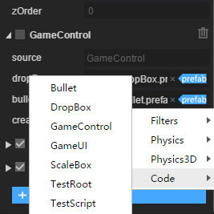
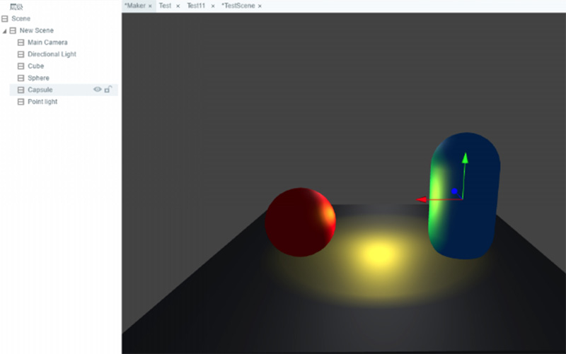

#2D

--**핵심 라이브러리**

cacheas = normal 때 문자가 모호한 문제를 줄이고 문자 관련 최적화

Scene, Sprite 의 destroy 가 잘못된 문제를 볼 수 있다

캐llLater 지연 조정

Loader 자동 판단 파일 형식 잘못된 문제 해결

SceneLoader sk 파일을 추가할 때 Png 파일을 자동으로 가재합니다.

Graphics.drawtexture 색 필터가 잘못된 문제를 해결하다

Audiosound 소각시 Pool 제거 대상을 늘리며 존재할 수 있는 소리를 풀 수 없습니다

Stage 조정 모드 해결 잘못된 문제

애니메이션, 다니메이션 해체, 잘못된 문제 해결

--**UI 라이브러리**

List 와 Panel 이 elasticenabled 속성 을 증가시켜 고무줄 을 켜기 편리하다

Dialog 목록 복원 중 애니메이션 종료가 끝나지 않았을 때 다시 열어 실패한 bug 열기

--**배합 창고**

마이크로신과 바이두 입력 상자 지원 정규 사용

3d 프로젝트 자원 복구 특수 상황 하에서 나온 문제

소리 캐시 방안 수정

#3D

--**3D 엔진**

카메라 render 함수 증가replacementag 인자 증가

Shader 프레임 추가 Subshader 개념

프로그램화 하늘 소재 증가

애니메이션 메모리 점용

물리 구성 요소 조정 Transform 업데이트 메커니즘

사용자 정의 Shader 설정 인자 변경

골격 애니메이션 모형 파일 크기와 현존 크기 최적화

애니메이터 애니메이션 지원 거꾸로 재생 기능

모형 파일 압축 기능 증가

camera layer 관련 인터페이스 최적화

Stat 통계 drawCall 조정 RenderBatch

Primitivemesh 관련 서브를 메쉬 통용류로 조정하여 정적 공장식 Primitivemesh.createX () 방법, 간소화

Charactier Controller 폐쇄 오류 BUG

몇몇 모형 하이라이트 형식 가재 오류 BUG

수정 강체 구성 요소 BUG 크기 조정

물리 복원 이벤트 폐쇄 물리 구성 요소 붕괴

복구 요정 설정 cast Shadow 후 파기하면 붕괴 버그

물리 구성 요소 복구 후 터치 속성 오류 BUG

3D 미리 노드 복구 후 다시 캐시 노드 버그

PixelLineSprite3D 수정 maxLineCount 붕괴 버그

애니메이션 복구 융합 버그

복구 카메라 축소로 비정상 버그 보이기

--**3DUnity 플러그인**

회원 계정 관리 페이지 조정

복구 법선 스티커 BUG 내보내기

안탁 플랫폼 텍스처 압축 속도 최적화

LayaiarRun 기능을 최적화하여 cmd 창 제거

#IDE

--**신규 기능**

새로운 텍스처 이미지 변환 도구, 안탁과 ios 파일 메모리 크기 감소 (vip 서비스)

새로운 증가는 nodejs 새 버전 배포 시스템에 근거하여 스스로 프로세스를 제시할 수 있고 명령행 방식으로 실행할 수 있다

장면 페이지 오른쪽 키 증가 검색 참조 기능

장면 추출 캐시 최적화, 파일은 변함없이 내보내지 않고, 컴파일링 효율을 높인다

모니터링 클래스 파일 수정, 컴파일을 변경하지 않고, 컴파일링 효율을 높이기

블록 체인 항목 추가 (ETH, NEO, HPB)

#beta 버전 로그
###beta1
​

1년간의 준비를 거쳐 결국 2.0 테스트판을 맞았다. 2.0부터 성능을 계속 중시하고, 우리는 엔진 기능을 완비하고, 확장성, 확장성 등 측면에서 발전성: 2D가 대량 개선, 구성 지원 증가, 물리 시스템, 시화 물리 편집, 3D가 비교적 큰 업그레이드, 성능과 기능을 대폭 언급했다.업그레이드, Native 운행 시 성능의 비약도 가져와 3D 가속 지원, 기타 200여 개 세부 개선도 가져왔다.그중 주요 개선:

#2D

일.**내장 물리 시스템**

Layaiaiar1.0은 Matter 물리 엔진을 지원하지만 단순한 지지만 심도 없이 사용할 때 직관하기 편리하지 않다.작은 게임이 개방됨에 따라 점점 더 많은 게임이 물리적 엔진의 지원을 필요로 하기 때문에 2.0부터 우리는 box2d 물리 엔진을 내장해 물리 조직을 봉쇄하고 IDE 물리적 속성을 위한 가시화 편집을 제공해 물리 게임을 더욱 편리하게 한다.물리 엔진은 Matter 에서 box2d 로 바뀐 것은 매트테르의 정도가 높지 않았고, 유형의 게임을 만들 때 알 수 없는 문제가 생기고, box2d보다 더 완벽하기 때문이다.

​

​

이.**구성 지원**

1.0 우리는 간단한 스크립트 확장 지원을 제공했고, 사용자가 점점 넓어지면서 수요가 점점 복잡해지고 확장되어 흔한 수요가 되었다.이 수요를 개선하기 위해 구성 요소화 스크립트 지원, 공식 측이 제공하는 기본 구성 요소를 추가합니다. 수요를 충족시키지 못하면 스크립트 확장 방식을 통해 구성 요소 기능을 개선할 수 있습니다.부품화 개발은 기능 추상, 재활용 및 개발 효율 향상에도 도움이 된다.한편 우리는 페이지 기류 계승의 처리 방식을 보류해 UI 논리를 처리할 때 매우 편리하다.

【작은 힌트】 스크립트와 페이지 상속보다는 페이지급 논리라면 페이지 안에 여러 요소를 자주 방문하고 상속식 쓰기를 사용하여 독립 모듈, 기능 단일 복용으로 스크립트 방식을 제안합니다.

더 많은 구성 지원 문서 자세히 보기: https://ldc2.layabox.com/doc/? nav=zh-as-2-4-0

​

​

삼.**장면 관리 에 기반 하다**

2.0 우리들 은 장면 을 기반 관리 방식 을 제공 했 다. 개발자 는 장면 의 창의적 설계 에 관심 을 갖 고 나머지 의 장면 을 가재, 자원 가재, 도화 사용, 자원 사용, 자원 소멸 등등, 엔진 은 전체 방안 을 제공 했 고, 원래 주 공정 이 필요 한 일 을 제공 했 다. 현재 엔진 도 제공 개발 원가 를 간소화 했 다. 더 많은 시간 을 게임 설계 에 더 많은 시간 을 게임 설계 상 에 들 었 다.

​

​

사.**가정화 컴파일러 디버그**

2.0 우리는 gulp 자동화 스크립트를 채용하여 컴파일과 테스트 프로세스를 구성하고, 전체 컴파일과 디버깅 프로세스를 통해 스크립트와 디버깅 중간에 사용자 정의 새 프로세스를 삽입하려면 copy, 압축 등, gulp 파일에만 새로운 임무를 추가하면 됩니다. 이 프로젝트에 사용자 정의, 지능화를 할 수 있습니다.

동시에 엔진은 기본적으로 require 를 지원합니다. 이렇게 대량의 제3자 nodejs 라이브러리를 사용하면 엔진에서 직접 사용할 수 있습니다.

한편 위신소게임 디버그 방식을 개선하고 개발하면서 디버깅을 할 수 있으며, 더 이상 발표할 필요가 없다.

후속 버전 게시판도 스크립트화 정제 방식으로 재구성돼 개성화 수요를 발표하면 걱정이 없다.

   

​

오.**3D 편집기**

2.0 시작, IDE, 3D 프로젝트 편집 지원 추가, IDE 편집 3D 장면, 재질, 물리 등 기능

현재 개선 중이기 때문에, 테스트 버전은 잠시 사용하지 않습니다.

​

​

육.**새로운 layacloud 프로젝트**

LayaCloud 게임 서버 집단은 빠른 개발에 근거하여 많은 사람들이 전투 게임에 대한 설계를 위해 높은 신뢰성, 확장 목표로 건설하고 서버 개발 원가를 간소화했다.https://wiki.cloud.layabox.com

   

​

칠.**새로운 IDE**

2.0은 IDE 피부와 레이아웃을 다시 설계해 더욱 간결하고 예뻤고, 다량의 기능을 개선하고 개발성을 향상시켜 개발효율을 높여 실제 사용에서 제시할 수 있다.

​

​

​

​

#3D

일.**성능**
알다시피 Layaiair는 성능으로 알려졌으며, 이번 리야아 3D2.0은 기능을 제외하고, 이용성 향상과 개선, 성능에 대한 대폭 향상을 보여줬다.하층에 대해 대량 재구성 업그레이드, 정적 모형과 동태 모형에 대해 대량 최적화를 했다. 특히 정적 장면 성능을 크게 높였다.JS 와 WebGL 인터페이스의 호출 횟수를 더 높일 수 있도록 더 선진적인 메커니즘을 채택해 성능을 높이기 위해 JS와 WebGL 인터페이스를 줄인다.

이.**재질 시스템**
레이레이어리아2.0 소재는 재질 개선과 향상, 엔진에 더 많은 공식 소재와 사용자 정의 소재 관련 기능을 제공해 새로 증가한 주요 공식 소재는 PBRStandardMaterial, PBRSpercularmateal, Unlitmateal 소재를 포함한다.PBR 소재도 최근 몇 년 동안 비교적 유행하는 물리 보카시 소재를 바탕으로 더욱 과학적인 shader 알고리즘을 사용하여 더욱 리얼한 소재감이다.UnlitMatatmaterial은 간소화 버전의 무광사진 소재로 일반적으로 기능특효로 사용되며 가색법이나 투명 혼합을 통해 강체 애니메이션을 이뤄낼 수 있다.사용자 정의 Shader 측면에서 우리는 주로 다양한 패스 기능을 증가하고 있으며, 예를 들어 카톡 렌더를 실현하는 데 필요한 스펙트럼을 실현하는 등, 다파쓰스는 샤더가 렌더를 보일 때 여러 번 보낸다.재질은 renderQue 인터페이스를 개방했으며, renderquere는 보카마의 순서로 개발자가 지정된 renderQue 값을 변경하여 소재의 요정 순서를 수정할 수 있다.

1) Shader 많이 pass 렌더링 추가
2) 개방renderQue, 개발자 정의 렌더순서
3) Unlitmaterial 재질
4) Effect 소재
5) PBRStandardmaterial 재질
6) PBRSpercularmaterial 재질

 

삼.**텍스처 시스템**
레이어리아2.0은 무늬 기능을 향상시키고 개선, 무늬의 유연성과 가진성을 증가시켰다.mipmap 다단계로 생성 여부, format 텍스처 형식 (예를 들어 R8G8B88과 R8G8B8A8 등), wrapModeU 와 wrapModeV 는 텍스트 모드 모드 패턴, filterMode 는 텍스처 모드 패턴, anisollevel은 각 성별 이형 여과로 여과된다.텍스쳐가 픽셀을 올리는 인터페이스를 추가하고, 개발자는 자체적으로 픽셀 색상을 업로드해 텍스처를 생성할 수 있다.GPU 텍스트 압축 (Android, IOS) 지원을 지원합니다. ETC, PVR, 현존 점용을 대폭 감소시켜 게임 자원 총량을 증가시켜 게임 품질을 향상시킬 수 있습니다.

1) 다양한 무늬 인자 설정 (mipmap, format, wrapModeU, wrapModeV, filterMode, aniso Level)
2) 텍스처 추가 화소 인터페이스
3) GPU 텍스처 압축

사.**애니메이션 시스템**
Layaiaiar2.0보다 완벽한 애니메이터 애니메이션 시스템, 애니메이션 속성을 지원하며 애니메이션 과도 융합을 지원하고, 더 자연스럽고 자연스럽고, 두 가지 비연관된 동작을 전환할 때 번쩍이는 현상이 나타날 수 있다.애니메이터는 애니메이션 다층의 혼합을 지원하여 애니메이션 상하 분리 등의 기능을 실현할 수 있으며, 각 층은 모두 독립적으로 어떤 뼈를 통제할 수 있다.애니메이터 애니메이터가 실시간으로 조정되어 메모리를 대폭 줄일 수 있으며 같은 프레임에서 애니메이션 유창도를 높이고 있다.

1) 애니메이터 애니메이션 융합 기능 crossFade
2) 애니메이션 다중 혼합 재생
3) 애니메이션 업데이트 메커니즘을 실시간으로 조정하여 대폭 메모리와 애니메이션 유창도 표현
4) 다양한 소재 속성 애니메이션

 

오.**물리 시스템**
Layaiar1.0 물리 기능이 부족해 2.0은 물리 시스템에 대해 재구성 설계를 진행했다.다양한 물리 구성 요소는 RigidBody, Physcscollider, CharCorController, 개발자는 프로젝트 수요에 따라 다른 물리적 요소를 선택할 수 있다.다양한 Shape, 개발자는 한 개 또는 여러 개의 Shape, 물리 요소를 추가할 수 있는 테두리 묘사를 마음대로 추가할 수 있습니다.

1) 신규 강체: RigidBody
2) 신규 충돌기: Physicscollider
3) 새로운 역할 컨트롤러: Character Controller
4) 신규 충돌기 형태: BoxCollidershapsuleColliderShape, CompoundColliderShape, ConeCollidershape, CyliderCollidercollidershape, Spherecollidershape, Melidershape
5) 추가 보조 검사 기능: shapeCapacast, shapacastAll 등

육.**요정**
트랜지스터 요정을 새로 늘렸고, 트랜지스터의 스트레칭 효과를 실현하는데 쓰이는 3차원 특효에서 비교적 자주 사용하는 요정은 입자, 미시 가강체 애니메이션, 그리고 이번 2.0 중 새로 늘린 트랙터.또한 화소선 요정은 픽셀 테두리를 그리는 데 사용되고, 이것은 일반적으로 다시 게임이나 일부 개발 과정 중 디버그 패턴이 비교적 유용합니다.

1) Trail Sprite3D 추가
2) PixelLineSprite3D

     

칠.**스크립트 시스템**
Layaiaiaiar2.0 엔진은 사용성 향상에 매우 신경을 쓰고 스크립트에서 다양한 회송 함수를 늘렸고, 충돌 반응, 3차원 모형 마우스 습득이 더욱 간단하고 편리하다. 구체적인 onCollisonXXX는 물리적 충돌을 포함해 충돌과 충돌, 충돌, 충돌, 충돌, 탈퇴, 우리는 1.0 후반 버전에서 onTriggerX 함수를 제공했다.

1) onMouseDrag, onMouseDay, onouseDown, onMouseDrag, onMouseClick, onMouseup, onMouseUp, onMouseonMouseover, onMouseOver, onMouseout이 충돌 함수를 기록했다.

팔.**기타**
자원 석방에 대해 Layair 1.0에서는 개발자가 골치 아픈 일이 많았다.Layaiaiar2.0에서 우리 공식은 destroyUnusedResedResources () 를 모의GC 에서 현재 장면을 방출할 경우 자원이 없습니다.레이레이어리아2.0이 빛사진의 이모티콘을 최적화한 것으로 알려져 빛사진 스티커가 1.0 이상의 HDR 색상에 비추어 효과가 더욱 생생하다.

1) 대량 자원 석방 기능 추가
2) HDR 빛 사진 포토 형식 추가

기타 주요 개선:

##-WebGL 밑바닥 반복 실현HTMLDivElement 재구성, 원래의 노드 패드를 Graphic 모드로 바꾸고 노드 생성 향상
##-색상 필터 밝기, 대비도, 포화도, 색조의 설정을 사용하면 더욱 편리하다Graphics 명령행 cmd 의 복귀, cmd 명령 수정
##- Graphics drawTexture 함수 증가Graphics 신규 drawImage, 간소화 버전의 drawTexture
##- Graphics 신규 drawTriangles, 정점에 근거하여 삼각형을 그릴 수 있다Loader 증가 WorkderLoader 지원
##-Sprite 의 Texture 개선, Texture 렌더링 성능 향상Sprite 가 bounds 성능을 최적화했습니다.
##-모든 색상 값은 Alpha 채널 지원 증가노드 증가 offAll Caller 인터페이스 증가, 어떤 개체의 모든 사건에 대한 편리성 향상
##-대부분의 UI 구성 개선, 자원 비동기 가재 지원엔진은 큰 그림이 모아진 지지를 제거하고, 사용자의 이해원가와 엔진의 복잡도를 줄였다.
##- 모든 IF-Flash 관련 코드 지우고 불필요한 분기 감소 코드 크기 감소기타 알 bug 해결

IDE

##- 물리 시스템 지원, 편집 물리 속성 을 시화, 더욱 편리 한 제작 물리 소놀이새로운 구성 요소화 확장 지원, 모든 노드 모두 구성 요소 방식으로 확장하여, 개인화 수요를 빠르게 실현할 수 있다.
##- 자원 축소 미리 보기 판넬, 위치 관리 자원IDE 가시화 인터페이스 구조 조정, 자원 패널, 페이지 패널, 스크립트 및 기본 구성 요소 전시, 실용성 향상
##-Prefab 제작 및 사용 지원새로 플러그인 항목 생성, 플러그인 확장 메커니즘을 확장하기 편리하다 IDE
##-디버그 기능 개선, 단축 디버깅, 신규 실행 기능, 링크 VScode 디버깅, chrome 디버그 사용작은 그림 및 도화 자동 맵 증가, 작은 그림을 가재할 때, 그림이 있는지 여부를 자동으로 판정할 수 있습니다. 만약 그림을 우선 사용한다면
##-디버그 전환 시도, 어떤 특정 장면을 디버깅하기 편리(예를 들어 현재 열리는 장면)계층 지원 노드 변경 이름 변경
##- 시화 편집 도구, 회전 도구, 장면 축소 도구, 정렬 도구IDE 실행 속도를 최적화시켜 더욱 빠르게 시작
##- 최신 VSCode 지원을 지지하고, 기능이 더 강해 ts, js 지원에 더욱 우호적이다최신 AS3 코드 힌트 플러그인을 사용하여 AS3 언어 사용 체험 개선
##-Viewstack 사용 체험 개선작업 프로세스를 설정할 수 있으며 사용자 정의 프로세스 증가
##-속성 기본 값 증가, 속성 보기 더 직관적소도구 위치 개선, 인터페이스 요소 간소화
##-시간축 증가 함수 호출 지원새 항목 목록 페이지
##-템플릿 저장 단추를 늘려 템플릿으로 저장하기 편리하다페이지 설정 단추 추가
##-새로운 게임 인자 설정, 시작 장면 설정디버그 및 프레임 스위치 추가
-스크립트 선택 제어 증가, 제3자 스크립트 사용 편리

###beta2
​

2.0이 방금 발표한 기능이 아직 안정되지 않았기 때문에, 우리는 새로운 버전 업데이트 힘을 가속시켜 매주 한 버전의 업데이트 힘을 유지하고 있다면, 어떤 문제에 부딪히면 즉시 피드백을 해주십시오.

**물리 엔진**

물리 엔진을 한층 보완하고 물리 보조선 설정 증가, 인터페이스 증가, 완벽 주석

`IDE内通过项目设置面板（快捷键F9），可以打开物理辅助线，代码中可以通过PhysicsDebugDraw.enable()打开`

물리 엔진 조정

- 물리 보조선, 물리 보조선 실현 webgl 렌더링, 스위치 추가

- RigidBody 의 linearVelocity 속성을 object 형식으로 바꾸기

- RigidBody getWorldCenter 인터페이스 증가, 강체 중심점 찾기 편리

- Physics 종류 강체 증가, 관절 수량, 충돌 수량

-충돌 사건 추가 충돌 정보 취득 방법

- 관련 물리 주석, 상세 소개 설명 증가

**미니 게임 표현**

- 위신이 scene 파일을 지원하지 않기 때문에 엔진이 부합하여 scene 접미사를 가재할 수 있는 장면으로 동명 json 파일로 변경, 게임 코드 변경, 후속 마이크로폰 지원 scene 접미사 후 스위치를 제거

- IDE 스위치 추가 장면 등 파일을 json 으로 내보내며 프로젝트 설정을 통해 열기

- 마이크로폰 소규모 게임 복구, IOS 아래 텍스트 표시 없이 bug

**복원 bug**

-IDE 내에서 디버깅을 할 수 없는 문제를 복원합니다.

- 복원 그림 9궁격 설치 이상 보이기

- IDE 내단축키 이상 수정

-복구 기능 이상

-자원 속성 수정 후 즉각 쇄신 문제가 없습니다

- canvas 모드 복구, 필터 표시 잘못된 문제

- webgl 아래에 rgb a(r, g, b, a) rgb(r, g, b) 타입의 색상이 잘못된 질문을 표시합니다.

- drawCirl drawline 이 축소되는 상황에서 정상적인 문제가 될 수도 있다

**기타**

- API 문서 정보 https://layaiair.ldc.layabox.com/ap2/

- graphics 속성 패널 증가 rendertype 설정

- 음효 석방 전략을 개선하여 더욱 합리적으로 만든다

-drawCirl drawline 등 적당량 인터페이스를 개선하고, Webgl 아래에 비정상적인 문제를 보일 수 있습니다

**3D 엔진**

- CompoundColliderShape, clearchildShape 방법 증가

- 복구 요정 축소, Rigidbody3D 이상 BUG

- ShinnedMeshRenderer rootbone 연결 메커니즘 조정, 로트본은 골격 절점 동기 매트릭스

- 물리 세계를 조정

- 물리 수정 Shape Center 이동 비정상 BUG

- 위신 소규모 게임 3D 초기화 실패 문제 복구

**3DUnity 플러그인**

-자원 내보내는 속도 최적화

-blinphong 소재 하이라이트

-애니메이션 내보내는 모션의 버그 복구

- 복구 장면 파일 이름 바꾸기

-유닛 기본 그림 복구 중 자원 내보내는 버그

- blinphong 처음으로 전환된 버그 복구

###beta3
#2D

--**신규 위신 개방 도메인 데이터 전시 구성 요소**

위신 개방 데이터필은 항상 귀찮은 일이며 특수 인코딩이 필요하고 성능 병목으로, 마우스 사건에 대한 문제가 자주 발생한다.

Layaiaia 2.0 시작, Laya 공식 위신 개방 도메인 UI 구성 요소를 제시하고 이 문제를 해결해 더 간단하고 성능이 높습니다. http:/ldc2.layabox.com/doc/ 나v = zh-5-7-7

  

​

--**LayairIDE2.0 Mac 버전 발표**

  

​

--**물리적**

물리 구성 요소 최적화 대상 창설 비용

마우스 관절 개선, 설정 제어점이 선택되어 있으며, 설정하지 않으면 마우스 클릭 위치에 따라 제어점으로 변경됩니다

마우스 관절 복구 오류 버그

​

--**핵심 라이브러리**

Loader 가 sk, ani 등 파일 접미사에 대한 자동식별 증가

마이크로폰 작은 게임 복구, 특정 ios10.1 버전 텍스트 표시할 수 없는 bug

음성 복구 중 정지된 버그

애니메이션 종류 로ad애니메이션 논리 오류 복원

drawToCanvas 를 조정했습니다.

입자 수정 오류

​

#3D

물리 구성 요소 복구 붕괴 버그

물리 구성 요소 초기화 후 요정 좌표 위치

collisionGroup 및 canCollideWith 붕괴 BUG

물리 사건 리콜 복구 부정확 BUG

리소스 버전 복구 오류 BUG

CompoundColliderShape.removechildShape () 방법 BUG

Rigidbody3D.clearForces 방법 복구 BUG

Physicscollider 위치를 복구할 수 있습니다.

**3DUnity 플러그인**

복구 장면 파일 내보내기 단계 분실

정점 컬러 수정

###beta4
이번 업데이트 주요 수정 복구의 버그 다음과 같습니다:

#카테고리

--**2D 라이브러리**

Scene open 방법은 param 인자를 늘리는데, 이 변수는 결국 onOpen 방법에 전달되며, 상황을 열어 볼 때 인자를 처리하기 편리하다

Scene 종류 증가 단례의 지원, ide 안에 어떤 장면을 설정하는 경우, 이 장면을 열기는 시종일관 실례가 있습니다

2.0 버전 완성, QQ 플랫폼

Byte 종류 증가 readArrayBuffer 방법

무료 소규모 유량 공유 구성 요소 추가

골격 애니메이션 증가

--**3D 라이브러리**

애니메이터가 요정 active 속성 지원 증가

마우스 복원 이벤트 BUG

물리 구성 요소 ColliderShap이 비어 있을 때 복제 오류 BUG

2D, 3D 복원, 3D 혼합, 계급 착란 BUG

Rigidbody3D 의 linearVelocity, angularvelocity 가 무효가 될 수 있습니다 BUG

transform 의 rotationEuler 를 복구하는 오류 BUG

Input3D 좌표 오류 버그 복원

모형 합병

#편집기

--**LayairIDE**

자원 미리 보기 패널 키보드 단축위치 증가 키보드 지정

새 디렉터리 메뉴 추가

시간축 패널 지원

기본 속성이 잘못된 문제를 복구합니다

참고도 비정상적인 문제를 복구하다

복구 ts var 비정상적인 문제 내보내기

as 항목 이름 runtime 복구 위치 파일을 누르면 안 됩니다

UIVIVIEW 오류 내보내기

복구 프로젝트 패널 드래그 폴더가 정상적으로 경신된 문제가 없습니다

--**3DUnity 플러그인**

유닛 중 Layashader 출력 색상 범위 조정

복구 요정 active 속성 내보내기 오류 BUG

복구 선택 Auto Generate 내보내기 라이트 사진 스티커 오류 BUG

MeshCollider 복구 오류 내보내기

###beta5
#2D

--**핵심 라이브러리**

  **바이두의 작은 게임이 적당한 조합을 추가하여, Layaiair 엔진은 바이두 지능의 작은 게임에 이을 수 있다.**

  **[불호환 조정!]**Scene 종류 open 방법 param 인자와 complete 변수 순서를 조정하고,**여기 는 호환 조정 을 하지 않 았 는데, complete 인자 를 사용하면 즉시 순서 를 조정해 주십시오**

Scene 종류 증가 progress 환율 증가

Scene loading 페이지 설정 증가, setLodingPage 방법으로 페이지를 다운로드, 화면 전환 시 loading 페이지, loading 페이지가 현재 장면을 자동으로 접수할 수 있는 progress 이벤트

Scene 추가 showLoading Page와 하이드 LodingPage 수동 제어 loading 페이지 표시

Scene close 방법 type 속성 증가, 닫기 편리한 원인

Sprite loadImage 방법 증가 url

문자가 너무 큰 붕괴 문제를 해결하다

Eventedispatcher ofAllCaller 실효된 bug

sleep 모드에서 올바르게 time 업데이트 중인 bug

해결 mask 관련 bug

cacheas = normal 해결 이상 표시

Text padding 잘못된 문제를 해결하다

텍스트 스티커 반복 사용하기 위한 텍스트 혼란 버그

--**UI 라이브러리**

UI 라이브러리 동적 피부의 구성 요소를 가재 완료 후 resize 이벤트 추가

Panel 모자이크 VBox 해결이 죽음의 순환을 초래할 수 있다

dilog 커버 제거 안 된 bug 해결

--**골격 애니메이션 라이브러리**

Boneslot 피부 전환 해결 때때로 비정상적인 문제

#3D

--**3D 엔진**

Rigidbody3D 구성 증가 수면 상태 속성 issleeping

Rigidbody3D 구성 증가 sleepLinearVelocity sleepAngularVelocity 속성

물리 구성 요소 activate () 방법 삭제, Rigidbody3D 구성 요소 wakeup

Trail Sprite3D 요정을 재구성하고 일부 BUG, API

PixelLineSprite3D 요정 재구성, 사용성 향상, API 자세

Vector3 SetValue 방법 증가

TrailRender 신규 TransformZ 모드

애니메이터 애니메이션 복원, 오란 버그 틀림.

복구 요정 Active false 때, 물리 구성 요소는 여전히 BUG

입자 RotationOverLifeTime 모듈 BUG, 3D 모드 보완과 관련성

입자 정렬 BUG

--**3DUnity 플러그인**
애니메이터 구성 복구 중복과 여건이 심각하다 BUG

플러그인 내보내기 성능 최적화

#IDE

--**신규 기능**

  **바이두 소규모 게임 발표 기능 추가**

새 종류 노드 다선, 이 종류 더 많은 속성 기능 보이기

새로운 style 파일 (자원 기본 속성) 변화 검사 기능을 발견하면 IDE 가 자동으로 고칠 수 있으며, 효과가 잘못된 문제를 나타내는 것을 효과적으로 방지할 수 있습니다.

구궁 칸 설정 인터페이스 입력 상자 tab 전환 기능

--**복원 bug**

코드 캐시 오류 해결

미리 보기 판넬을 해결할 수 없는 문제입니다.

레벨보드 해결 마지막 비정상적인 문제

계층 판넬 슬라이드 노드 해결

그림 캐시 해결 은 제때에 업데이트 할 문제 가 없다

시크릿을 끌고 장면에 가서 틀린 문제를 해결하다

고청스크린 이 잘못된 문제 를 해결하다

###beta5.1
###IDE **신규 기능**

새 스크립트 파일 지원
LayaCloud 가 공식 환경 및 관리 센터 기능 추가 배치

  **단축키 변경:**

Ctrl + P 페이지 열기

Ctrl + Shift + P 페이지 설정