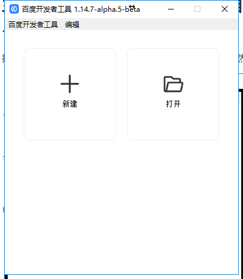

#첫 번째 바이두 작은 게임 만들기

>>*author:charley vesion:Layair 2.0 update:2018-10-27*

###개발 환경을 마련하다

####1, 다운로드 및 레이아아이리드 집성 개발 환경 설치

LayaiairID는 Layaia 엔진의 집성 개발 환경으로 레이야아 엔진과 예제 항목, UI, 애니메이션 등 가시화 편집, 프로젝트 코드 작성 및 관리 등 개발 도구를 집성했다.**베타5 이후의 버전 개발자는 레이레이아이드 창건과 백도 소규모 게임 프로젝트를 직접 채택할 수 있다.**

**홈페이지 다운로드 주소**：[http://ldc2.layabox.com/layadownload/?type=layaairide](http://ldc2.layabox.com/layadownload/?type=layaairide)

####2, 다운로드 및 바이두 개발자 도구 설치

바이두 개발자 도구는 주로 작은 게임 제품의 미리보기와 디버그 테스트, 진기 테스트, 올리기 등이다.작은 게임 개발의 필수 도구다.

**개발 도구 다운로드 주소**：
[잠시 개방되지 않아 협력은 우리 비즈니스와 연락을 얻을 수 있다] ()

  

####3, 개발자 ID 가져오기 (AppID)

AppID 도 개발할 수 있지만 기능이 제한된다.

개발자 ID 가 개방되지 않았는데, 만약 우리 비즈니스 협력에 연락이 필요하다면.

###

###둘째, LayairierIDE 만들기 및 바이두 소규모 게임 발표

####1. LayairierIDE로 바이두 미니 게임 실례

2.0은 이미 적당한 동작을 할 필요는 없고, 배포할 때 바이두 소게임을 선택하면 된다.

서류 추출은 바이두 5M 가방체가 제출한 제한을 올리기 때문이다.파일 추출 기능을 통해 5M 가방 안에 있는 파일을 지정한 바이두 소규모 게임 디렉터리에 복사할 수 있습니다.하도에서 제시한 바와 같다.

> 패키지 제한, 100m, 관련 내용의 다른 문서에 소개합니다.이 편은 초보에 대한 빠른 속도로 작은 게임 발표 프로세스를 잘 알고 있다.

 

(그림: 파일 추출 기능, 브라우징 클릭 후 선택된 5M 파일을 선별할 수 있습니다)

**Tips**：

>> 플랫폼의 오른쪽 물음표 아이콘을 누르면 각 옵션의 상세한 설명을 볼 수 있습니다.

발표에 필요한 내용을 설정한 후.최종 조회 발표.바이두의 작은 게임 항목을 생성할 수 있다.

###셋, 바이두 개발자 도구로 작은 게임 프로젝트 만들기

####1, 프로젝트 만들기

"바이두 개발자 도구", 팝업 판넬에서 왼쪽 암호를 누르면 작은 게임 항목을 팝업으로 만들 수 있습니다.

 

  

`项目目录`방금 기능을 추출하여 복사한 로컬 백 디렉터리를 선택하는 것이 좋다.만약 이 기능에 익숙하지 않다면.다만 유통과정을 달리기 위해 LayaiairiDE는 작은 게임의 디렉토리 (일반적으로 프로젝트 루트 목록 아래에 있는 release (bdgame) 를 임시로 선택할 수 있다.

`AppID`바이두 개발ID 를 입력하면 (잠시 개방되지 않음, 만약 우리와 연락이 필요하다면, 입력하지 않아도 디버그 조회식 조회수를 개발할 수 있지만 기능이 제한된다.그래서 AppID 를 입력하는 것이 좋다.

####3, 바이두 개발자 도구 번역

작은 게임 프로젝트를 완성한 후 도구 안에서 미리 보기 효과와 디버깅을 할 수 있습니다.

 

