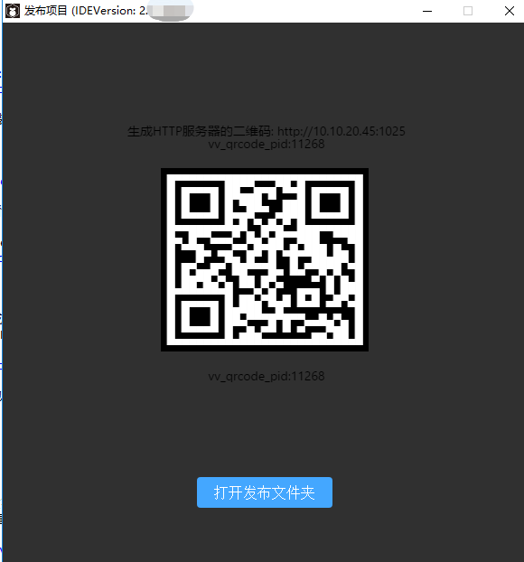

#vivo 작은 게임 발표 및 디버그 안내

> update: 2019-07-01
>>
> vivo 작은 게임의 배포는 LayaiaiairiDe, IDE 다운로드 관련 문서를 살펴보고, 이 글의 안내 범위 안에 없습니다.

##1, vivo 작은 게임 발표, 디버그 준비

1, vivo 브랜드 핸드폰

2, vivo 설치 디버그 APP, 다운로드 페이지:[https://minigame.vivo.com.cn/documents/](https://minigame.vivo.com.cn/documents/#/download/debugger)#[/download/debugger](https://minigame.vivo.com.cn/documents/#/download/debugger)

페이지에 들어가면 바로 다운로드를 누르면 다운로드 가능합니다.vivo 디버깅 APP 를 어떻게 설치하느냐에 따라 이곳은 소개하지 않을 것이다.

3, vivo 작은 게임 엔진 다운로드

현재**디버그 APP**내장된 vivo 엔진 버전은 1034입니다. 이 버전은 이미 BUG 가 존재합니다. Vivo 작은 게임 홈페이지에 최신 버전의 작은 게임 엔진 apk을 다운로드해야 합니다.

페이지 다운로드:

https: minigame.vivo.com.cn/documents/#/ download/engine

현재 추천하는 버전은 1041, 다운로드 설치 후, vivo 빨리 디버너 버전 번호를 볼 수 있는 1041.

4, PC 컴퓨터의 크로미 브라우저와 휴대전화 데이터 연결선.

5, 설치 nodejs 환경[node官网：[https://nodejs.org/en/](https://nodejs.org/en/)명

다운로드 설치가 쉽고 소개도 잘 하지 않습니다.명령줄에서 npm 명령을 옮기는 것은 성공한 셈이다.

6, LayaiarIDE 집중 개발 환경, Layaiaiair IDE 2.1.1beta나 이상 버전[ 官网下载: [https://ldc2.layabox.com/layadownload/?type=layaairide](https://ldc2.layabox.com/layadownload/?type=layaairide)명

7. ADB 설치

ADB 는 권한과 추송 등에서 ADB의 홈페이지를 다운로드하고 설치할 수 있다.


 [ ADB官网下载:  [http://adbshell.com/downloads](http://adbshell.com/downloads)명

>> 간단한 힌트, ADB Kits, 다운로드 후 압축백을 다운로드한 경로의 간단한 디렉터리를 해제할 것을 건의합니다 (예):`D:\adb`무엇환경 변수를 첨가하는 것을 기억해야 한다.
>>

##2, vivo 작은 게임 발표 및 전체 프로세스

###1, vivo 작은 오락가방 발표(xx.rpk)

레이어이더의 발표 기능은 비보의 작은 게임의 발표 기능을 포함해 레이야아 엔진의 프로젝트를 선포하고, 발표 기능을 통해 rpk 접미사 가방으로 만들어야 한다.발표 기능에 관한 사용.이곳은 중복 소개를 하지 않는다.아니에요. 공식 웹 문서로 찾아볼 수 있어요.

링크:[https://ldc2.layabox.com/doc/?nav=zh-ts-3-0-6](https://ldc2.layabox.com/doc/?nav=zh-ts-3-0-6)

###2. 2차원 부호 인터페이스를 보류한다.

발표 후 2차원 부호의 인터페이스는 1개 정도 표시됩니다.이 인터페이스는 끄지 말고 뒤의 휴대전화 스코어가 필요합니다.

 


(그림 1)

###3. chrome 디버그 환경 시작

####3.1 설치 및 앱 디버깅

컴퓨터 PC C의 chrome 디버깅 환경을 시작하려면 우선 vivo 작은 게임의 디버깅 APP (빨리 응용 디버깅기) 를 설치해야 한다.그리고 진입을 클릭합니다.

 


(그림 3)

####3.2는 디버그 인터페이스 스코드에 vivo 작은 게임을 설치하는 rpk 가방

빠른 응용 디버깅기에 들어간 후에는 그림 4개처럼 보이는 APP 조작 인터페이스를 볼 수 있다.

  


(그림 4)

이때 우리는 4의 스코어 설치를 클릭 4중 Layaiaiaiair IDE 에서 인터페이스에 있는 QR코드 (끄지 말기 전에 QR코드를 다시 발포할 것이다.휴대전화 중에는 진기 환경에서 운행할 수 있다.

>> 여기에 힌트를 주는 것은: 휴대전화 네트워크와 PC 가 같은 랜네트워크 단속(4G망으로 도메인을 쓸어서는 안 된다).

게시 목록 아래 / dist 디렉토리 내의 rpk 가방을 휴대폰에 전달한다면 점검을 통해`本地安装`버튼을 설치하는 것도 가능하다.하지만 스코드를 설치하는 것이, 스코어가 더 편리하기 때문이다.

####3.3 물리 선로 연결 및 인증

관련 경험이 있는 개발자에게 USB 휴대전화 연결선 물리 라인을 확보하는 것은 이미 연결된 상태이며 USB 디버깅 허가도 문제 없어 이 절차를 넘을 수 있다.

#####다음과 같습니다:

1. 휴대전화 연결선으로 휴대전화와 PC 를 물리적으로 연결한다.

2, 이전에 열린 명령행에서 adb shell 입력, 그림 5-1USB 디버그 모드 인증을 받지 못했습니다.

 


(사진 5-1)

이때 우리는 휴대전화 엔트리를 주목해야 한다. 그림 5-2의 제시된 힌트가 나타날 경우 USB 디버깅을 허가할 수 있는 것을 점검해야 한다.

 


(사진 5-2)

3, 재검증 허가.

USB 디버그 패턴이 성공한 후, 우리는 다시 adb shell 을 입력하면 5-3의 지시를 같아야 한다.

 


(사진 5-3)

어쨌든 이 코너에서 PC 는 권한적으로 이 휴대전화 설비를 디버깅하는 것을 보장해야 한다.

####3.4 Crome 디버그 환경 시작

이전에 스코드가 설치된 후 자동으로 설치된 게임이나 디모에 들어갈 수 있다.

디버깅을 시작하려면 먼저 물러나셔야 합니다.

그리고 6 시 시, 클릭**디버그 시작**vivo 작은 게임의 디버깅 모드에 들어갑니다.

 


(그림 6)

리얼리티 디버그 모드에 들어가서 PC 에 Crome 브라우저를 켜겠습니다.

이때 잊지 마세요. USB 데이터라인을 연결하고, 휴대전화 장치와 PC 와 연결, 권한을 언급한 질문에 다시 반복하지 않는다고 합니다.

휴대폰에서 휴대전화를 찾은 IP (어떻게 셀프 바이두를 어떻게 알아야 할지 모른 채 기억해야 한다.휴대폰망과 PC 망은 같은 랜 단락에 계속 유지해야 한다는 것이 주의해야 한다는 것이다.

chrome 브라우저 입력 표시줄에 입력:


```

chrome-devtools://devtools/bundled/inspector.html?v8only=true&ws={IP}:5086/00010002-0003-4004-8005-000600070008
```


{IP} 휴대폰 IP 주소로 바꾸면 그림 7개처럼 됩니다.

(그림 7)


이로써 vivo 작은 게임은 Crome 디버깅 완료 프로세스를 발표했습니다.더 많은 vivo 작은 게임의 연결 프로세스 및 문서 소개를 알고 싶으면 이 사이트를 기억합니다:

https://minigame.vivo.com.cn


##본문 칭찬

만약 본문은 당신에게 도움이 된다고 생각하시면, 스코드가 작가님을 환영합니다. 당신의 격려는 우리가 더 우수한 문서의 동력입니다.


