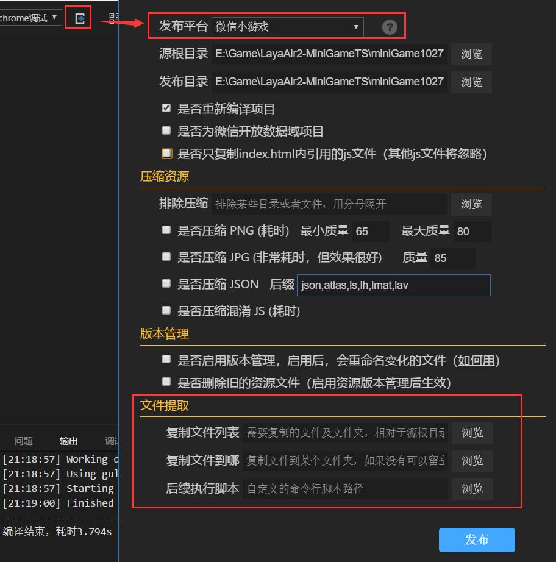

#첫 번째 웨이보 게임 만들기

>>*author:charley vesion:Layair 2.0 update:2018-10-27*

###개발 환경을 마련하다

####1, 다운로드 및 레이아아이리드 집성 개발 환경 설치

LayaiairID는 Layaia 엔진의 집성 개발 환경으로 레이야아 엔진과 예제 항목, UI, 애니메이션 등 가시화 편집, 프로젝트 코드 작성 및 관리 등 개발 도구를 집성했다.**개발자는 LayairierIDE 창건과 위신소게임 프로젝트를 직접 채택할 수 있다.**

**홈페이지 다운로드 주소**：[http://ldc2.layabox.com/layadownload/?type=layaairide](http://ldc2.layabox.com/layadownload/?type=layaairide)

####2, 다운로드 및 마이크로폰 개발자 도구 설치

위신 개발자 도구는 주로 작은 게임 제품의 미리보기와 디버그, 진기 테스트, 올리기 등이다.작은 게임 개발의 필수 도구다.

**개발 도구 다운로드 주소**：
[https://developers.weixin.qq.com/minigame/dev/devtools/download.html](https://developers.weixin.qq.com/minigame/dev/devtools/download.html)

  

####3, 작은 프로그램을 만드는 기업 개발자 계정, 개발자 ID (ApppID)

AppID 도 개발할 수 있지만 기능이 제한된다.그래서 개발에 앞서 마이크로크플랫폼에 작은 프로그램 개발자 계정을 작성하는 것이 좋다.

#####등록 계정 앞 관련 주의사항

일.**개인 개발자에게 판호를 필요로 하지는 않지만 내사 (지불) 기능을 인수할 수 없다.**광고를 접수하여 데이터 변환을 할 수 있고 광고가 접입할 때 개인 정보를 기입할 수도 있다.
2. 게임에서**지불 기능에 관련되어, 반드시 기업 개발자 계좌번호를 사용해야 한다.**.그리고 판호를 제출해야 합니다.
3. 마이크로편지 공중 플랫폼 계정을 등록할 때는 게임 분류로 기억해야 한다. 그렇지 않으면 등록된 계좌는 작은 프로그램을 개발할 수 있다.
4. 작은 게임은 현재 안탁시스템 버전만 개통되고 있으며, 광고변현 안탁과 아이OS 모두 접수할 수 있다.

**등록 주소**：[https://mp.weixin.qq.com/wxopen/waregister?action=step1](https://mp.weixin.qq.com/wxopen/waregister?action=step1)

개발자 계정을 등록하고 로그인한 후 메뉴 개발 설정에 AppID 를 볼 수 있으며, 하도에서 제시한 다음 개발자는 기록을 기록하고 작은 게임 항목을 만들 때 사용해야 한다.

###

###둘째, LayairierIDE 만들기 및 마이크로 게임 발표

####1, LayairirIDE로 작은 게임 표시 항목 만들기

LayairIDE 열기, 클릭`新建`새 프로젝트 패널을 팝니다.패널 왼쪽 항목 형식 목록에서 임의의 항목 형식을 선택하고, 패널 오른쪽 설정 항목 이름, 항목 경로, 개발 언어 형식, 엔진 버전.작은 게임 항목을 만들 수 있습니다. 위신 작은 게임 항목에 대해서는 잊지 마세요`增加微信小游戏支持`그림이 제시한 바와 같다.

####2, 프로젝트 개발

프로젝트 개발본 부분은 자세히 소개되지 않고, 관련 엔진과 IDE 의 사용은 다른 문서를 볼 수 있습니다.우리가 선택한 것은 예시 프로젝트이기 때문에 작은 게임 발표 코너에 직접 들어갈 수 있다.

####3. 웨이보 게임 발표

항목 발표 단추를 누르면 팝업 발표 항목 인터페이스에서 플랫폼을 웨이보 게임으로 선택하십시오.

프로젝트에서 번역하지 않았다면 재번역 프로젝트를 선택하면 반포할 때 다시 번역할 수 있다.

서류 추출이 매우 관건인데, 위신 4M 가방체가 제출한 제한을 올리기 때문이다.파일 추출 기능을 통해 4M 가방 안에 있는 파일을 지정한 마이크로폰 프로젝트 디렉토리로 복사할 수 있습니다.하도에서 제시한 바와 같다.

> 패키지 제한, 패키지는 8M, 관련 내용의 다른 문서에 소개합니다.이 편은 초보에 대한 빠른 속도로 작은 게임 발표 프로세스를 잘 알고 있다.

 

 

(그림: 파일 추출 기능, 브라우징 클릭 후 선택된 4M 백 파일을 선별할 수 있습니다)

**Tips**：

>> 플랫폼의 오른쪽 물음표 아이콘을 누르면 각 옵션의 상세한 설명을 볼 수 있습니다.

발표에 필요한 내용을 설정한 후.최종 조회 발표.마이크로 소규모 게임 프로젝트를 생성할 수 있다.

###셋, 마이크로 개발자 도구로 작은 게임 프로젝트 만들기

####1, 개발자 계정 로그인, 프로젝트 형식 선택

위신 웹 개발자 도구 열기 ', 개발자의 마이크로카드 로그인그리고 선택**애플릿 프로젝트**항목 설정 누르십시오.

 

####2, 작은 게임 만들기

애플릿 항목을 클릭한 후 팝업 판넬에서 오른쪽 밑 모서리의 가호를 누르면 작은 게임 항목을 만들 수 있습니다.하도에서 제시한 바와 같다.

  

`项目目录`방금 기능을 추출하여 복사한 로컬 백 디렉터리를 선택하는 것이 좋다.만약 이 기능에 익숙하지 않다면.다만 유통과정을 달리기 위해 LayaiairiDE는 작은 게임의 디렉토리 (일반적으로 항목의 루트 디렉토리 아래에서 release (wxgame) 를 임시로 선택할 수 있다.

`AppID`앞서 위신대중 플랫폼에서 볼 수 있는 AppID 를 입력하면 입력하지 않아도 디버깅을 개발할 수 있지만 기능이 제한된다.그래서 AppID 를 입력하는 것이 좋다.

####3, 마이크로 개발자 도구 번역

작은 게임 프로젝트를 완성한 후 도구 안에서 미리 보기 효과와 디버깅을 할 수 있습니다.

 

####4, 진기 테스트 및 디버그

레이어이더에서도 디버그 프로젝트의 효과를 볼 수 있기 때문에 적합한 문제가 아니라 기본적으로 양쪽의 효과는 다르지 않다.그래서 여기서 제일 중요한 건 클릭이에요.**미리 보기**기능, 휴대전화 웨이보 스톡을 통해, 위신에서 진기 테스트와 디버깅을 한다.

 

**Tips:**

리얼리티를 올릴 때 기본적으로 4M을 초과할 수 없고 프로필백은 8M을 초과할 수 없으므로 IDE 게시 디렉토리 아래에서 예시 항목의 libs 디렉토리를 직접 삭제할 수 있다.이 예시 항목은 이미 code.js 에 통합되었기 때문이다.그렇지 않으면 4M을 넘어 올릴 수도 있다.이 문제는 새로운 판본에서 최적화될 것이다.

마이크로카드를 사용한 후 애플릿 프로그램을 시작하여 오른쪽 위쪽 윈도 단추를 누르면 디버깅과 성능 모니터링 패널을 열 수 있습니다.

리얼리티 디버깅과 성능 모니터 패널 개시 후 그림 아래에 제시한 것 같다.

 

이로써 완전한 게임 개발 프로세스가 끝났다.쉽지는 않아요.LayaiairIDE가 개발한 작은 게임 프로그램을 채택하여 기본적으로 위챗 소게임에 사용되지 않습니다.