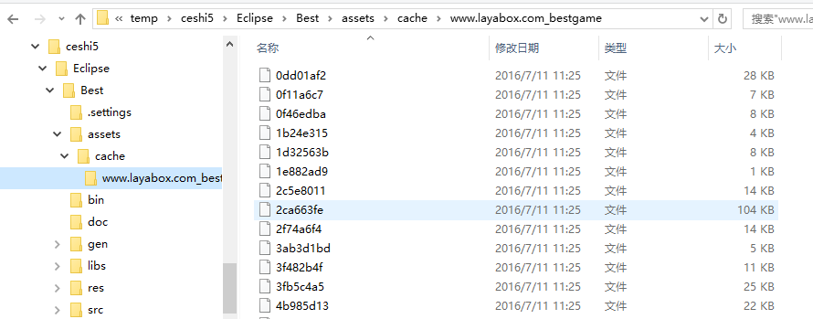
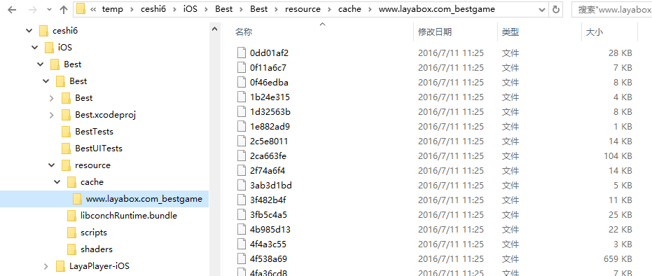

## 介绍
LayaDcc 是用来给项目打包资源和生成dcc文件的工具。Dcc文件可以用来实现文件的增量更新，即项目更新的时候，
只下载变化了的文件，这有利于减少下载量，为项目提供实时更新的功能。  

LayaDcc会遍历所有的项目文件，生成一个包含项目所有文件签名的二进制文件，LayaPlayer在启动的时候，会根据从服务器获取Dcc信息，确定需要更新什么文件。
## 安装和使用
LayaDcc是一个基于Node.js的命令行程序，所以需要Node.js的环境。
1. 安装Node.js。 如果没有安装的话，到nodejs[官网](https://nodejs.org/en/)下载。
node.js必须是新版的，不支持 0.xx的版本，可以用命令查看node版本
```bash
node -v
```
例如:  
```bash
node -v
v4.2.0
```
2. 安装 LayaDcc
```bash
npm install -g layadcc
```
3. 使用方法
```
layadcc 输入目录，[options]
options:
    -cache 生成cache.
    -lwr 文件路径全部转为小写。
    -url url 生成cache的话，对应的url.
    -cout outpath cache的输出目录，如果不设置的话，就是在资源目录下。
例如:
   layadcc d:/game/wow -cache -url www.game.com
 ```
4. 示例
   1. 打包一个带资源的app  
    有一个游戏项目，放在e:/game/bestgame/目录下(就是首页在这个目录下)，希望把这个目录的资源打包
    进app中。这个项目的在线地址是 http://www.layabox.com/bestgame/index.html
        * 先生成cache  
            ```bash
            layadcc e:/game/bestgame -cache -url http://www.layabox.com/bestgame/index.html
            ```
            这样，就会在e:/game/bestgame下生成一个 layadccout 目录，把这个目录下面的cache目录拷贝到项目的资源目录下.
            对于android，资源目录是项目下的assets目录，对于ios是resource目录。考完的结构如下图:
            Android：  
            
            iOS:
            
        * 生成服务器端dcc
            ```bash
            layadcc e:/game/bestgame 
            ```
            这个会在 e:/game/bestgame/目录下生成一个update目录，想办法把这个update目录上传到服务器的
            对应目录。

	    * 测试
            运行app，看日志，如果打包的资源文件都没有下载(除了首页index.html)，就表示成功了。

 

*注意:*  
此工具执行的时候会修改所有文件的修改时间，目的是为了防止cdn在回源的时候以为文件没有被修改。 如果不需要此功能，需要改js源码。

## TODO
以后会加一个界面整合到IDE中。

## 常见问题
1. 客户端报校验错误   
这个可能的原因很多，在没有cdn的情况下，一种可能是文本文件的回车换行的问题，即文件在发到服务器以后，回车换行被上传工具修改了。
例如svn,git,和部分上传软件都会做这种转换，解决方法是通过设置去掉这种转换，或者以zip的方式上传文件，在服务器解开。

## 更新
* 20160713 version: 1.7.0    
加了一个 -cout 参数直接控制输出路径。
如果不用 -cout 缺省输出改成了资源目录下。
加了个输出打印。
-url 后面的参数可以不完整，例如 http://www.layabox.com 不必有index.html了。
