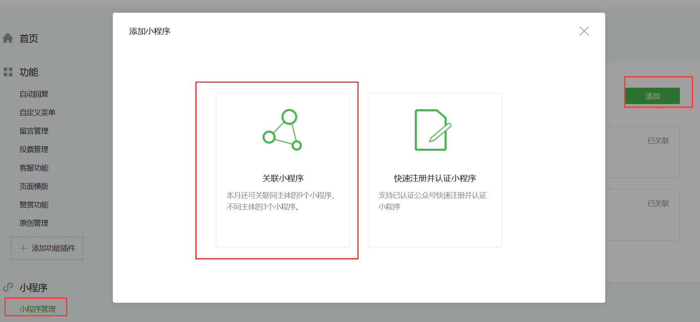
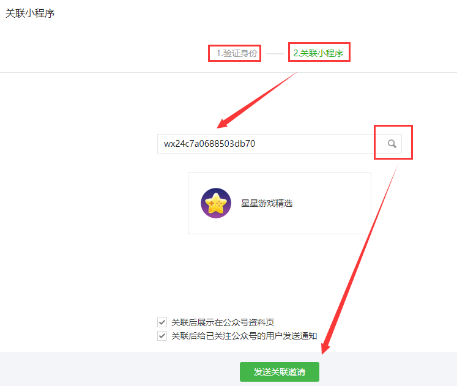

## 流量共享平台使用指南

### 一、平台导航功能介绍

#### 1、平台介绍

平台介绍页面中会阐述平台建立的目标以及流量获得原理。

#### 2、使用指南

使用指南页面中会介绍平台的页面功能与加入Layabox流量共享平台的详细技术指南。

#### 3、运营数据

运营数据页面中会自动生成一个与后台自动绑定的小程序码，开发者可以扫一扫该小程序码，在微信端打开Layabox共享数据助手，在数据助手中查询自己的游戏在平台中的总流入、总流入，以及单个游戏的总流入贡献和总流出获得等关键数据。

#### 4、游戏列表

在游戏列表页面中，可以提交新的小游戏加入Layabox流量共享平台。也可以在游戏列表中查看和修改已提交的小游戏相关信息，还可以下架或上架等基础运营管理功能。

### 二、加入流量共享平台的流程

#### 1、AppID的关联

先在微信公众号（订阅号或服务号）中关联平台的AppID和要加入共享平台的小程序APPID。具体操作步骤如下：

##### 步骤一：关联流量共享平台的AppID

在微信公众平台登录订阅号或服务号（不是小程序号）。进入后点击左侧的`小程序管理`，然后点击右侧的`添加`按钮，在新弹出的添加小程序窗口里，点击`关联小程序`。如下图所示。

 

在弹出的二维码页面里，用管理员帐号扫码验证身份，然后会进入关联小程序的窗口。先输入平台的AppID：`wx24c7a0688503db70` 然后点击`放大镜`图标会显示出`星星游戏精选`的图标和字样。这时直接点击`发送关联邀请`即可。

 

**在接中过程中如有问题请联系客服QQ** `3150564572`

> 注意：预计11月份微信平台接口将会改变为不再需要公众号绑定，在微信接口改变前，请务必要保障公众号中平台AppID与小游戏AppID关联着同一个公众号。

##### 步骤二：关联小游戏的AppID

除了关注平台的AppID，还需要关联要提交共享平台的微信小游戏AppID，只有两个小程序共同关联同一个公众号后，才可以互相跳转。具体操作方式和步骤一相同，AppID输入处替换为要提交的小游戏AppID即可。

#### 2、在游戏中接入流量共享组件

小游戏的开发者需要在游戏中接入Layabox提供的流量共享组件，目前仅只支持LayaAir、egret、cocos2d-js引擎。LayaAir IDE的1.7.22版本或者2.0.0 beta4开始，内置流量共享组件，直接拖拽即可接入。详细的接入方式请小游戏开发者参照后面章节的技术接入指南。

#### 3、在平台的游戏列表栏目中提交小游戏

如果游戏中已接入流量共享组件，需要先提交微信版本审核。然后在Layabox流量共享平台的`游戏列表`栏目中按文件上传规范提交相关的资料信息。

Layabox流量共享平台运营人员，会检查游戏中是否已接入流量共享组件，和游戏是否可正常运行。达标通过后，运营人员会立即开放流量共享平台的入口。

### 三、流量共享组件技术接入指南

###  1、LayaAir

