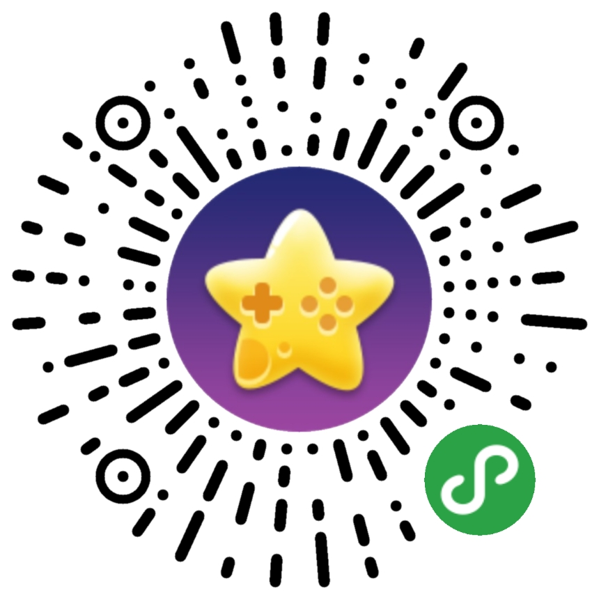

## 平台介绍

​	对于绝大多数微信小游戏而言，买量一定是个亏本的生意，买多少亏多少！那免费的流量（用户）从哪里来呢？	

​	为帮助众多开发者获得免费的流量，Layabox推出小游戏流量共享平台。并在LayaAirIDE内集成流量共享的组件，让开发者仅仅是通过拖拽就实现了技术上的对接，简单提交一下小游戏的基础信息，就可以自助加入到小游戏流量共享平台，从而实现免费获得流量！

​	Layabox作为拥有近50万开发者的游戏引擎提供方，同时也作为流量共享平台的运营方与发起方，承诺绝不收取参与流量共享平台的开发者任何费用与分成，旨在帮助微信生态中大量的长尾游戏能够生存下来，搭建一个“`我为人人，人人为我`”的免费共享生态。

### 什么是流量共享平台

​	所谓流量共享平台，那共享的自然是游戏用户，那游戏用户是如何实现共享的呢。在了解这个概念之前，我们先讲一个换量的故事。

​	关系链分享转化、名称关键字搜索优化、小游戏换量，这是几个重要的免费流量来源和运营策略。而换量是指小游戏与小游戏之间，通过商务的方式达成对等交换的协议，在游戏内以icon图标的方式彼此点击跳转到另一款游戏中的行为。最终双方会形成对等的用户新增交换。

​	比如A、B游戏都有5万日活用户，A游戏带给B游戏1万新增，那B游戏也需要对等的为A游戏带去1万新增。双方在达到各自达成约定的新增条件后先后关闭入口，从而达成对等的用户交换。

​	这种合作模式在当前较为常见，因为属于自己游戏的忠实用户肯定会回来，不是自己忠实的用户在流出的同时也会换来新增，而新增里必然会有一定比例的用户是忠实用户。所以，换量模式也是一种主流的免费获量模式之一。

​	但是，这种模式也有一定的限定条件，比如A游戏只有1万日活，那B游戏有10万日活，A游戏一天只能为B游戏带去几百用户，而B游戏一天可以为A游戏带去几千用户，那这种差距会导致B游戏不愿意与A游戏交换。另外，就是如何能找到更多同级别的游戏进行交换，这本就需要较大的商务资源与人脉，且需要较大的精力，尤其是那些连1万日活都没有的小游戏，如何去换?

​	Layabox的流量共享平台原理与换量相似，以去重后的单用户点击为依据计算平台流量贡献与流量获得。但是无需商务接洽，没有日活条件限制，不收取任何费用，开发者直接登录平台自助提交游戏，平台方只审核流量共享组件是否技术已实现和游戏可正常运行即可上架共享流量平台。

​	既便日活只有几千或者刚刚上线的小游戏，对共享平台只能贡献几十的新增或者是百位数的点击，那也会得到共享平台对等或超预期的回报。因为Layabox搭建流量共享平台的目标是建立一个互助的抱团取暖平台，活跃微信长尾游戏生态，让长尾游戏有更多的机会生存下来。

### 流量共享平台的流量获得原理

​	所有共享平台的长尾游戏需要先接入流量共享的组件。通过该组件，部分玩家可以跳转到统一的共享流量池（**星星游戏精选**），在共享流量池中，用户根据平台中的曝光推荐位置和自己的喜好，进入到其它的游戏。相当于对共享流量池进行流量的二次分配。

​	在初始的共享流量池中，Layabox会将自研的精品以及深度合作伙伴的小游戏精品都放入共享平台，成为流量池中主要贡献者，为众多新加入平台的长尾游戏和新上线的小游戏带来初始用户来源。并且Layabox会不断的增加更多精选的优质自研游戏，和邀请优质产品加入进来，为加入的开发者带来福利，尤其是早期加入的开发者，会享受到超值的共享回报。

​	随着平台的长尾小游戏增多，Layabox流量共享平台的大数据算法与AI算法会开始产生作用，系统会以去重后的单用户点击为依据计算小游戏的平台流量贡献与流量获得，根据净贡献值对平台中的小游戏进行自动改变和调整展示位置，向用户推荐喜好的游戏。使得流量付出与获得最终达到相对均衡。例如，某游戏加入平台后，从游戏中进入到平台的有效点击（去重后）只有500，而平台流量池进入到该游戏中的有效点击用户达到1000，那该游戏的净贡献值为负数，展示权重将被AI算法自动下调，新增或点击开始衰减。如果小游戏中因展示位置改变等因素使得净贡献值负数减少或者是净贡献值正向增大，那展示曝光的权重将会自动增加，给游戏带来的新增或点击也会自动提升。所以游戏中展示权重的核心因素，取决于贡献与获得的净贡献值。

### 流量共享平台的数据查询

​	流量共享平台的数据是以小程序的形式体现。打开平台的运营数据，会生成一个与后台自动绑定的小程序码，开发者可以扫码打开Layabox共享数据助手，在数据助手中查询自己的游戏在平台中的流量总贡献、流量总获得，以及可用流量，以及单个游戏的总贡献和总获得等关键数据。

### 流量共享平台的基础支持

​	Layabox流量共享平台除了登录平台后的相关技术指南。还有Layabox官方人员提供对接相关的技术支持。保障开发者在对接与加入共享平台中的顺畅性。

​	对于优质的长尾小游戏，加入到流量共享平台后，Layabox将会在官方公众号、QQ群、官网等渠道，为精选的小游戏进行不定期的免费推广。

​	对于已拥有卓越数据的精品小游戏和头部小游戏，如果愿意主动贡献流量，支持长尾小游戏的发展，Layabox引擎官方可以为作出特殊贡献的小游戏开发者，在游戏开发过程中提供免费的一对一引擎技术支持。

​	为迎接第一批加入平台的开发者，Layabox已率先拿出数款优质的小游戏产品加入到流量共享池（**星星游戏精选**），为第一批参与流量共享的开发者提供了基础的流量保障。

