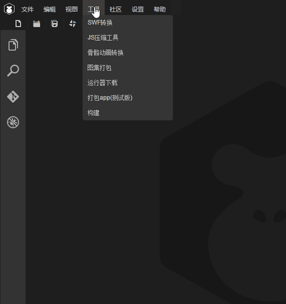
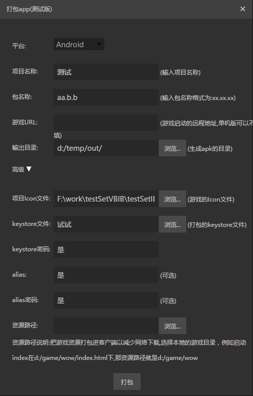

# LayaBox打包工具


## 作用：
把已有的layabox的包解开，修改图标和启动页面等参数，重新生成一个新的app。生成的这个app可以直接安装运行，也可以直接发布到各大平台（没有接入登陆和支付）。

## 运行需求：
1. 需要已经安装了1.7（含）以上的jdk，如果没有安装，可以到
[这里](http://www.oracle.com/technetwork/java/javase/downloads/jdk8-downloads-2133151.html)下载。
2. IDE本身只是提供的打包工具的入口，真正的功能由于需要的文件较大，需要单独下载，下载地址为  
[http://ldc.layabox.com/download/LayaAir/runtime/download.zip](http://ldc.layabox.com/download/LayaAir/runtime/download.zip)  
下载完成以后，解压到ide目录的 resources\app\out\vs\layaEditor\libs\RuntimePackTools 子目录下，覆盖原来的文件或者目录，就能使用了。

现在ide内部提供的下载引导功能，所以也可以在ide中直接操作，跟随引导即可。

## 打开方法：
单击菜单的 工具/打包app(测试版)，如下图:  


## Android Apk 打包
主界面:  

界面参数的意义：  
* 名称  
就是app的名称，安装以后显示在app图标下面的名称。  
（目前只能修改中文系统下的名称）  
例如：  
  
 猎刃2 就是这里要填的名称。
* 包名  
android应用的包名，这个正常情况下是不可见的。一般采用反域名命名规则（有利于分辨和避免与系统中已经有的app冲突)。   
例如 : com.layabox.runtime.demo   
包名必须是 xxx.yyy.zzz 的格式，至少要有两级，即xxx.yyy 。否则打包会失败。

* 游戏url  
如果要打包的应用是一个在线项目，就需要提供一个启动url，这是一个html地址，是应用的入口。  
对于通过layaair生成的项目，总是会输出一个启动页面，一般是index.html, 在测试的时候，为了方便，
都是使用的本地地址在浏览器中测试，当打成anroid应用的时候，就必须有一个真正的webserver的地址，
例如：  
*局域网地址：*  
``` 
    http://10.10.20.19:8888/index.html
```
*实际地址:*  
```
    http://layaair.ldc.layabox.com/layaplayer/index.html
```

* 输出目录  
就是打包结果，如果没有错误的话，这个目录下面就会生成重新打包好的文件，现在名字固定为 game.apk, 可以根据需要自己修改
文件的名称，修改文件名称不会影响app安装后显示的名称。  
*目前的问题：*  
如果打包过程中出现问题而中断，则会在这个目录下残留一些临时目录，遇到这种情况，只要直接把这些目录删掉即可。

* ICON  
app的图标文件，打包工具会根据这个文件来生成android需要的各个大小的图标，因此，这个图标最好符合android的最大图标的大小，
例如 144x144。图标文件的格式必须是jpg或者png，如果有圆角的话，必须是png且圆角部分透明。

* keystore，keystore密码，alias，alias密码  
这些都是keystore相关参数，如果不填的话，打包工具会使用自带的keystore文件来对打出的apk进行签名。
为了安全，建议使用自己的keystore文件，如果还没有keystore文件的话，可以用java自带的keytool来生成一个，具体生成方法可以
自己查找相关帮助。  
为什么要有keystore密码和alias密码两个密码呢，这个具体含义可以看keytool的帮助。如果简单理解下，可以认为keystore是一个
可以包含很多证书的集合，里面的每个证书都有一个别名，就是alias。如果要取出某个证书来使用的话，首先要进入keystore，就需要
keystore的密码，然后需要取出里面的某个alias的证书又要这个alias的密码。

* 资源路径  
资源就是实际的游戏资源，例如脚本、图片、声音等。对于在线游戏，只要有游戏的url就能正常运行，但是把资源直接打进包中的话，
可以避免网络下载，加快资源载入速度。如果是单机游戏，由于可能没有提供游戏url，就必须给资源目录，把所需的资源全部打包进apk。
注意打包进apk的资源依然可以通过我们的dcc工具（资源缓存管理）进行更新。
打包资源的缺点是会增加包的大小。

## iOS IPA 打包
暂时没有实现。