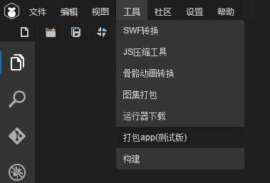
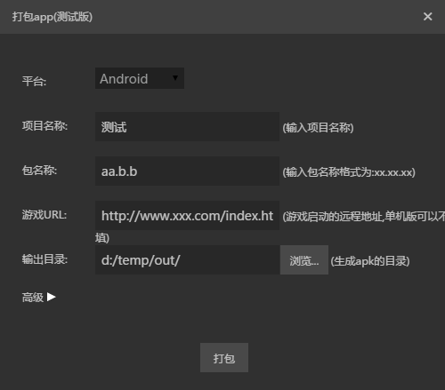

# 打包工具的帮助


## 作用
把已有的layabox的包解开，修改图标和启动页面等参数，重新生成一个新的app。生成的这个app可以直接安装运行，也可以直接发布到各大平台（没有接入登陆和支付）。

## 使用
1. 单击菜单的 工具/打包app(测试版)  


2. 显示主界面  
  
填好参数后，点 打包 ，


## Android Apk 打包
界面参数的意义：  
* 名称  
就是app的名称，安装以后显示在app图标下面的名称。  
（目前只能修改中文系统下的名称）  
例如：  
  
 猎刃2 就是这里要填的名称。
* 包名  
android应用的包名，这个正常情况下是不可见的。一般采用反域名命名规则（有利于分辨和避免与系统中已经有的app冲突)。   
例如 : com.layabox.runtime.demo   
包名必须是 xxx.yyy.zzz 的格式，至少要有两级，即xxx.yyy 。否则打包会失败。

* 游戏url  
如果要打包的应用是一个在线项目，就需要提供一个启动url，这是一个html地址，是应用的入口。  
对于通过layaair生成的项目，总是会输出一个启动页面，一般是index.html, 在测试的时候，为了方便，
都是使用的本地地址在浏览器中测试，当打成anroid应用的时候，就必须有一个真正的webserver的地址，
例如：  
*局域网地址：*  
``` 
    http://10.10.20.19:8888/index.html
```
*实际地址:*  
```
    http://layaair.ldc.layabox.com/layaplayer/index.html
```
* 输出目录
就是打包结果，如果没有错误的话，这个目录下面就会生成重新打包好的文件，现在名字固定为 game.apk, 可以根据需要自己修改
文件的名称，修改文件名称不会影响app安装后显示的名称。  
*目前的问题：*  
如果打包过程中出现问题而中断，则会在这个目录下残留一些临时目录，遇到这种情况，只要直接把这些目录删掉即可。
* ICON
app的图标文件，打包工具会根据这个文件来生成android需要的各个大小的图标，因此，这个图标最好符合android的最大图标的大小，
例如 144x144。图标文件的格式必须是jpg或者png，如果有圆角的话，必须是png且圆角部分透明。
* keystore
* keystore密码
* alias
* alias密码
* 资源路径

## iOS IPA 打包
暂时没有实现。