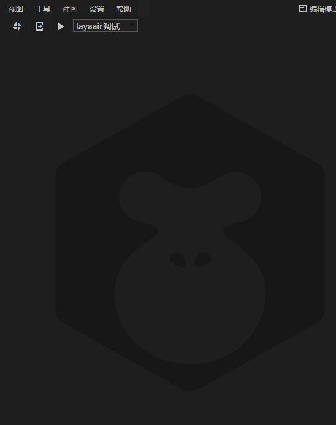

# LayaBox 构建工具
构建工具用来生成使用LayaBox加速器的移动端项目，相当于项目向导。目前支持Android（Eclipse项目和Android studio项目）和
iOS(XCode项目)。

## 运行需求
如果构建Android项目，则必须要有必须的Android开发环境。
如果要构建iOS项目，则必须要有必须的iOS开发环境（Mac电脑，XCode）。  
由于构建工具需要几个很大的库文件，无法随LayaAir IDE一起发放，因此要使用这个工具的话，需要下载单独的工具包。
下载地址为  
[http://ldc.layabox.com/download/LayaAir/runtime/download.zip](http://ldc.layabox.com/download/LayaAir/runtime/download.zip)  
下载完成以后，解压到ide目录的 resources\app\out\vs\layaEditor\libs\RuntimePackTools 子目录下，覆盖原来的文件或者目录，就能使用了。

*现在ide内部提供的下载引导功能，所以也可以在ide中直接操作，跟随引导即可。*

## 面向用户
如果要构建Android项目，则必须要有基本的android开发基础。  
如果要构建iOS项目，则必须要有基本的iOS开发基础。

## 打开方法
  

## 界面参数

* 名称  
app的名称。同时也是输出目录。

* 包名   
应用的包名，这个正常情况下是不可见的。一般采用反域名命名规则（有利于分辨和避免与系统中已经有的app冲突)。   
例如 : com.layabox.runtime.demo   
包名必须是 xxx.yyy.zzz 的格式，至少要有两级，即xxx.yyy 。否则打包会失败。

* 游戏url
如果要打包的应用是一个在线项目，就需要提供一个启动url，指向一个html页面，是应用的入口。  
如果是通过layaair生成的项目，总是会输出一个启动页面，一般是index.html。 在测试的时候，为了方便，
都是使用的本地地址在浏览器中测试，但是当打成anroid应用的时候，就必须有一个真正的webserver的地址，
例如：  
*局域网地址：*  
``` 
    http://10.10.20.19:8888/index.html
```
*实际地址:*  
```
    http://layaair.ldc.layabox.com/layaplayer/index.html
```

* 输出路径  
项目文件的输出路径。

* 资源路径  
资源就是实际的游戏资源，例如脚本、图片、声音等。对于在线游戏，只要有游戏的url就能正常运行，但是把资源直接打进包中的话，
可以避免网络下载，加快资源载入速度。如果是单机游戏，由于没有提供游戏url，就必须给资源目录，把所需的资源全部打包进apk。
注意打包进apk的资源依然可以通过我们的dcc工具（资源缓存管理）进行更新。
如果这时候没有设置资源路径，在构建完项目以后，依然可以手动添加资源，添加方法见下面的<怎么手动添加资源>。  
注意：  
    * 打包资源的缺点是会增加包的大小。  
    * 打包资源的在线游戏，必须在server端打dcc了，否则就会使其打包的优势，依然会下载所有的资源。    
    如何打dcc，参考<[LayaDcc工具](LayaDcc工具.md)> 

## 怎么手动添加资源
1. 需要有node开发环境，如果没有的话，先去[官网](https://nodejs.org/en/)下载。
2. 安装layadcc工具
```sh
npm install -g layadcc
```
3. 使用layadcc  
用法：layadcc 资源路径 -cache -url 游戏的url。  
资源路径：可以是相对路径也可以是绝对路径。
  
例如：  
```sh
layadcc e:/game/wow/ -cache -url www.best.game/game2/index.html
```
这样就会在 当前目录下面生成一个layadccout目录，把这个目录下的cache目录拷贝到项目的资源目录下，对android项目是
assets目录，对XCode就是resource目录，即可。

## 构建结果说明
见其他文档
